---
tags:
   - campaigns
---
# Frankenstein
## ID:C0001
[Frankenstein](/mitre/campaigns/C0001) was described by security researchers as a highly-targeted campaign conducted by moderately sophisticated and highly resourceful threat actors in early 2019. The unidentified actors primarily relied on open source tools, including [Empire](/mitre/software/S0363). The campaign name refers to the actors' ability to piece together several unrelated open-source tool components.(Citation: Talos Frankenstein June 2019)
## Techniques Used By Campaign
* [Process Discovery](/mitre/techniques/T1057)
* [System Information Discovery](/mitre/techniques/T1082)
* [Command Obfuscation](/mitre/techniques/T1027/010)
* [Automated Exfiltration](/mitre/techniques/T1020)
* [Scheduled Task](/mitre/techniques/T1053/005)
* [Malicious File](/mitre/techniques/T1204/002)
* [Spearphishing Attachment](/mitre/techniques/T1566/001)
* [Ingress Tool Transfer](/mitre/techniques/T1105)
* [PowerShell](/mitre/techniques/T1059/001)
* [Security Software Discovery](/mitre/techniques/T1518/001)
* [Visual Basic](/mitre/techniques/T1059/005)
* [Web Protocols](/mitre/techniques/T1071/001)
* [Template Injection](/mitre/techniques/T1221)
* [Exploitation for Client Execution](/mitre/techniques/T1203)
* [Windows Command Shell](/mitre/techniques/T1059/003)
* [System Checks](/mitre/techniques/T1497/001)
* [Windows Management Instrumentation](/mitre/techniques/T1047)
* [Automated Collection](/mitre/techniques/T1119)
* [Masquerade Task or Service](/mitre/techniques/T1036/004)
* [Data from Local System](/mitre/techniques/T1005)
* [Exfiltration Over C2 Channel](/mitre/techniques/T1041)
* [System Network Configuration Discovery](/mitre/techniques/T1016)
* [Deobfuscate/Decode Files or Information](/mitre/techniques/T1140)
* [Tool](/mitre/techniques/T1588/002)
* [MSBuild](/mitre/techniques/T1127/001)
* [System Owner/User Discovery](/mitre/techniques/T1033)
* [Symmetric Cryptography](/mitre/techniques/T1573/001)

# Summary of Techniques and Mitigations

```mermaid
flowchart LR
group[Frankenstein] --> T1057[Process Discovery]
group[Frankenstein] --> T1082[System Information Discovery]
group[Frankenstein] --> T1027.010[Command Obfuscation]
T1027.010[Command Obfuscation] --> M1040[Behavior Prevention on Endpoint]
T1027.010[Command Obfuscation] --> M1049[Antivirus/Antimalware]
group[Frankenstein] --> T1020[Automated Exfiltration]
group[Frankenstein] --> T1053.005[Scheduled Task]
T1053.005[Scheduled Task] --> M1026[Privileged Account Management]
T1053.005[Scheduled Task] --> M1018[User Account Management]
T1053.005[Scheduled Task] --> M1047[Audit]
T1053.005[Scheduled Task] --> M1028[Operating System Configuration]
group[Frankenstein] --> T1204.002[Malicious File]
T1204.002[Malicious File] --> M1038[Execution Prevention]
T1204.002[Malicious File] --> M1040[Behavior Prevention on Endpoint]
T1204.002[Malicious File] --> M1017[User Training]
group[Frankenstein] --> T1566.001[Spearphishing Attachment]
T1566.001[Spearphishing Attachment] --> M1049[Antivirus/Antimalware]
T1566.001[Spearphishing Attachment] --> M1031[Network Intrusion Prevention]
T1566.001[Spearphishing Attachment] --> M1054[Software Configuration]
T1566.001[Spearphishing Attachment] --> M1017[User Training]
T1566.001[Spearphishing Attachment] --> M1021[Restrict Web-Based Content]
group[Frankenstein] --> T1105[Ingress Tool Transfer]
T1105[Ingress Tool Transfer] --> M1031[Network Intrusion Prevention]
group[Frankenstein] --> T1059.001[PowerShell]
T1059.001[PowerShell] --> M1042[Disable or Remove Feature or Program]
T1059.001[PowerShell] --> M1049[Antivirus/Antimalware]
T1059.001[PowerShell] --> M1045[Code Signing]
T1059.001[PowerShell] --> M1026[Privileged Account Management]
T1059.001[PowerShell] --> M1038[Execution Prevention]
group[Frankenstein] --> T1518.001[Security Software Discovery]
group[Frankenstein] --> T1059.005[Visual Basic]
T1059.005[Visual Basic] --> M1042[Disable or Remove Feature or Program]
T1059.005[Visual Basic] --> M1049[Antivirus/Antimalware]
T1059.005[Visual Basic] --> M1038[Execution Prevention]
T1059.005[Visual Basic] --> M1040[Behavior Prevention on Endpoint]
T1059.005[Visual Basic] --> M1021[Restrict Web-Based Content]
group[Frankenstein] --> T1071.001[Web Protocols]
T1071.001[Web Protocols] --> M1031[Network Intrusion Prevention]
group[Frankenstein] --> T1221[Template Injection]
T1221[Template Injection] --> M1049[Antivirus/Antimalware]
T1221[Template Injection] --> M1031[Network Intrusion Prevention]
T1221[Template Injection] --> M1017[User Training]
T1221[Template Injection] --> M1042[Disable or Remove Feature or Program]
group[Frankenstein] --> T1203[Exploitation for Client Execution]
T1203[Exploitation for Client Execution] --> M1050[Exploit Protection]
T1203[Exploitation for Client Execution] --> M1048[Application Isolation and Sandboxing]
group[Frankenstein] --> T1059.003[Windows Command Shell]
T1059.003[Windows Command Shell] --> M1038[Execution Prevention]
group[Frankenstein] --> T1497.001[System Checks]
group[Frankenstein] --> T1047[Windows Management Instrumentation]
T1047[Windows Management Instrumentation] --> M1026[Privileged Account Management]
T1047[Windows Management Instrumentation] --> M1040[Behavior Prevention on Endpoint]
T1047[Windows Management Instrumentation] --> M1018[User Account Management]
T1047[Windows Management Instrumentation] --> M1038[Execution Prevention]
group[Frankenstein] --> T1119[Automated Collection]
T1119[Automated Collection] --> M1029[Remote Data Storage]
T1119[Automated Collection] --> M1041[Encrypt Sensitive Information]
group[Frankenstein] --> T1036.004[Masquerade Task or Service]
group[Frankenstein] --> T1005[Data from Local System]
T1005[Data from Local System] --> M1057[Data Loss Prevention]
group[Frankenstein] --> T1041[Exfiltration Over C2 Channel]
T1041[Exfiltration Over C2 Channel] --> M1031[Network Intrusion Prevention]
T1041[Exfiltration Over C2 Channel] --> M1057[Data Loss Prevention]
group[Frankenstein] --> T1016[System Network Configuration Discovery]
group[Frankenstein] --> T1140[Deobfuscate/Decode Files or Information]
group[Frankenstein] --> T1588.002[Tool]
T1588.002[Tool] --> M1056[Pre-compromise]
group[Frankenstein] --> T1127.001[MSBuild]
T1127.001[MSBuild] --> M1042[Disable or Remove Feature or Program]
T1127.001[MSBuild] --> M1038[Execution Prevention]
group[Frankenstein] --> T1033[System Owner/User Discovery]
group[Frankenstein] --> T1573.001[Symmetric Cryptography]
T1573.001[Symmetric Cryptography] --> M1031[Network Intrusion Prevention]
```
