---
tags:
   - campaigns
---
# Night Dragon
## ID:C0002
[Night Dragon](/mitre/campaigns/C0002) was a cyber espionage campaign that targeted oil, energy, and petrochemical companies, along with individuals and executives in Kazakhstan, Taiwan, Greece, and the United States. The unidentified threat actors searched for information related to oil and gas field production systems, financials, and collected data from SCADA systems. Based on the observed techniques, tools, and network activities, security researchers assessed the campaign involved a threat group based in China.(Citation: McAfee Night Dragon)
## Techniques Used By Campaign
* [Domain Accounts](techniques/T1078/002)
* [Upload Malware](techniques/T1608/001)
* [Malware](techniques/T1588/001)
* [Spearphishing Link](techniques/T1566/002)
* [Malicious Link](techniques/T1204/001)
* [External Remote Services](techniques/T1133)
* [Data from Local System](techniques/T1005)
* [Windows Command Shell](techniques/T1059/003)
* [Software Packing](techniques/T1027/002)
* [Exploit Public-Facing Application](techniques/T1190)
* [Valid Accounts](techniques/T1078)
* [Encrypted/Encoded File](techniques/T1027/013)
* [System Owner/User Discovery](techniques/T1033)
* [Tool](techniques/T1588/002)
* [Modify Registry](techniques/T1112)
* [Security Account Manager](techniques/T1003/002)
* [Web Protocols](techniques/T1071/001)
* [Local Email Collection](techniques/T1114/001)
* [Fallback Channels](techniques/T1008)
* [File and Directory Discovery](techniques/T1083)
* [Server](techniques/T1583/004)
* [Pass the Hash](techniques/T1550/002)
* [Remote Access Software](techniques/T1219)
* [Password Cracking](techniques/T1110/002)
* [Server](techniques/T1584/004)
* [Dynamic Resolution](techniques/T1568)
* [Ingress Tool Transfer](techniques/T1105)
* [Remote Data Staging](techniques/T1074/002)
* [Disable or Modify Tools](techniques/T1562/001)

# Summary of Techniques and Mitigations

```mermaid
flowchart LR
group[Night Dragon] --> T1078.002[Domain Accounts]
T1078.002[Domain Accounts] --> M1032[Multi-factor Authentication]
T1078.002[Domain Accounts] --> M1026[Privileged Account Management]
T1078.002[Domain Accounts] --> M1017[User Training]
group[Night Dragon] --> T1608.001[Upload Malware]
T1608.001[Upload Malware] --> M1056[Pre-compromise]
group[Night Dragon] --> T1588.001[Malware]
T1588.001[Malware] --> M1056[Pre-compromise]
group[Night Dragon] --> T1566.002[Spearphishing Link]
T1566.002[Spearphishing Link] --> M1054[Software Configuration]
T1566.002[Spearphishing Link] --> M1021[Restrict Web-Based Content]
T1566.002[Spearphishing Link] --> M1047[Audit]
T1566.002[Spearphishing Link] --> M1018[User Account Management]
T1566.002[Spearphishing Link] --> M1017[User Training]
group[Night Dragon] --> T1204.001[Malicious Link]
T1204.001[Malicious Link] --> M1031[Network Intrusion Prevention]
T1204.001[Malicious Link] --> M1017[User Training]
T1204.001[Malicious Link] --> M1021[Restrict Web-Based Content]
group[Night Dragon] --> T1133[External Remote Services]
T1133[External Remote Services] --> M1030[Network Segmentation]
T1133[External Remote Services] --> M1042[Disable or Remove Feature or Program]
T1133[External Remote Services] --> M1035[Limit Access to Resource Over Network]
T1133[External Remote Services] --> M1032[Multi-factor Authentication]
group[Night Dragon] --> T1005[Data from Local System]
T1005[Data from Local System] --> M1057[Data Loss Prevention]
group[Night Dragon] --> T1059.003[Windows Command Shell]
T1059.003[Windows Command Shell] --> M1038[Execution Prevention]
group[Night Dragon] --> T1027.002[Software Packing]
T1027.002[Software Packing] --> M1049[Antivirus/Antimalware]
group[Night Dragon] --> T1190[Exploit Public-Facing Application]
T1190[Exploit Public-Facing Application] --> M1048[Application Isolation and Sandboxing]
T1190[Exploit Public-Facing Application] --> M1030[Network Segmentation]
T1190[Exploit Public-Facing Application] --> M1016[Vulnerability Scanning]
T1190[Exploit Public-Facing Application] --> M1026[Privileged Account Management]
T1190[Exploit Public-Facing Application] --> M1050[Exploit Protection]
T1190[Exploit Public-Facing Application] --> M1051[Update Software]
group[Night Dragon] --> T1078[Valid Accounts]
T1078[Valid Accounts] --> M1027[Password Policies]
T1078[Valid Accounts] --> M1018[User Account Management]
T1078[Valid Accounts] --> M1026[Privileged Account Management]
T1078[Valid Accounts] --> M1013[Application Developer Guidance]
T1078[Valid Accounts] --> M1017[User Training]
T1078[Valid Accounts] --> M1015[Active Directory Configuration]
T1078[Valid Accounts] --> M1036[Account Use Policies]
group[Night Dragon] --> T1027.013[Encrypted/Encoded File]
T1027.013[Encrypted/Encoded File] --> M1049[Antivirus/Antimalware]
T1027.013[Encrypted/Encoded File] --> M1040[Behavior Prevention on Endpoint]
group[Night Dragon] --> T1033[System Owner/User Discovery]
group[Night Dragon] --> T1588.002[Tool]
T1588.002[Tool] --> M1056[Pre-compromise]
group[Night Dragon] --> T1112[Modify Registry]
T1112[Modify Registry] --> M1024[Restrict Registry Permissions]
group[Night Dragon] --> T1003.002[Security Account Manager]
T1003.002[Security Account Manager] --> M1027[Password Policies]
T1003.002[Security Account Manager] --> M1026[Privileged Account Management]
T1003.002[Security Account Manager] --> M1028[Operating System Configuration]
T1003.002[Security Account Manager] --> M1017[User Training]
group[Night Dragon] --> T1071.001[Web Protocols]
T1071.001[Web Protocols] --> M1031[Network Intrusion Prevention]
group[Night Dragon] --> T1114.001[Local Email Collection]
T1114.001[Local Email Collection] --> M1041[Encrypt Sensitive Information]
group[Night Dragon] --> T1008[Fallback Channels]
T1008[Fallback Channels] --> M1031[Network Intrusion Prevention]
group[Night Dragon] --> T1083[File and Directory Discovery]
group[Night Dragon] --> T1583.004[Server]
T1583.004[Server] --> M1056[Pre-compromise]
group[Night Dragon] --> T1550.002[Pass the Hash]
T1550.002[Pass the Hash] --> M1051[Update Software]
T1550.002[Pass the Hash] --> M1052[User Account Control]
T1550.002[Pass the Hash] --> M1018[User Account Management]
T1550.002[Pass the Hash] --> M1026[Privileged Account Management]
group[Night Dragon] --> T1219[Remote Access Software]
T1219[Remote Access Software] --> M1038[Execution Prevention]
T1219[Remote Access Software] --> M1037[Filter Network Traffic]
T1219[Remote Access Software] --> M1031[Network Intrusion Prevention]
T1219[Remote Access Software] --> M1042[Disable or Remove Feature or Program]
group[Night Dragon] --> T1110.002[Password Cracking]
T1110.002[Password Cracking] --> M1027[Password Policies]
T1110.002[Password Cracking] --> M1032[Multi-factor Authentication]
group[Night Dragon] --> T1584.004[Server]
T1584.004[Server] --> M1056[Pre-compromise]
group[Night Dragon] --> T1568[Dynamic Resolution]
T1568[Dynamic Resolution] --> M1031[Network Intrusion Prevention]
T1568[Dynamic Resolution] --> M1021[Restrict Web-Based Content]
group[Night Dragon] --> T1105[Ingress Tool Transfer]
T1105[Ingress Tool Transfer] --> M1031[Network Intrusion Prevention]
group[Night Dragon] --> T1074.002[Remote Data Staging]
group[Night Dragon] --> T1562.001[Disable or Modify Tools]
T1562.001[Disable or Modify Tools] --> M1038[Execution Prevention]
T1562.001[Disable or Modify Tools] --> M1024[Restrict Registry Permissions]
T1562.001[Disable or Modify Tools] --> M1018[User Account Management]
T1562.001[Disable or Modify Tools] --> M1022[Restrict File and Directory Permissions]
```
