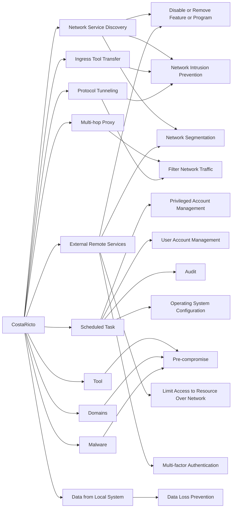

---
tags:
   - campaigns
---
# CostaRicto
## ID:C0004
[CostaRicto](/mitre/campaigns/C0004) was a suspected hacker-for-hire cyber espionage campaign that targeted multiple industries worldwide, with a large number being financial institutions. [CostaRicto](/mitre/campaigns/C0004) actors targeted organizations in Europe, the Americas, Asia, Australia, and Africa, with a large concentration in South Asia (especially India, Bangladesh, and Singapore), using custom malware, open source tools, and a complex network of proxies and SSH tunnels.(Citation: BlackBerry CostaRicto November 2020)
## Techniques Used By Campaign
* [Network Service Discovery](techniques/T1046)
* [Ingress Tool Transfer](techniques/T1105)
* [Multi-hop Proxy](techniques/T1090/003)
* [Scheduled Task](techniques/T1053/005)
* [Tool](techniques/T1588/002)
* [External Remote Services](techniques/T1133)
* [Domains](techniques/T1583/001)
* [Malware](techniques/T1587/001)
* [Data from Local System](techniques/T1005)
* [Protocol Tunneling](techniques/T1572)

# Summary of Techniques and Mitigations
