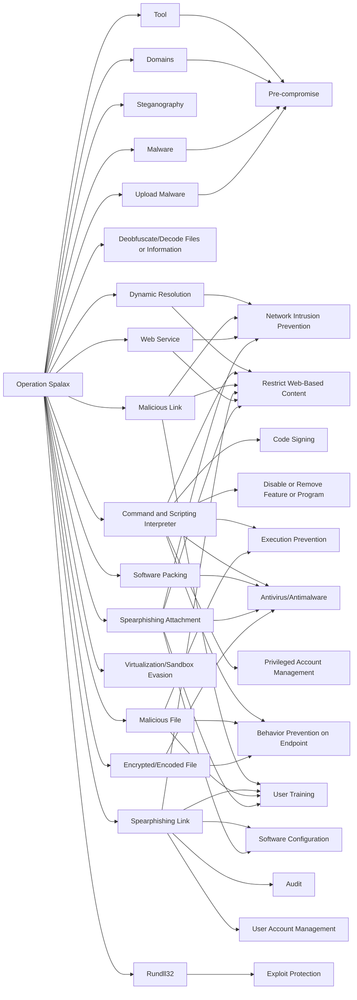

---
tags:
   - campaigns
---
# Operation Spalax
## ID:C0005
[Operation Spalax](campaigns/C0005) was a campaign that primarily targeted Colombian government organizations and private companies, particularly those associated with the energy and metallurgical industries. The [Operation Spalax](campaigns/C0005) threat actors distributed commodity malware and tools using generic phishing topics related to COVID-19, banking, and law enforcement action. Security researchers noted indicators of compromise and some infrastructure overlaps with other campaigns dating back to April 2018, including at least one separately attributed to [APT-C-36](groups/G0099), however identified enough differences to report this as separate, unattributed activity.(Citation: ESET Operation Spalax Jan 2021)  
## Techniques Used By Campaign
* [Tool](techniques/T1588/002)
* [Domains](techniques/T1583/001)
* [Steganography](techniques/T1027/003)
* [Malware](techniques/T1588/001)
* [Dynamic Resolution](techniques/T1568)
* [Deobfuscate/Decode Files or Information](techniques/T1140)
* [Command and Scripting Interpreter](techniques/T1059)
* [Malicious Link](techniques/T1204/001)
* [Spearphishing Link](techniques/T1566/002)
* [Web Service](techniques/T1102)
* [Software Packing](techniques/T1027/002)
* [Upload Malware](techniques/T1608/001)
* [Virtualization/Sandbox Evasion](techniques/T1497)
* [Malicious File](techniques/T1204/002)
* [Spearphishing Attachment](techniques/T1566/001)
* [Rundll32](techniques/T1218/011)
* [Encrypted/Encoded File](techniques/T1027/013)

# Summary of Techniques and Mitigations
