---
tags:
   - campaigns
---
# Operation Honeybee
## ID:C0006
[Operation Honeybee](/mitre/campaigns/C0006) was a campaign that targeted humanitarian aid and inter-Korean affairs organizations from at least late 2017 through early 2018. [Operation Honeybee](/mitre/campaigns/C0006) initially targeted South Korea, but expanded to include Vietnam, Singapore, Japan, Indonesia, Argentina, and Canada. Security researchers assessed the threat actors were likely Korean speakers based on metadata used in both lure documents and executables, and named the campaign "Honeybee" after the author name discovered in malicious Word documents.(Citation: McAfee Honeybee) 
## Techniques Used By Campaign
* [Email Accounts](techniques/T1585/002)
* [File and Directory Discovery](techniques/T1083)
* [Native API](techniques/T1106)
* [File Deletion](techniques/T1070/004)
* [Local Data Staging](techniques/T1074/001)
* [Domains](techniques/T1583/001)
* [Encrypted/Encoded File](techniques/T1027/013)
* [Code Signing](techniques/T1553/002)
* [Exfiltration Over C2 Channel](techniques/T1041)
* [Modify Registry](techniques/T1112)
* [Windows Command Shell](techniques/T1059/003)
* [System Information Discovery](techniques/T1082)
* [Service Execution](techniques/T1569/002)
* [Archive via Utility](techniques/T1560/001)
* [Services Registry Permissions Weakness](techniques/T1574/011)
* [Digital Certificates](techniques/T1588/004)
* [File Transfer Protocols](techniques/T1071/002)
* [Bypass User Account Control](techniques/T1548/002)
* [Data from Local System](techniques/T1005)
* [Windows Service](techniques/T1543/003)
* [Server](techniques/T1583/004)
* [Match Legitimate Name or Location](techniques/T1036/005)
* [Malicious File](techniques/T1204/002)
* [Ingress Tool Transfer](techniques/T1105)
* [Visual Basic](techniques/T1059/005)
* [Process Discovery](techniques/T1057)
* [Deobfuscate/Decode Files or Information](techniques/T1140)
* [Masquerading](techniques/T1036)

# Summary of Techniques and Mitigations

```mermaid
flowchart LR
group[Operation Honeybee] --> T1585.002[Email Accounts]
T1585.002[Email Accounts] --> M1056[Pre-compromise]
group[Operation Honeybee] --> T1083[File and Directory Discovery]
group[Operation Honeybee] --> T1106[Native API]
T1106[Native API] --> M1038[Execution Prevention]
T1106[Native API] --> M1040[Behavior Prevention on Endpoint]
group[Operation Honeybee] --> T1070.004[File Deletion]
group[Operation Honeybee] --> T1074.001[Local Data Staging]
group[Operation Honeybee] --> T1583.001[Domains]
T1583.001[Domains] --> M1056[Pre-compromise]
group[Operation Honeybee] --> T1027.013[Encrypted/Encoded File]
T1027.013[Encrypted/Encoded File] --> M1049[Antivirus/Antimalware]
T1027.013[Encrypted/Encoded File] --> M1040[Behavior Prevention on Endpoint]
group[Operation Honeybee] --> T1553.002[Code Signing]
group[Operation Honeybee] --> T1041[Exfiltration Over C2 Channel]
T1041[Exfiltration Over C2 Channel] --> M1031[Network Intrusion Prevention]
T1041[Exfiltration Over C2 Channel] --> M1057[Data Loss Prevention]
group[Operation Honeybee] --> T1112[Modify Registry]
T1112[Modify Registry] --> M1024[Restrict Registry Permissions]
group[Operation Honeybee] --> T1059.003[Windows Command Shell]
T1059.003[Windows Command Shell] --> M1038[Execution Prevention]
group[Operation Honeybee] --> T1082[System Information Discovery]
group[Operation Honeybee] --> T1569.002[Service Execution]
T1569.002[Service Execution] --> M1026[Privileged Account Management]
T1569.002[Service Execution] --> M1040[Behavior Prevention on Endpoint]
T1569.002[Service Execution] --> M1022[Restrict File and Directory Permissions]
group[Operation Honeybee] --> T1560.001[Archive via Utility]
T1560.001[Archive via Utility] --> M1047[Audit]
group[Operation Honeybee] --> T1574.011[Services Registry Permissions Weakness]
T1574.011[Services Registry Permissions Weakness] --> M1024[Restrict Registry Permissions]
group[Operation Honeybee] --> T1588.004[Digital Certificates]
T1588.004[Digital Certificates] --> M1056[Pre-compromise]
group[Operation Honeybee] --> T1071.002[File Transfer Protocols]
T1071.002[File Transfer Protocols] --> M1031[Network Intrusion Prevention]
group[Operation Honeybee] --> T1548.002[Bypass User Account Control]
T1548.002[Bypass User Account Control] --> M1051[Update Software]
T1548.002[Bypass User Account Control] --> M1047[Audit]
T1548.002[Bypass User Account Control] --> M1052[User Account Control]
T1548.002[Bypass User Account Control] --> M1026[Privileged Account Management]
group[Operation Honeybee] --> T1005[Data from Local System]
T1005[Data from Local System] --> M1057[Data Loss Prevention]
group[Operation Honeybee] --> T1543.003[Windows Service]
T1543.003[Windows Service] --> M1040[Behavior Prevention on Endpoint]
T1543.003[Windows Service] --> M1028[Operating System Configuration]
T1543.003[Windows Service] --> M1047[Audit]
T1543.003[Windows Service] --> M1045[Code Signing]
T1543.003[Windows Service] --> M1018[User Account Management]
group[Operation Honeybee] --> T1583.004[Server]
T1583.004[Server] --> M1056[Pre-compromise]
group[Operation Honeybee] --> T1036.005[Match Legitimate Name or Location]
T1036.005[Match Legitimate Name or Location] --> M1022[Restrict File and Directory Permissions]
T1036.005[Match Legitimate Name or Location] --> M1038[Execution Prevention]
T1036.005[Match Legitimate Name or Location] --> M1045[Code Signing]
group[Operation Honeybee] --> T1204.002[Malicious File]
T1204.002[Malicious File] --> M1038[Execution Prevention]
T1204.002[Malicious File] --> M1040[Behavior Prevention on Endpoint]
T1204.002[Malicious File] --> M1017[User Training]
group[Operation Honeybee] --> T1105[Ingress Tool Transfer]
T1105[Ingress Tool Transfer] --> M1031[Network Intrusion Prevention]
group[Operation Honeybee] --> T1059.005[Visual Basic]
T1059.005[Visual Basic] --> M1042[Disable or Remove Feature or Program]
T1059.005[Visual Basic] --> M1049[Antivirus/Antimalware]
T1059.005[Visual Basic] --> M1038[Execution Prevention]
T1059.005[Visual Basic] --> M1040[Behavior Prevention on Endpoint]
T1059.005[Visual Basic] --> M1021[Restrict Web-Based Content]
group[Operation Honeybee] --> T1057[Process Discovery]
group[Operation Honeybee] --> T1140[Deobfuscate/Decode Files or Information]
group[Operation Honeybee] --> T1036[Masquerading]
T1036[Masquerading] --> M1017[User Training]
T1036[Masquerading] --> M1045[Code Signing]
T1036[Masquerading] --> M1040[Behavior Prevention on Endpoint]
T1036[Masquerading] --> M1022[Restrict File and Directory Permissions]
T1036[Masquerading] --> M1049[Antivirus/Antimalware]
T1036[Masquerading] --> M1038[Execution Prevention]
```
