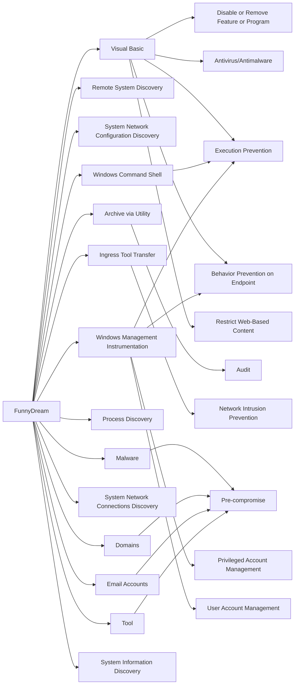

---
tags:
   - campaigns
---
# FunnyDream
## ID:C0007
[FunnyDream](/mitre/campaigns/C0007) was a suspected Chinese cyber espionage campaign that targeted government and foreign organizations in Malaysia, the Philippines, Taiwan, Vietnam, and other parts of Southeast Asia. Security researchers linked the [FunnyDream](/mitre/campaigns/C0007) campaign to possible Chinese-speaking threat actors through the use of the [Chinoxy](/mitre/software/S1041) backdoor and noted infrastructure overlap with the TAG-16 threat group.(Citation: Bitdefender FunnyDream Campaign November 2020)(Citation: Kaspersky APT Trends Q1 2020)(Citation: Recorded Future Chinese Activity in Southeast Asia December 2021)
## Techniques Used By Campaign
* [Visual Basic](techniques/T1059/005)
* [Remote System Discovery](techniques/T1018)
* [System Network Configuration Discovery](techniques/T1016)
* [Archive via Utility](techniques/T1560/001)
* [Windows Command Shell](techniques/T1059/003)
* [Ingress Tool Transfer](techniques/T1105)
* [Malware](techniques/T1588/001)
* [Process Discovery](techniques/T1057)
* [Domains](techniques/T1583/001)
* [System Network Connections Discovery](techniques/T1049)
* [Email Accounts](techniques/T1585/002)
* [Windows Management Instrumentation](techniques/T1047)
* [Tool](techniques/T1588/002)
* [System Information Discovery](techniques/T1082)

# Summary of Techniques and Mitigations
