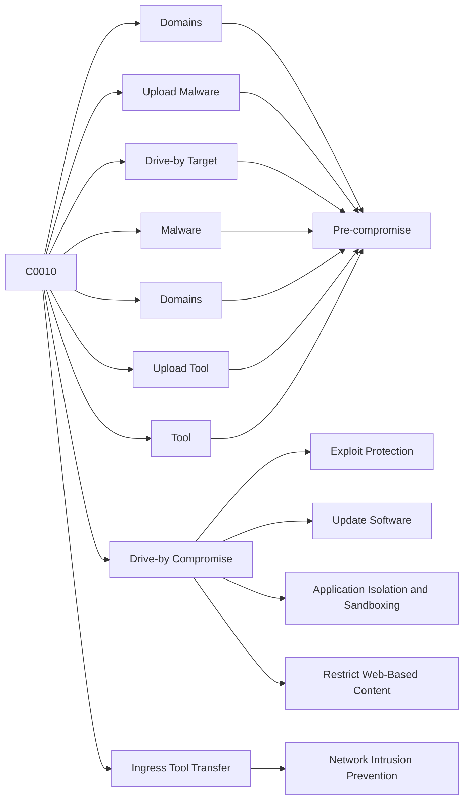

---
tags:
   - campaigns
---
# C0010
## ID:C0010
[C0010](campaigns/C0010) was a cyber espionage campaign conducted by UNC3890 that targeted Israeli shipping, government, aviation, energy, and healthcare organizations. Security researcher assess UNC3890 conducts operations in support of Iranian interests, and noted several limited technical connections to Iran, including PDB strings and Farsi language artifacts. [C0010](campaigns/C0010) began by at least late 2020, and was still ongoing as of mid-2022.(Citation: Mandiant UNC3890 Aug 2022)
## Techniques Used By Campaign
* [Domains](techniques/T1584/001)
* [Upload Malware](techniques/T1608/001)
* [Drive-by Compromise](techniques/T1189)
* [Drive-by Target](techniques/T1608/004)
* [Malware](techniques/T1587/001)
* [Domains](techniques/T1583/001)
* [Ingress Tool Transfer](techniques/T1105)
* [Upload Tool](techniques/T1608/002)
* [Tool](techniques/T1588/002)

# Summary of Techniques and Mitigations
