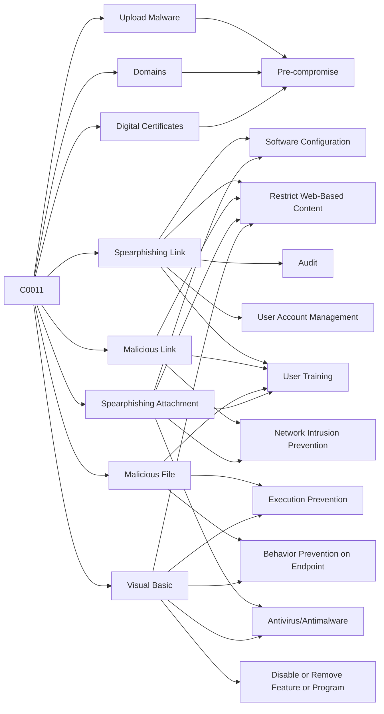

---
tags:
   - campaigns
---
# C0011
## ID:C0011
[C0011](/mitre/campaigns/C0011) was a suspected cyber espionage campaign conducted by [Transparent Tribe](/mitre/groups/G0134) that targeted students at universities and colleges in India. Security researchers noted this campaign against students was a significant shift from [Transparent Tribe](/mitre/groups/G0134)'s historic targeting Indian government, military, and think tank personnel, and assessed it was still ongoing as of July 2022.(Citation: Cisco Talos Transparent Tribe Education Campaign July 2022) 
## Techniques Used By Campaign
* [Upload Malware](techniques/T1608/001)
* [Spearphishing Link](techniques/T1566/002)
* [Malicious Link](techniques/T1204/001)
* [Malicious File](techniques/T1204/002)
* [Spearphishing Attachment](techniques/T1566/001)
* [Visual Basic](techniques/T1059/005)
* [Domains](techniques/T1583/001)
* [Digital Certificates](techniques/T1587/003)

# Summary of Techniques and Mitigations
