---
tags:
   - campaigns
---
# Operation CuckooBees
## ID:C0012
[Operation CuckooBees](campaigns/C0012) was a cyber espionage campaign targeting technology and manufacturing companies in East Asia, Western Europe, and North America since at least 2019. Security researchers noted the goal of [Operation CuckooBees](campaigns/C0012), which was still ongoing as of May 2022, was likely the theft of proprietary information, research and development documents, source code, and blueprints for various technologies. Researchers assessed [Operation CuckooBees](campaigns/C0012) was conducted by actors affiliated with [Winnti Group](groups/G0044), [APT41](groups/G0096), and BARIUM.(Citation: Cybereason OperationCuckooBees May 2022)
## Techniques Used By Campaign
* [Peripheral Device Discovery](techniques/T1120)
* [Remote System Discovery](techniques/T1018)
* [Windows Service](techniques/T1543/003)
* [Archive via Utility](techniques/T1560/001)
* [External Remote Services](techniques/T1133)
* [File and Directory Discovery](techniques/T1083)
* [System Information Discovery](techniques/T1082)
* [System Time Discovery](techniques/T1124)
* [Domain Accounts](techniques/T1078/002)
* [System Network Configuration Discovery](techniques/T1016)
* [Password Policy Discovery](techniques/T1201)
* [Tool](techniques/T1588/002)
* [Match Legitimate Name or Location](techniques/T1036/005)
* [Local Account](techniques/T1087/001)
* [System Owner/User Discovery](techniques/T1033)
* [Command Obfuscation](techniques/T1027/010)
* [Domain Account](techniques/T1087/002)
* [Scheduled Task](techniques/T1053/005)
* [Exploit Public-Facing Application](techniques/T1190)
* [Local Groups](techniques/T1069/001)
* [Fileless Storage](techniques/T1027/011)
* [Windows Command Shell](techniques/T1059/003)
* [Web Shell](techniques/T1505/003)
* [Security Account Manager](techniques/T1003/002)
* [Web Protocols](techniques/T1071/001)
* [System Network Connections Discovery](techniques/T1049)
* [Visual Basic](techniques/T1059/005)
* [Network Share Discovery](techniques/T1135)
* [DLL Side-Loading](techniques/T1574/002)
* [Process Discovery](techniques/T1057)
* [Kernel Modules and Extensions](techniques/T1547/006)
* [System Service Discovery](techniques/T1007)
* [Data from Local System](techniques/T1005)

# Summary of Techniques and Mitigations

```mermaid
flowchart LR
group[Operation CuckooBees] --> T1120[Peripheral Device Discovery]
group[Operation CuckooBees] --> T1018[Remote System Discovery]
group[Operation CuckooBees] --> T1543.003[Windows Service]
T1543.003[Windows Service] --> M1040[Behavior Prevention on Endpoint]
T1543.003[Windows Service] --> M1028[Operating System Configuration]
T1543.003[Windows Service] --> M1047[Audit]
T1543.003[Windows Service] --> M1045[Code Signing]
T1543.003[Windows Service] --> M1018[User Account Management]
group[Operation CuckooBees] --> T1560.001[Archive via Utility]
T1560.001[Archive via Utility] --> M1047[Audit]
group[Operation CuckooBees] --> T1133[External Remote Services]
T1133[External Remote Services] --> M1030[Network Segmentation]
T1133[External Remote Services] --> M1042[Disable or Remove Feature or Program]
T1133[External Remote Services] --> M1035[Limit Access to Resource Over Network]
T1133[External Remote Services] --> M1032[Multi-factor Authentication]
group[Operation CuckooBees] --> T1083[File and Directory Discovery]
group[Operation CuckooBees] --> T1082[System Information Discovery]
group[Operation CuckooBees] --> T1124[System Time Discovery]
group[Operation CuckooBees] --> T1078.002[Domain Accounts]
T1078.002[Domain Accounts] --> M1032[Multi-factor Authentication]
T1078.002[Domain Accounts] --> M1026[Privileged Account Management]
T1078.002[Domain Accounts] --> M1017[User Training]
group[Operation CuckooBees] --> T1016[System Network Configuration Discovery]
group[Operation CuckooBees] --> T1201[Password Policy Discovery]
T1201[Password Policy Discovery] --> M1027[Password Policies]
group[Operation CuckooBees] --> T1588.002[Tool]
T1588.002[Tool] --> M1056[Pre-compromise]
group[Operation CuckooBees] --> T1036.005[Match Legitimate Name or Location]
T1036.005[Match Legitimate Name or Location] --> M1022[Restrict File and Directory Permissions]
T1036.005[Match Legitimate Name or Location] --> M1038[Execution Prevention]
T1036.005[Match Legitimate Name or Location] --> M1045[Code Signing]
group[Operation CuckooBees] --> T1087.001[Local Account]
T1087.001[Local Account] --> M1028[Operating System Configuration]
group[Operation CuckooBees] --> T1033[System Owner/User Discovery]
group[Operation CuckooBees] --> T1027.010[Command Obfuscation]
T1027.010[Command Obfuscation] --> M1040[Behavior Prevention on Endpoint]
T1027.010[Command Obfuscation] --> M1049[Antivirus/Antimalware]
group[Operation CuckooBees] --> T1087.002[Domain Account]
T1087.002[Domain Account] --> M1028[Operating System Configuration]
group[Operation CuckooBees] --> T1053.005[Scheduled Task]
T1053.005[Scheduled Task] --> M1026[Privileged Account Management]
T1053.005[Scheduled Task] --> M1018[User Account Management]
T1053.005[Scheduled Task] --> M1047[Audit]
T1053.005[Scheduled Task] --> M1028[Operating System Configuration]
group[Operation CuckooBees] --> T1190[Exploit Public-Facing Application]
T1190[Exploit Public-Facing Application] --> M1048[Application Isolation and Sandboxing]
T1190[Exploit Public-Facing Application] --> M1030[Network Segmentation]
T1190[Exploit Public-Facing Application] --> M1016[Vulnerability Scanning]
T1190[Exploit Public-Facing Application] --> M1026[Privileged Account Management]
T1190[Exploit Public-Facing Application] --> M1050[Exploit Protection]
T1190[Exploit Public-Facing Application] --> M1051[Update Software]
group[Operation CuckooBees] --> T1069.001[Local Groups]
group[Operation CuckooBees] --> T1027.011[Fileless Storage]
T1027.011[Fileless Storage] --> M1047[Audit]
group[Operation CuckooBees] --> T1059.003[Windows Command Shell]
T1059.003[Windows Command Shell] --> M1038[Execution Prevention]
group[Operation CuckooBees] --> T1505.003[Web Shell]
T1505.003[Web Shell] --> M1042[Disable or Remove Feature or Program]
T1505.003[Web Shell] --> M1018[User Account Management]
group[Operation CuckooBees] --> T1003.002[Security Account Manager]
T1003.002[Security Account Manager] --> M1027[Password Policies]
T1003.002[Security Account Manager] --> M1026[Privileged Account Management]
T1003.002[Security Account Manager] --> M1028[Operating System Configuration]
T1003.002[Security Account Manager] --> M1017[User Training]
group[Operation CuckooBees] --> T1071.001[Web Protocols]
T1071.001[Web Protocols] --> M1031[Network Intrusion Prevention]
group[Operation CuckooBees] --> T1049[System Network Connections Discovery]
group[Operation CuckooBees] --> T1059.005[Visual Basic]
T1059.005[Visual Basic] --> M1042[Disable or Remove Feature or Program]
T1059.005[Visual Basic] --> M1049[Antivirus/Antimalware]
T1059.005[Visual Basic] --> M1038[Execution Prevention]
T1059.005[Visual Basic] --> M1040[Behavior Prevention on Endpoint]
T1059.005[Visual Basic] --> M1021[Restrict Web-Based Content]
group[Operation CuckooBees] --> T1135[Network Share Discovery]
T1135[Network Share Discovery] --> M1028[Operating System Configuration]
group[Operation CuckooBees] --> T1574.002[DLL Side-Loading]
T1574.002[DLL Side-Loading] --> M1051[Update Software]
T1574.002[DLL Side-Loading] --> M1013[Application Developer Guidance]
group[Operation CuckooBees] --> T1057[Process Discovery]
group[Operation CuckooBees] --> T1547.006[Kernel Modules and Extensions]
T1547.006[Kernel Modules and Extensions] --> M1026[Privileged Account Management]
T1547.006[Kernel Modules and Extensions] --> M1018[User Account Management]
T1547.006[Kernel Modules and Extensions] --> M1049[Antivirus/Antimalware]
T1547.006[Kernel Modules and Extensions] --> M1038[Execution Prevention]
group[Operation CuckooBees] --> T1007[System Service Discovery]
group[Operation CuckooBees] --> T1005[Data from Local System]
T1005[Data from Local System] --> M1057[Data Loss Prevention]
```
