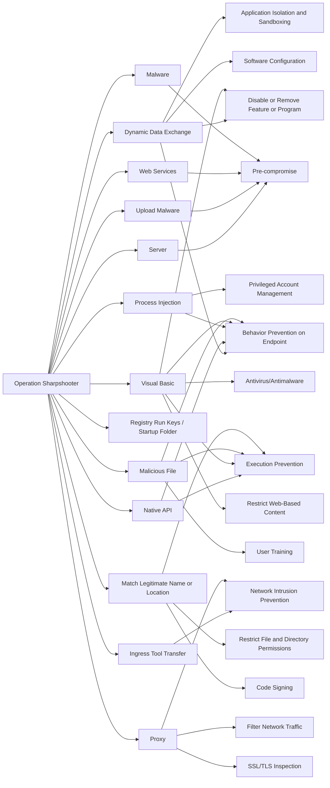

---
tags:
   - campaigns
---
# Operation Sharpshooter
## ID:C0013
[Operation Sharpshooter](/mitre/campaigns/C0013) was a global cyber espionage campaign that targeted nuclear, defense, government, energy, and financial companies, with many located in Germany, Turkey, the United Kingdom, and the United States. Security researchers noted the campaign shared many similarities with previous [Lazarus Group](/mitre/groups/G0032) operations, including fake job recruitment lures and shared malware code.(Citation: McAfee Sharpshooter December 2018)(Citation: Bleeping Computer Op Sharpshooter March 2019)(Citation: Threatpost New Op Sharpshooter Data March 2019)    
## Techniques Used By Campaign
* [Dynamic Data Exchange](techniques/T1559/002)
* [Server](techniques/T1584/004)
* [Upload Malware](techniques/T1608/001)
* [Web Services](techniques/T1583/006)
* [Native API](techniques/T1106)
* [Process Injection](techniques/T1055)
* [Visual Basic](techniques/T1059/005)
* [Registry Run Keys / Startup Folder](techniques/T1547/001)
* [Ingress Tool Transfer](techniques/T1105)
* [Malware](techniques/T1587/001)
* [Malicious File](techniques/T1204/002)
* [Match Legitimate Name or Location](techniques/T1036/005)
* [Proxy](techniques/T1090)

# Summary of Techniques and Mitigations
