---
tags:
   - campaigns
---
# Operation Wocao
## ID:C0014
[Operation Wocao](/mitre/campaigns/C0014) was a cyber espionage campaign that targeted organizations around the world, including in Brazil, China, France, Germany, Italy, Mexico, Portugal, Spain, the United Kingdom, and the United States. The suspected China-based actors compromised government organizations and managed service providers, as well as aviation, construction, energy, finance, health care, insurance, offshore engineering, software development, and transportation companies.(Citation: FoxIT Wocao December 2019)

Security researchers assessed the [Operation Wocao](/mitre/campaigns/C0014) actors used similar TTPs and tools as APT20, suggesting a possible overlap. [Operation Wocao](/mitre/campaigns/C0014) was named after an observed command line entry by one of the threat actors, possibly out of frustration from losing webshell access.(Citation: FoxIT Wocao December 2019)
## Techniques Used By Campaign
* [Query Registry](/mitre/techniques/T1012)
* [LSASS Memory](/mitre/techniques/T1003/001)
* [Keylogging](/mitre/techniques/T1056/001)
* [Security Software Discovery](/mitre/techniques/T1518/001)
* [Remote System Discovery](/mitre/techniques/T1018)
* [Asymmetric Cryptography](/mitre/techniques/T1573/002)
* [Malware](/mitre/techniques/T1587/001)
* [Windows Command Shell](/mitre/techniques/T1059/003)
* [Password Managers](/mitre/techniques/T1555/005)
* [Private Keys](/mitre/techniques/T1552/004)
* [Automated Collection](/mitre/techniques/T1119)
* [System Network Connections Discovery](/mitre/techniques/T1049)
* [Email Accounts](/mitre/techniques/T1585/002)
* [System Time Discovery](/mitre/techniques/T1124)
* [Non-Standard Port](/mitre/techniques/T1571)
* [Multi-Factor Authentication Interception](/mitre/techniques/T1111)
* [Exploit Public-Facing Application](/mitre/techniques/T1190)
* [Multi-hop Proxy](/mitre/techniques/T1090/003)
* [Local Data Staging](/mitre/techniques/T1074/001)
* [System Owner/User Discovery](/mitre/techniques/T1033)
* [Web Protocols](/mitre/techniques/T1071/001)
* [Service Execution](/mitre/techniques/T1569/002)
* [Data from Local System](/mitre/techniques/T1005)
* [Clipboard Data](/mitre/techniques/T1115)
* [Server](/mitre/techniques/T1583/004)
* [Archive via Utility](/mitre/techniques/T1560/001)
* [Native API](/mitre/techniques/T1106)
* [Local Groups](/mitre/techniques/T1069/001)
* [Valid Accounts](/mitre/techniques/T1078)
* [Network Share Discovery](/mitre/techniques/T1135)
* [File Deletion](/mitre/techniques/T1070/004)
* [Data Obfuscation](/mitre/techniques/T1001)
* [Tool](/mitre/techniques/T1588/002)
* [Kerberoasting](/mitre/techniques/T1558/003)
* [SMB/Windows Admin Shares](/mitre/techniques/T1021/002)
* [Lateral Tool Transfer](/mitre/techniques/T1570)
* [Visual Basic](/mitre/techniques/T1059/005)
* [Internet Connection Discovery](/mitre/techniques/T1016/001)
* [Domain Account](/mitre/techniques/T1087/002)
* [Domain Accounts](/mitre/techniques/T1078/002)
* [Process Injection](/mitre/techniques/T1055)
* [File and Directory Discovery](/mitre/techniques/T1083)
* [Gather Victim Identity Information](/mitre/techniques/T1589)
* [Python](/mitre/techniques/T1059/006)
* [Modify Registry](/mitre/techniques/T1112)
* [Internal Proxy](/mitre/techniques/T1090/001)
* [Proxy](/mitre/techniques/T1090)
* [Exfiltration Over C2 Channel](/mitre/techniques/T1041)
* [Match Legitimate Name or Location](/mitre/techniques/T1036/005)
* [Disable or Modify System Firewall](/mitre/techniques/T1562/004)
* [System Service Discovery](/mitre/techniques/T1007)
* [Peripheral Device Discovery](/mitre/techniques/T1120)
* [DCSync](/mitre/techniques/T1003/006)
* [Indicator Removal from Tools](/mitre/techniques/T1027/005)
* [Scheduled Task](/mitre/techniques/T1053/005)
* [System Information Discovery](/mitre/techniques/T1082)
* [Command Obfuscation](/mitre/techniques/T1027/010)
* [PowerShell](/mitre/techniques/T1059/001)
* [Windows Management Instrumentation](/mitre/techniques/T1047)
* [Network Service Discovery](/mitre/techniques/T1046)
* [Non-Application Layer Protocol](/mitre/techniques/T1095)
* [System Network Configuration Discovery](/mitre/techniques/T1016)
* [External Remote Services](/mitre/techniques/T1133)
* [Clear Windows Event Logs](/mitre/techniques/T1070/001)
* [Web Shell](/mitre/techniques/T1505/003)
* [Software Discovery](/mitre/techniques/T1518)
* [Ingress Tool Transfer](/mitre/techniques/T1105)
* [Local Accounts](/mitre/techniques/T1078/003)
* [Process Discovery](/mitre/techniques/T1057)

# Summary of Techniques and Mitigations

```mermaid
flowchart LR
group[Operation Wocao] --> T1012[Query Registry]
group[Operation Wocao] --> T1003.001[LSASS Memory]
T1003.001[LSASS Memory] --> M1028[Operating System Configuration]
T1003.001[LSASS Memory] --> M1043[Credential Access Protection]
T1003.001[LSASS Memory] --> M1025[Privileged Process Integrity]
T1003.001[LSASS Memory] --> M1026[Privileged Account Management]
T1003.001[LSASS Memory] --> M1017[User Training]
T1003.001[LSASS Memory] --> M1040[Behavior Prevention on Endpoint]
T1003.001[LSASS Memory] --> M1027[Password Policies]
group[Operation Wocao] --> T1056.001[Keylogging]
group[Operation Wocao] --> T1518.001[Security Software Discovery]
group[Operation Wocao] --> T1018[Remote System Discovery]
group[Operation Wocao] --> T1573.002[Asymmetric Cryptography]
T1573.002[Asymmetric Cryptography] --> M1031[Network Intrusion Prevention]
T1573.002[Asymmetric Cryptography] --> M1020[SSL/TLS Inspection]
group[Operation Wocao] --> T1587.001[Malware]
T1587.001[Malware] --> M1056[Pre-compromise]
group[Operation Wocao] --> T1059.003[Windows Command Shell]
T1059.003[Windows Command Shell] --> M1038[Execution Prevention]
group[Operation Wocao] --> T1555.005[Password Managers]
T1555.005[Password Managers] --> M1051[Update Software]
T1555.005[Password Managers] --> M1054[Software Configuration]
T1555.005[Password Managers] --> M1027[Password Policies]
group[Operation Wocao] --> T1552.004[Private Keys]
T1552.004[Private Keys] --> M1027[Password Policies]
T1552.004[Private Keys] --> M1022[Restrict File and Directory Permissions]
T1552.004[Private Keys] --> M1047[Audit]
T1552.004[Private Keys] --> M1041[Encrypt Sensitive Information]
group[Operation Wocao] --> T1119[Automated Collection]
T1119[Automated Collection] --> M1029[Remote Data Storage]
T1119[Automated Collection] --> M1041[Encrypt Sensitive Information]
group[Operation Wocao] --> T1049[System Network Connections Discovery]
group[Operation Wocao] --> T1585.002[Email Accounts]
T1585.002[Email Accounts] --> M1056[Pre-compromise]
group[Operation Wocao] --> T1124[System Time Discovery]
group[Operation Wocao] --> T1571[Non-Standard Port]
T1571[Non-Standard Port] --> M1030[Network Segmentation]
T1571[Non-Standard Port] --> M1031[Network Intrusion Prevention]
group[Operation Wocao] --> T1111[Multi-Factor Authentication Interception]
T1111[Multi-Factor Authentication Interception] --> M1017[User Training]
group[Operation Wocao] --> T1190[Exploit Public-Facing Application]
T1190[Exploit Public-Facing Application] --> M1048[Application Isolation and Sandboxing]
T1190[Exploit Public-Facing Application] --> M1030[Network Segmentation]
T1190[Exploit Public-Facing Application] --> M1016[Vulnerability Scanning]
T1190[Exploit Public-Facing Application] --> M1026[Privileged Account Management]
T1190[Exploit Public-Facing Application] --> M1050[Exploit Protection]
T1190[Exploit Public-Facing Application] --> M1051[Update Software]
group[Operation Wocao] --> T1090.003[Multi-hop Proxy]
T1090.003[Multi-hop Proxy] --> M1037[Filter Network Traffic]
group[Operation Wocao] --> T1074.001[Local Data Staging]
group[Operation Wocao] --> T1033[System Owner/User Discovery]
group[Operation Wocao] --> T1071.001[Web Protocols]
T1071.001[Web Protocols] --> M1031[Network Intrusion Prevention]
group[Operation Wocao] --> T1569.002[Service Execution]
T1569.002[Service Execution] --> M1026[Privileged Account Management]
T1569.002[Service Execution] --> M1040[Behavior Prevention on Endpoint]
T1569.002[Service Execution] --> M1022[Restrict File and Directory Permissions]
group[Operation Wocao] --> T1005[Data from Local System]
T1005[Data from Local System] --> M1057[Data Loss Prevention]
group[Operation Wocao] --> T1115[Clipboard Data]
group[Operation Wocao] --> T1583.004[Server]
T1583.004[Server] --> M1056[Pre-compromise]
group[Operation Wocao] --> T1560.001[Archive via Utility]
T1560.001[Archive via Utility] --> M1047[Audit]
group[Operation Wocao] --> T1106[Native API]
T1106[Native API] --> M1038[Execution Prevention]
T1106[Native API] --> M1040[Behavior Prevention on Endpoint]
group[Operation Wocao] --> T1069.001[Local Groups]
group[Operation Wocao] --> T1078[Valid Accounts]
T1078[Valid Accounts] --> M1027[Password Policies]
T1078[Valid Accounts] --> M1018[User Account Management]
T1078[Valid Accounts] --> M1026[Privileged Account Management]
T1078[Valid Accounts] --> M1013[Application Developer Guidance]
T1078[Valid Accounts] --> M1017[User Training]
T1078[Valid Accounts] --> M1015[Active Directory Configuration]
T1078[Valid Accounts] --> M1036[Account Use Policies]
group[Operation Wocao] --> T1135[Network Share Discovery]
T1135[Network Share Discovery] --> M1028[Operating System Configuration]
group[Operation Wocao] --> T1070.004[File Deletion]
group[Operation Wocao] --> T1001[Data Obfuscation]
T1001[Data Obfuscation] --> M1031[Network Intrusion Prevention]
group[Operation Wocao] --> T1588.002[Tool]
T1588.002[Tool] --> M1056[Pre-compromise]
group[Operation Wocao] --> T1558.003[Kerberoasting]
T1558.003[Kerberoasting] --> M1027[Password Policies]
T1558.003[Kerberoasting] --> M1041[Encrypt Sensitive Information]
T1558.003[Kerberoasting] --> M1026[Privileged Account Management]
group[Operation Wocao] --> T1021.002[SMB/Windows Admin Shares]
T1021.002[SMB/Windows Admin Shares] --> M1026[Privileged Account Management]
T1021.002[SMB/Windows Admin Shares] --> M1035[Limit Access to Resource Over Network]
T1021.002[SMB/Windows Admin Shares] --> M1037[Filter Network Traffic]
T1021.002[SMB/Windows Admin Shares] --> M1027[Password Policies]
group[Operation Wocao] --> T1570[Lateral Tool Transfer]
T1570[Lateral Tool Transfer] --> M1037[Filter Network Traffic]
T1570[Lateral Tool Transfer] --> M1031[Network Intrusion Prevention]
group[Operation Wocao] --> T1059.005[Visual Basic]
T1059.005[Visual Basic] --> M1042[Disable or Remove Feature or Program]
T1059.005[Visual Basic] --> M1049[Antivirus/Antimalware]
T1059.005[Visual Basic] --> M1038[Execution Prevention]
T1059.005[Visual Basic] --> M1040[Behavior Prevention on Endpoint]
T1059.005[Visual Basic] --> M1021[Restrict Web-Based Content]
group[Operation Wocao] --> T1016.001[Internet Connection Discovery]
group[Operation Wocao] --> T1087.002[Domain Account]
T1087.002[Domain Account] --> M1028[Operating System Configuration]
group[Operation Wocao] --> T1078.002[Domain Accounts]
T1078.002[Domain Accounts] --> M1032[Multi-factor Authentication]
T1078.002[Domain Accounts] --> M1026[Privileged Account Management]
T1078.002[Domain Accounts] --> M1017[User Training]
group[Operation Wocao] --> T1055[Process Injection]
T1055[Process Injection] --> M1026[Privileged Account Management]
T1055[Process Injection] --> M1040[Behavior Prevention on Endpoint]
group[Operation Wocao] --> T1083[File and Directory Discovery]
group[Operation Wocao] --> T1589[Gather Victim Identity Information]
T1589[Gather Victim Identity Information] --> M1056[Pre-compromise]
group[Operation Wocao] --> T1059.006[Python]
T1059.006[Python] --> M1047[Audit]
T1059.006[Python] --> M1049[Antivirus/Antimalware]
T1059.006[Python] --> M1033[Limit Software Installation]
T1059.006[Python] --> M1038[Execution Prevention]
group[Operation Wocao] --> T1112[Modify Registry]
T1112[Modify Registry] --> M1024[Restrict Registry Permissions]
group[Operation Wocao] --> T1090.001[Internal Proxy]
T1090.001[Internal Proxy] --> M1031[Network Intrusion Prevention]
group[Operation Wocao] --> T1090[Proxy]
T1090[Proxy] --> M1037[Filter Network Traffic]
T1090[Proxy] --> M1031[Network Intrusion Prevention]
T1090[Proxy] --> M1020[SSL/TLS Inspection]
group[Operation Wocao] --> T1041[Exfiltration Over C2 Channel]
T1041[Exfiltration Over C2 Channel] --> M1031[Network Intrusion Prevention]
T1041[Exfiltration Over C2 Channel] --> M1057[Data Loss Prevention]
group[Operation Wocao] --> T1036.005[Match Legitimate Name or Location]
T1036.005[Match Legitimate Name or Location] --> M1022[Restrict File and Directory Permissions]
T1036.005[Match Legitimate Name or Location] --> M1038[Execution Prevention]
T1036.005[Match Legitimate Name or Location] --> M1045[Code Signing]
group[Operation Wocao] --> T1562.004[Disable or Modify System Firewall]
T1562.004[Disable or Modify System Firewall] --> M1047[Audit]
T1562.004[Disable or Modify System Firewall] --> M1018[User Account Management]
T1562.004[Disable or Modify System Firewall] --> M1024[Restrict Registry Permissions]
T1562.004[Disable or Modify System Firewall] --> M1022[Restrict File and Directory Permissions]
group[Operation Wocao] --> T1007[System Service Discovery]
group[Operation Wocao] --> T1120[Peripheral Device Discovery]
group[Operation Wocao] --> T1003.006[DCSync]
T1003.006[DCSync] --> M1027[Password Policies]
T1003.006[DCSync] --> M1015[Active Directory Configuration]
T1003.006[DCSync] --> M1026[Privileged Account Management]
group[Operation Wocao] --> T1027.005[Indicator Removal from Tools]
group[Operation Wocao] --> T1053.005[Scheduled Task]
T1053.005[Scheduled Task] --> M1026[Privileged Account Management]
T1053.005[Scheduled Task] --> M1018[User Account Management]
T1053.005[Scheduled Task] --> M1047[Audit]
T1053.005[Scheduled Task] --> M1028[Operating System Configuration]
group[Operation Wocao] --> T1082[System Information Discovery]
group[Operation Wocao] --> T1027.010[Command Obfuscation]
T1027.010[Command Obfuscation] --> M1040[Behavior Prevention on Endpoint]
T1027.010[Command Obfuscation] --> M1049[Antivirus/Antimalware]
group[Operation Wocao] --> T1059.001[PowerShell]
T1059.001[PowerShell] --> M1042[Disable or Remove Feature or Program]
T1059.001[PowerShell] --> M1049[Antivirus/Antimalware]
T1059.001[PowerShell] --> M1045[Code Signing]
T1059.001[PowerShell] --> M1026[Privileged Account Management]
T1059.001[PowerShell] --> M1038[Execution Prevention]
group[Operation Wocao] --> T1047[Windows Management Instrumentation]
T1047[Windows Management Instrumentation] --> M1026[Privileged Account Management]
T1047[Windows Management Instrumentation] --> M1040[Behavior Prevention on Endpoint]
T1047[Windows Management Instrumentation] --> M1018[User Account Management]
T1047[Windows Management Instrumentation] --> M1038[Execution Prevention]
group[Operation Wocao] --> T1046[Network Service Discovery]
T1046[Network Service Discovery] --> M1042[Disable or Remove Feature or Program]
T1046[Network Service Discovery] --> M1031[Network Intrusion Prevention]
T1046[Network Service Discovery] --> M1030[Network Segmentation]
group[Operation Wocao] --> T1095[Non-Application Layer Protocol]
T1095[Non-Application Layer Protocol] --> M1031[Network Intrusion Prevention]
T1095[Non-Application Layer Protocol] --> M1037[Filter Network Traffic]
T1095[Non-Application Layer Protocol] --> M1030[Network Segmentation]
group[Operation Wocao] --> T1016[System Network Configuration Discovery]
group[Operation Wocao] --> T1133[External Remote Services]
T1133[External Remote Services] --> M1030[Network Segmentation]
T1133[External Remote Services] --> M1042[Disable or Remove Feature or Program]
T1133[External Remote Services] --> M1035[Limit Access to Resource Over Network]
T1133[External Remote Services] --> M1032[Multi-factor Authentication]
group[Operation Wocao] --> T1070.001[Clear Windows Event Logs]
T1070.001[Clear Windows Event Logs] --> M1022[Restrict File and Directory Permissions]
T1070.001[Clear Windows Event Logs] --> M1029[Remote Data Storage]
T1070.001[Clear Windows Event Logs] --> M1041[Encrypt Sensitive Information]
group[Operation Wocao] --> T1505.003[Web Shell]
T1505.003[Web Shell] --> M1042[Disable or Remove Feature or Program]
T1505.003[Web Shell] --> M1018[User Account Management]
group[Operation Wocao] --> T1518[Software Discovery]
group[Operation Wocao] --> T1105[Ingress Tool Transfer]
T1105[Ingress Tool Transfer] --> M1031[Network Intrusion Prevention]
group[Operation Wocao] --> T1078.003[Local Accounts]
T1078.003[Local Accounts] --> M1026[Privileged Account Management]
T1078.003[Local Accounts] --> M1027[Password Policies]
group[Operation Wocao] --> T1057[Process Discovery]
```
