---
tags:
   - campaigns
---
# C0015
## ID:C0015
[C0015](campaigns/C0015) was a ransomware intrusion during which the unidentified attackers used [Bazar](software/S0534), [Cobalt Strike](software/S0154), and [Conti](software/S0575), along with other tools, over a 5 day period. Security researchers assessed the actors likely used the widely-circulated [Conti](software/S0575) ransomware playbook based on the observed pattern of activity and operator errors.(Citation: DFIR Conti Bazar Nov 2021)
## Techniques Used By Campaign
* [Network Share Discovery](techniques/T1135)
* [Windows Management Instrumentation](techniques/T1047)
* [File and Directory Discovery](techniques/T1083)
* [Code Signing](techniques/T1553/002)
* [Exfiltration to Cloud Storage](techniques/T1567/002)
* [Malicious File](techniques/T1204/002)
* [Local Data Staging](techniques/T1074/001)
* [Rundll32](techniques/T1218/011)
* [Spearphishing Attachment](techniques/T1566/001)
* [Data from Local System](techniques/T1005)
* [Local Groups](techniques/T1069/001)
* [Process Discovery](techniques/T1057)
* [Domain Groups](techniques/T1069/002)
* [Ingress Tool Transfer](techniques/T1105)
* [Dynamic-link Library Injection](techniques/T1055/001)
* [Visual Basic](techniques/T1059/005)
* [Data Encrypted for Impact](techniques/T1486)
* [Obfuscated Files or Information](techniques/T1027)
* [Windows Command Shell](techniques/T1059/003)
* [Regsvr32](techniques/T1218/010)
* [Malware](techniques/T1588/001)
* [Remote Desktop Protocol](techniques/T1021/001)
* [System Time Discovery](techniques/T1124)
* [Data Transfer Size Limits](techniques/T1030)
* [Remote Access Software](techniques/T1219)
* [Data from Network Shared Drive](techniques/T1039)
* [Lateral Tool Transfer](techniques/T1570)
* [Remote System Discovery](techniques/T1018)
* [System Network Configuration Discovery](techniques/T1016)
* [Tool](techniques/T1588/002)
* [JavaScript](techniques/T1059/007)
* [Masquerading](techniques/T1036)
* [Domain Trust Discovery](techniques/T1482)
* [Mshta](techniques/T1218/005)

# Summary of Techniques and Mitigations

```mermaid
flowchart LR
group[C0015] --> T1135[Network Share Discovery]
T1135[Network Share Discovery] --> M1028[Operating System Configuration]
group[C0015] --> T1047[Windows Management Instrumentation]
T1047[Windows Management Instrumentation] --> M1026[Privileged Account Management]
T1047[Windows Management Instrumentation] --> M1040[Behavior Prevention on Endpoint]
T1047[Windows Management Instrumentation] --> M1018[User Account Management]
T1047[Windows Management Instrumentation] --> M1038[Execution Prevention]
group[C0015] --> T1083[File and Directory Discovery]
group[C0015] --> T1553.002[Code Signing]
group[C0015] --> T1567.002[Exfiltration to Cloud Storage]
T1567.002[Exfiltration to Cloud Storage] --> M1021[Restrict Web-Based Content]
group[C0015] --> T1204.002[Malicious File]
T1204.002[Malicious File] --> M1038[Execution Prevention]
T1204.002[Malicious File] --> M1040[Behavior Prevention on Endpoint]
T1204.002[Malicious File] --> M1017[User Training]
group[C0015] --> T1074.001[Local Data Staging]
group[C0015] --> T1218.011[Rundll32]
T1218.011[Rundll32] --> M1050[Exploit Protection]
group[C0015] --> T1566.001[Spearphishing Attachment]
T1566.001[Spearphishing Attachment] --> M1049[Antivirus/Antimalware]
T1566.001[Spearphishing Attachment] --> M1031[Network Intrusion Prevention]
T1566.001[Spearphishing Attachment] --> M1054[Software Configuration]
T1566.001[Spearphishing Attachment] --> M1017[User Training]
T1566.001[Spearphishing Attachment] --> M1021[Restrict Web-Based Content]
group[C0015] --> T1005[Data from Local System]
T1005[Data from Local System] --> M1057[Data Loss Prevention]
group[C0015] --> T1069.001[Local Groups]
group[C0015] --> T1057[Process Discovery]
group[C0015] --> T1069.002[Domain Groups]
group[C0015] --> T1105[Ingress Tool Transfer]
T1105[Ingress Tool Transfer] --> M1031[Network Intrusion Prevention]
group[C0015] --> T1055.001[Dynamic-link Library Injection]
T1055.001[Dynamic-link Library Injection] --> M1040[Behavior Prevention on Endpoint]
group[C0015] --> T1059.005[Visual Basic]
T1059.005[Visual Basic] --> M1042[Disable or Remove Feature or Program]
T1059.005[Visual Basic] --> M1049[Antivirus/Antimalware]
T1059.005[Visual Basic] --> M1038[Execution Prevention]
T1059.005[Visual Basic] --> M1040[Behavior Prevention on Endpoint]
T1059.005[Visual Basic] --> M1021[Restrict Web-Based Content]
group[C0015] --> T1486[Data Encrypted for Impact]
T1486[Data Encrypted for Impact] --> M1040[Behavior Prevention on Endpoint]
T1486[Data Encrypted for Impact] --> M1053[Data Backup]
group[C0015] --> T1027[Obfuscated Files or Information]
T1027[Obfuscated Files or Information] --> M1047[Audit]
T1027[Obfuscated Files or Information] --> M1040[Behavior Prevention on Endpoint]
T1027[Obfuscated Files or Information] --> M1017[User Training]
T1027[Obfuscated Files or Information] --> M1049[Antivirus/Antimalware]
group[C0015] --> T1059.003[Windows Command Shell]
T1059.003[Windows Command Shell] --> M1038[Execution Prevention]
group[C0015] --> T1218.010[Regsvr32]
T1218.010[Regsvr32] --> M1050[Exploit Protection]
group[C0015] --> T1588.001[Malware]
T1588.001[Malware] --> M1056[Pre-compromise]
group[C0015] --> T1021.001[Remote Desktop Protocol]
T1021.001[Remote Desktop Protocol] --> M1047[Audit]
T1021.001[Remote Desktop Protocol] --> M1035[Limit Access to Resource Over Network]
T1021.001[Remote Desktop Protocol] --> M1030[Network Segmentation]
T1021.001[Remote Desktop Protocol] --> M1028[Operating System Configuration]
T1021.001[Remote Desktop Protocol] --> M1042[Disable or Remove Feature or Program]
T1021.001[Remote Desktop Protocol] --> M1018[User Account Management]
T1021.001[Remote Desktop Protocol] --> M1032[Multi-factor Authentication]
T1021.001[Remote Desktop Protocol] --> M1026[Privileged Account Management]
group[C0015] --> T1124[System Time Discovery]
group[C0015] --> T1030[Data Transfer Size Limits]
T1030[Data Transfer Size Limits] --> M1031[Network Intrusion Prevention]
group[C0015] --> T1219[Remote Access Software]
T1219[Remote Access Software] --> M1038[Execution Prevention]
T1219[Remote Access Software] --> M1037[Filter Network Traffic]
T1219[Remote Access Software] --> M1031[Network Intrusion Prevention]
T1219[Remote Access Software] --> M1042[Disable or Remove Feature or Program]
group[C0015] --> T1039[Data from Network Shared Drive]
group[C0015] --> T1570[Lateral Tool Transfer]
T1570[Lateral Tool Transfer] --> M1037[Filter Network Traffic]
T1570[Lateral Tool Transfer] --> M1031[Network Intrusion Prevention]
group[C0015] --> T1018[Remote System Discovery]
group[C0015] --> T1016[System Network Configuration Discovery]
group[C0015] --> T1588.002[Tool]
T1588.002[Tool] --> M1056[Pre-compromise]
group[C0015] --> T1059.007[JavaScript]
T1059.007[JavaScript] --> M1040[Behavior Prevention on Endpoint]
T1059.007[JavaScript] --> M1038[Execution Prevention]
T1059.007[JavaScript] --> M1042[Disable or Remove Feature or Program]
T1059.007[JavaScript] --> M1021[Restrict Web-Based Content]
group[C0015] --> T1036[Masquerading]
T1036[Masquerading] --> M1017[User Training]
T1036[Masquerading] --> M1045[Code Signing]
T1036[Masquerading] --> M1040[Behavior Prevention on Endpoint]
T1036[Masquerading] --> M1022[Restrict File and Directory Permissions]
T1036[Masquerading] --> M1049[Antivirus/Antimalware]
T1036[Masquerading] --> M1038[Execution Prevention]
group[C0015] --> T1482[Domain Trust Discovery]
T1482[Domain Trust Discovery] --> M1047[Audit]
T1482[Domain Trust Discovery] --> M1030[Network Segmentation]
group[C0015] --> T1218.005[Mshta]
T1218.005[Mshta] --> M1038[Execution Prevention]
T1218.005[Mshta] --> M1042[Disable or Remove Feature or Program]
```
