---
tags:
   - campaigns
---
# Operation Dust Storm
## ID:C0016
[Operation Dust Storm](/mitre/campaigns/C0016) was a long-standing persistent cyber espionage campaign that targeted multiple industries in Japan, South Korea, the United States, Europe, and several Southeast Asian countries. By 2015, the [Operation Dust Storm](/mitre/campaigns/C0016) threat actors shifted from government and defense-related intelligence targets to Japanese companies or Japanese subdivisions of larger foreign organizations supporting Japan's critical infrastructure, including electricity generation, oil and natural gas, finance, transportation, and construction.(Citation: Cylance Dust Storm)

[Operation Dust Storm](/mitre/campaigns/C0016) threat actors also began to use Android backdoors in their operations by 2015, with all identified victims at the time residing in Japan or South Korea.(Citation: Cylance Dust Storm)
## Techniques Used By Campaign
* [Malicious File](/mitre/techniques/T1204/002)
* [Malicious Link](/mitre/techniques/T1204/001)
* [Domains](/mitre/techniques/T1583/001)
* [Software Packing](/mitre/techniques/T1027/002)
* [Spearphishing Attachment](/mitre/techniques/T1566/001)
* [Drive-by Compromise](/mitre/techniques/T1189)
* [Encrypted/Encoded File](/mitre/techniques/T1027/013)
* [Masquerading](/mitre/techniques/T1036)
* [Mshta](/mitre/techniques/T1218/005)
* [Dynamic Resolution](/mitre/techniques/T1568)
* [Visual Basic](/mitre/techniques/T1059/005)
* [Software Discovery](/mitre/techniques/T1518)
* [Exploitation for Client Execution](/mitre/techniques/T1203)
* [JavaScript](/mitre/techniques/T1059/007)
* [Email Accounts](/mitre/techniques/T1585/002)
* [Deobfuscate/Decode Files or Information](/mitre/techniques/T1140)
* [Spearphishing Link](/mitre/techniques/T1566/002)

# Summary of Techniques and Mitigations

```mermaid
flowchart LR
group[Operation Dust Storm] --> T1204.002[Malicious File]
T1204.002[Malicious File] --> M1038[Execution Prevention]
T1204.002[Malicious File] --> M1040[Behavior Prevention on Endpoint]
T1204.002[Malicious File] --> M1017[User Training]
group[Operation Dust Storm] --> T1204.001[Malicious Link]
T1204.001[Malicious Link] --> M1031[Network Intrusion Prevention]
T1204.001[Malicious Link] --> M1017[User Training]
T1204.001[Malicious Link] --> M1021[Restrict Web-Based Content]
group[Operation Dust Storm] --> T1583.001[Domains]
T1583.001[Domains] --> M1056[Pre-compromise]
group[Operation Dust Storm] --> T1027.002[Software Packing]
T1027.002[Software Packing] --> M1049[Antivirus/Antimalware]
group[Operation Dust Storm] --> T1566.001[Spearphishing Attachment]
T1566.001[Spearphishing Attachment] --> M1049[Antivirus/Antimalware]
T1566.001[Spearphishing Attachment] --> M1031[Network Intrusion Prevention]
T1566.001[Spearphishing Attachment] --> M1054[Software Configuration]
T1566.001[Spearphishing Attachment] --> M1017[User Training]
T1566.001[Spearphishing Attachment] --> M1021[Restrict Web-Based Content]
group[Operation Dust Storm] --> T1189[Drive-by Compromise]
T1189[Drive-by Compromise] --> M1050[Exploit Protection]
T1189[Drive-by Compromise] --> M1051[Update Software]
T1189[Drive-by Compromise] --> M1048[Application Isolation and Sandboxing]
T1189[Drive-by Compromise] --> M1021[Restrict Web-Based Content]
group[Operation Dust Storm] --> T1027.013[Encrypted/Encoded File]
T1027.013[Encrypted/Encoded File] --> M1049[Antivirus/Antimalware]
T1027.013[Encrypted/Encoded File] --> M1040[Behavior Prevention on Endpoint]
group[Operation Dust Storm] --> T1036[Masquerading]
T1036[Masquerading] --> M1017[User Training]
T1036[Masquerading] --> M1045[Code Signing]
T1036[Masquerading] --> M1040[Behavior Prevention on Endpoint]
T1036[Masquerading] --> M1022[Restrict File and Directory Permissions]
T1036[Masquerading] --> M1049[Antivirus/Antimalware]
T1036[Masquerading] --> M1038[Execution Prevention]
group[Operation Dust Storm] --> T1218.005[Mshta]
T1218.005[Mshta] --> M1038[Execution Prevention]
T1218.005[Mshta] --> M1042[Disable or Remove Feature or Program]
group[Operation Dust Storm] --> T1568[Dynamic Resolution]
T1568[Dynamic Resolution] --> M1031[Network Intrusion Prevention]
T1568[Dynamic Resolution] --> M1021[Restrict Web-Based Content]
group[Operation Dust Storm] --> T1059.005[Visual Basic]
T1059.005[Visual Basic] --> M1042[Disable or Remove Feature or Program]
T1059.005[Visual Basic] --> M1049[Antivirus/Antimalware]
T1059.005[Visual Basic] --> M1038[Execution Prevention]
T1059.005[Visual Basic] --> M1040[Behavior Prevention on Endpoint]
T1059.005[Visual Basic] --> M1021[Restrict Web-Based Content]
group[Operation Dust Storm] --> T1518[Software Discovery]
group[Operation Dust Storm] --> T1203[Exploitation for Client Execution]
T1203[Exploitation for Client Execution] --> M1050[Exploit Protection]
T1203[Exploitation for Client Execution] --> M1048[Application Isolation and Sandboxing]
group[Operation Dust Storm] --> T1059.007[JavaScript]
T1059.007[JavaScript] --> M1040[Behavior Prevention on Endpoint]
T1059.007[JavaScript] --> M1038[Execution Prevention]
T1059.007[JavaScript] --> M1042[Disable or Remove Feature or Program]
T1059.007[JavaScript] --> M1021[Restrict Web-Based Content]
group[Operation Dust Storm] --> T1585.002[Email Accounts]
T1585.002[Email Accounts] --> M1056[Pre-compromise]
group[Operation Dust Storm] --> T1140[Deobfuscate/Decode Files or Information]
group[Operation Dust Storm] --> T1566.002[Spearphishing Link]
T1566.002[Spearphishing Link] --> M1054[Software Configuration]
T1566.002[Spearphishing Link] --> M1021[Restrict Web-Based Content]
T1566.002[Spearphishing Link] --> M1047[Audit]
T1566.002[Spearphishing Link] --> M1018[User Account Management]
T1566.002[Spearphishing Link] --> M1017[User Training]
```
