---
tags:
   - campaigns
---
# C0017
## ID:C0017
[C0017](/mitre/campaigns/C0017) was an [APT41](/mitre/groups/G0096) campaign conducted between May 2021 and February 2022 that successfully compromised at least six U.S. state government networks through the exploitation of vulnerable Internet facing web applications. During [C0017](/mitre/campaigns/C0017), [APT41](/mitre/groups/G0096) was quick to adapt and use publicly-disclosed as well as zero-day vulnerabilities for initial access, and in at least two cases re-compromised victims following remediation efforts. The goals of [C0017](/mitre/campaigns/C0017) are unknown, however [APT41](/mitre/groups/G0096) was observed exfiltrating Personal Identifiable Information (PII).(Citation: Mandiant APT41)
## Techniques Used By Campaign
* [System Information Discovery](/mitre/techniques/T1082)
* [Software Packing](/mitre/techniques/T1027/002)
* [System Owner/User Discovery](/mitre/techniques/T1033)
* [Masquerade Task or Service](/mitre/techniques/T1036/004)
* [System Network Configuration Discovery](/mitre/techniques/T1016)
* [Scheduled Task](/mitre/techniques/T1053/005)
* [Exploit Public-Facing Application](/mitre/techniques/T1190)
* [Web Shell](/mitre/techniques/T1505/003)
* [Deobfuscate/Decode Files or Information](/mitre/techniques/T1140)
* [Security Account Manager](/mitre/techniques/T1003/002)
* [Obfuscated Files or Information](/mitre/techniques/T1027)
* [Exfiltration Over C2 Channel](/mitre/techniques/T1041)
* [Exfiltration Over Unencrypted Non-C2 Protocol](/mitre/techniques/T1048/003)
* [Exploitation for Privilege Escalation](/mitre/techniques/T1068)
* [Local Data Staging](/mitre/techniques/T1074/001)
* [Web Protocols](/mitre/techniques/T1071/001)
* [Data from Local System](/mitre/techniques/T1005)
* [Dead Drop Resolver](/mitre/techniques/T1102/001)
* [JavaScript](/mitre/techniques/T1059/007)
* [Hijack Execution Flow](/mitre/techniques/T1574)
* [Proxy](/mitre/techniques/T1090)
* [Match Legitimate Name or Location](/mitre/techniques/T1036/005)
* [Windows Command Shell](/mitre/techniques/T1059/003)
* [Protocol Impersonation](/mitre/techniques/T1001/003)
* [Access Token Manipulation](/mitre/techniques/T1134)
* [Exfiltration Over Web Service](/mitre/techniques/T1567)
* [Archive via Custom Method](/mitre/techniques/T1560/003)
* [Tool](/mitre/techniques/T1588/002)
* [Ingress Tool Transfer](/mitre/techniques/T1105)
* [Web Service](/mitre/techniques/T1102)

# Summary of Techniques and Mitigations

```mermaid
flowchart LR
group[C0017] --> T1082[System Information Discovery]
group[C0017] --> T1027.002[Software Packing]
T1027.002[Software Packing] --> M1049[Antivirus/Antimalware]
group[C0017] --> T1033[System Owner/User Discovery]
group[C0017] --> T1036.004[Masquerade Task or Service]
group[C0017] --> T1016[System Network Configuration Discovery]
group[C0017] --> T1053.005[Scheduled Task]
T1053.005[Scheduled Task] --> M1026[Privileged Account Management]
T1053.005[Scheduled Task] --> M1018[User Account Management]
T1053.005[Scheduled Task] --> M1047[Audit]
T1053.005[Scheduled Task] --> M1028[Operating System Configuration]
group[C0017] --> T1190[Exploit Public-Facing Application]
T1190[Exploit Public-Facing Application] --> M1048[Application Isolation and Sandboxing]
T1190[Exploit Public-Facing Application] --> M1030[Network Segmentation]
T1190[Exploit Public-Facing Application] --> M1016[Vulnerability Scanning]
T1190[Exploit Public-Facing Application] --> M1026[Privileged Account Management]
T1190[Exploit Public-Facing Application] --> M1050[Exploit Protection]
T1190[Exploit Public-Facing Application] --> M1051[Update Software]
group[C0017] --> T1505.003[Web Shell]
T1505.003[Web Shell] --> M1042[Disable or Remove Feature or Program]
T1505.003[Web Shell] --> M1018[User Account Management]
group[C0017] --> T1140[Deobfuscate/Decode Files or Information]
group[C0017] --> T1003.002[Security Account Manager]
T1003.002[Security Account Manager] --> M1027[Password Policies]
T1003.002[Security Account Manager] --> M1026[Privileged Account Management]
T1003.002[Security Account Manager] --> M1028[Operating System Configuration]
T1003.002[Security Account Manager] --> M1017[User Training]
group[C0017] --> T1027[Obfuscated Files or Information]
T1027[Obfuscated Files or Information] --> M1047[Audit]
T1027[Obfuscated Files or Information] --> M1040[Behavior Prevention on Endpoint]
T1027[Obfuscated Files or Information] --> M1017[User Training]
T1027[Obfuscated Files or Information] --> M1049[Antivirus/Antimalware]
group[C0017] --> T1041[Exfiltration Over C2 Channel]
T1041[Exfiltration Over C2 Channel] --> M1031[Network Intrusion Prevention]
T1041[Exfiltration Over C2 Channel] --> M1057[Data Loss Prevention]
group[C0017] --> T1048.003[Exfiltration Over Unencrypted Non-C2 Protocol]
T1048.003[Exfiltration Over Unencrypted Non-C2 Protocol] --> M1031[Network Intrusion Prevention]
T1048.003[Exfiltration Over Unencrypted Non-C2 Protocol] --> M1057[Data Loss Prevention]
T1048.003[Exfiltration Over Unencrypted Non-C2 Protocol] --> M1037[Filter Network Traffic]
T1048.003[Exfiltration Over Unencrypted Non-C2 Protocol] --> M1030[Network Segmentation]
group[C0017] --> T1068[Exploitation for Privilege Escalation]
T1068[Exploitation for Privilege Escalation] --> M1051[Update Software]
T1068[Exploitation for Privilege Escalation] --> M1050[Exploit Protection]
T1068[Exploitation for Privilege Escalation] --> M1048[Application Isolation and Sandboxing]
T1068[Exploitation for Privilege Escalation] --> M1019[Threat Intelligence Program]
T1068[Exploitation for Privilege Escalation] --> M1038[Execution Prevention]
group[C0017] --> T1074.001[Local Data Staging]
group[C0017] --> T1071.001[Web Protocols]
T1071.001[Web Protocols] --> M1031[Network Intrusion Prevention]
group[C0017] --> T1005[Data from Local System]
T1005[Data from Local System] --> M1057[Data Loss Prevention]
group[C0017] --> T1102.001[Dead Drop Resolver]
T1102.001[Dead Drop Resolver] --> M1021[Restrict Web-Based Content]
T1102.001[Dead Drop Resolver] --> M1031[Network Intrusion Prevention]
group[C0017] --> T1059.007[JavaScript]
T1059.007[JavaScript] --> M1040[Behavior Prevention on Endpoint]
T1059.007[JavaScript] --> M1038[Execution Prevention]
T1059.007[JavaScript] --> M1042[Disable or Remove Feature or Program]
T1059.007[JavaScript] --> M1021[Restrict Web-Based Content]
group[C0017] --> T1574[Hijack Execution Flow]
T1574[Hijack Execution Flow] --> M1052[User Account Control]
T1574[Hijack Execution Flow] --> M1040[Behavior Prevention on Endpoint]
T1574[Hijack Execution Flow] --> M1044[Restrict Library Loading]
T1574[Hijack Execution Flow] --> M1047[Audit]
T1574[Hijack Execution Flow] --> M1013[Application Developer Guidance]
T1574[Hijack Execution Flow] --> M1018[User Account Management]
T1574[Hijack Execution Flow] --> M1051[Update Software]
T1574[Hijack Execution Flow] --> M1038[Execution Prevention]
T1574[Hijack Execution Flow] --> M1022[Restrict File and Directory Permissions]
T1574[Hijack Execution Flow] --> M1024[Restrict Registry Permissions]
group[C0017] --> T1090[Proxy]
T1090[Proxy] --> M1037[Filter Network Traffic]
T1090[Proxy] --> M1031[Network Intrusion Prevention]
T1090[Proxy] --> M1020[SSL/TLS Inspection]
group[C0017] --> T1036.005[Match Legitimate Name or Location]
T1036.005[Match Legitimate Name or Location] --> M1022[Restrict File and Directory Permissions]
T1036.005[Match Legitimate Name or Location] --> M1038[Execution Prevention]
T1036.005[Match Legitimate Name or Location] --> M1045[Code Signing]
group[C0017] --> T1059.003[Windows Command Shell]
T1059.003[Windows Command Shell] --> M1038[Execution Prevention]
group[C0017] --> T1001.003[Protocol Impersonation]
T1001.003[Protocol Impersonation] --> M1031[Network Intrusion Prevention]
group[C0017] --> T1134[Access Token Manipulation]
T1134[Access Token Manipulation] --> M1018[User Account Management]
T1134[Access Token Manipulation] --> M1026[Privileged Account Management]
group[C0017] --> T1567[Exfiltration Over Web Service]
T1567[Exfiltration Over Web Service] --> M1021[Restrict Web-Based Content]
T1567[Exfiltration Over Web Service] --> M1057[Data Loss Prevention]
group[C0017] --> T1560.003[Archive via Custom Method]
group[C0017] --> T1588.002[Tool]
T1588.002[Tool] --> M1056[Pre-compromise]
group[C0017] --> T1105[Ingress Tool Transfer]
T1105[Ingress Tool Transfer] --> M1031[Network Intrusion Prevention]
group[C0017] --> T1102[Web Service]
T1102[Web Service] --> M1031[Network Intrusion Prevention]
T1102[Web Service] --> M1021[Restrict Web-Based Content]
```
