---
tags:
   - campaigns
---
# C0018
## ID:C0018

[C0018](/mitre/campaigns/C0018) was a month-long ransomware intrusion that successfully deployed [AvosLocker](/mitre/software/S1053) onto a compromised network. The unidentified actors gained initial access to the victim network through an exposed server and used a variety of open-source tools prior to executing [AvosLocker](/mitre/software/S1053).(Citation: Costa AvosLocker May 2022)(Citation: Cisco Talos Avos Jun 2022)
## Techniques Used By Campaign
* [Exploit Public-Facing Application](techniques/T1190)
* [Match Legitimate Name or Location](techniques/T1036/005)
* [Non-Standard Port](techniques/T1571)
* [Remote Desktop Protocol](techniques/T1021/001)
* [Remote Access Software](techniques/T1219)
* [Lateral Tool Transfer](techniques/T1570)
* [System Owner/User Discovery](techniques/T1033)
* [Data Encrypted for Impact](techniques/T1486)
* [Network Service Discovery](techniques/T1046)
* [PowerShell](techniques/T1059/001)
* [Command Obfuscation](techniques/T1027/010)
* [System Network Configuration Discovery](techniques/T1016)
* [Tool](techniques/T1588/002)
* [Web Protocols](techniques/T1071/001)
* [Software Deployment Tools](techniques/T1072)
* [Ingress Tool Transfer](techniques/T1105)
* [Masquerading](techniques/T1036)
* [Windows Management Instrumentation](techniques/T1047)
* [Rundll32](techniques/T1218/011)

# Summary of Techniques and Mitigations

```mermaid
flowchart LR
group[C0018] --> T1190[Exploit Public-Facing Application]
T1190[Exploit Public-Facing Application] --> M1048[Application Isolation and Sandboxing]
T1190[Exploit Public-Facing Application] --> M1030[Network Segmentation]
T1190[Exploit Public-Facing Application] --> M1016[Vulnerability Scanning]
T1190[Exploit Public-Facing Application] --> M1026[Privileged Account Management]
T1190[Exploit Public-Facing Application] --> M1050[Exploit Protection]
T1190[Exploit Public-Facing Application] --> M1051[Update Software]
group[C0018] --> T1036.005[Match Legitimate Name or Location]
T1036.005[Match Legitimate Name or Location] --> M1022[Restrict File and Directory Permissions]
T1036.005[Match Legitimate Name or Location] --> M1038[Execution Prevention]
T1036.005[Match Legitimate Name or Location] --> M1045[Code Signing]
group[C0018] --> T1571[Non-Standard Port]
T1571[Non-Standard Port] --> M1030[Network Segmentation]
T1571[Non-Standard Port] --> M1031[Network Intrusion Prevention]
group[C0018] --> T1021.001[Remote Desktop Protocol]
T1021.001[Remote Desktop Protocol] --> M1047[Audit]
T1021.001[Remote Desktop Protocol] --> M1035[Limit Access to Resource Over Network]
T1021.001[Remote Desktop Protocol] --> M1030[Network Segmentation]
T1021.001[Remote Desktop Protocol] --> M1028[Operating System Configuration]
T1021.001[Remote Desktop Protocol] --> M1042[Disable or Remove Feature or Program]
T1021.001[Remote Desktop Protocol] --> M1018[User Account Management]
T1021.001[Remote Desktop Protocol] --> M1032[Multi-factor Authentication]
T1021.001[Remote Desktop Protocol] --> M1026[Privileged Account Management]
group[C0018] --> T1219[Remote Access Software]
T1219[Remote Access Software] --> M1038[Execution Prevention]
T1219[Remote Access Software] --> M1037[Filter Network Traffic]
T1219[Remote Access Software] --> M1031[Network Intrusion Prevention]
T1219[Remote Access Software] --> M1042[Disable or Remove Feature or Program]
group[C0018] --> T1570[Lateral Tool Transfer]
T1570[Lateral Tool Transfer] --> M1037[Filter Network Traffic]
T1570[Lateral Tool Transfer] --> M1031[Network Intrusion Prevention]
group[C0018] --> T1033[System Owner/User Discovery]
group[C0018] --> T1486[Data Encrypted for Impact]
T1486[Data Encrypted for Impact] --> M1040[Behavior Prevention on Endpoint]
T1486[Data Encrypted for Impact] --> M1053[Data Backup]
group[C0018] --> T1046[Network Service Discovery]
T1046[Network Service Discovery] --> M1042[Disable or Remove Feature or Program]
T1046[Network Service Discovery] --> M1031[Network Intrusion Prevention]
T1046[Network Service Discovery] --> M1030[Network Segmentation]
group[C0018] --> T1059.001[PowerShell]
T1059.001[PowerShell] --> M1042[Disable or Remove Feature or Program]
T1059.001[PowerShell] --> M1049[Antivirus/Antimalware]
T1059.001[PowerShell] --> M1045[Code Signing]
T1059.001[PowerShell] --> M1026[Privileged Account Management]
T1059.001[PowerShell] --> M1038[Execution Prevention]
group[C0018] --> T1027.010[Command Obfuscation]
T1027.010[Command Obfuscation] --> M1040[Behavior Prevention on Endpoint]
T1027.010[Command Obfuscation] --> M1049[Antivirus/Antimalware]
group[C0018] --> T1016[System Network Configuration Discovery]
group[C0018] --> T1588.002[Tool]
T1588.002[Tool] --> M1056[Pre-compromise]
group[C0018] --> T1071.001[Web Protocols]
T1071.001[Web Protocols] --> M1031[Network Intrusion Prevention]
group[C0018] --> T1072[Software Deployment Tools]
T1072[Software Deployment Tools] --> M1018[User Account Management]
T1072[Software Deployment Tools] --> M1015[Active Directory Configuration]
T1072[Software Deployment Tools] --> M1051[Update Software]
T1072[Software Deployment Tools] --> M1026[Privileged Account Management]
T1072[Software Deployment Tools] --> M1027[Password Policies]
T1072[Software Deployment Tools] --> M1033[Limit Software Installation]
T1072[Software Deployment Tools] --> M1030[Network Segmentation]
T1072[Software Deployment Tools] --> M1017[User Training]
T1072[Software Deployment Tools] --> M1032[Multi-factor Authentication]
T1072[Software Deployment Tools] --> M1029[Remote Data Storage]
group[C0018] --> T1105[Ingress Tool Transfer]
T1105[Ingress Tool Transfer] --> M1031[Network Intrusion Prevention]
group[C0018] --> T1036[Masquerading]
T1036[Masquerading] --> M1017[User Training]
T1036[Masquerading] --> M1045[Code Signing]
T1036[Masquerading] --> M1040[Behavior Prevention on Endpoint]
T1036[Masquerading] --> M1022[Restrict File and Directory Permissions]
T1036[Masquerading] --> M1049[Antivirus/Antimalware]
T1036[Masquerading] --> M1038[Execution Prevention]
group[C0018] --> T1047[Windows Management Instrumentation]
T1047[Windows Management Instrumentation] --> M1026[Privileged Account Management]
T1047[Windows Management Instrumentation] --> M1040[Behavior Prevention on Endpoint]
T1047[Windows Management Instrumentation] --> M1018[User Account Management]
T1047[Windows Management Instrumentation] --> M1038[Execution Prevention]
group[C0018] --> T1218.011[Rundll32]
T1218.011[Rundll32] --> M1050[Exploit Protection]
```
