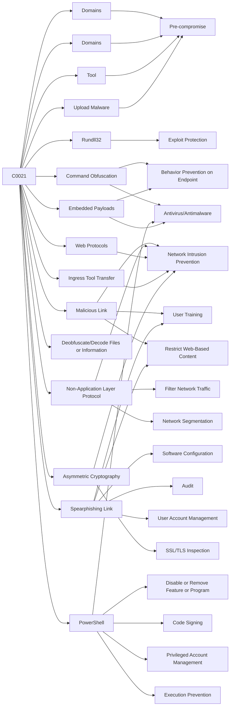

---
tags:
   - campaigns
---
# C0021
## ID:C0021
[C0021](/mitre/campaigns/C0021) was a spearphishing campaign conducted in November 2018 that targeted public sector institutions, non-governmental organizations (NGOs), educational institutions, and private-sector corporations in the oil and gas, chemical, and hospitality industries. The majority of targets were located in the US, particularly in and around Washington D.C., with other targets located in Europe, Hong Kong, India, and Canada. [C0021](/mitre/campaigns/C0021)'s technical artifacts, tactics, techniques, and procedures (TTPs), and targeting overlap with previous suspected [APT29](/mitre/groups/G0016) activity.(Citation: Microsoft Unidentified Dec 2018)(Citation: FireEye APT29 Nov 2018)
## Techniques Used By Campaign
* [Domains](/mitre/techniques/T1583/001)
* [Rundll32](/mitre/techniques/T1218/011)
* [Command Obfuscation](/mitre/techniques/T1027/010)
* [Domains](/mitre/techniques/T1584/001)
* [Malicious Link](/mitre/techniques/T1204/001)
* [Non-Application Layer Protocol](/mitre/techniques/T1095)
* [Tool](/mitre/techniques/T1588/002)
* [Web Protocols](/mitre/techniques/T1071/001)
* [Upload Malware](/mitre/techniques/T1608/001)
* [Ingress Tool Transfer](/mitre/techniques/T1105)
* [Deobfuscate/Decode Files or Information](/mitre/techniques/T1140)
* [Spearphishing Link](/mitre/techniques/T1566/002)
* [Asymmetric Cryptography](/mitre/techniques/T1573/002)
* [PowerShell](/mitre/techniques/T1059/001)
* [Embedded Payloads](/mitre/techniques/T1027/009)

# Summary of Techniques and Mitigations
