---
tags:
   - campaigns
---
# Operation Dream Job
## ID:C0022
[Operation Dream Job](campaigns/C0022) was a cyber espionage operation likely conducted by [Lazarus Group](groups/G0032) that targeted the defense, aerospace, government, and other sectors in the United States, Israel, Australia, Russia, and India. In at least one case, the cyber actors tried to monetize their network access to conduct a business email compromise (BEC) operation. In 2020, security researchers noted overlapping TTPs, to include fake job lures and code similarities, between [Operation Dream Job](campaigns/C0022), Operation North Star, and Operation Interception; by 2022 security researchers described [Operation Dream Job](campaigns/C0022) as an umbrella term covering both Operation Interception and Operation North Star.(Citation: ClearSky Lazarus Aug 2020)(Citation: McAfee Lazarus Jul 2020)(Citation: ESET Lazarus Jun 2020)(Citation: The Hacker News Lazarus Aug 2022)
## Techniques Used By Campaign
* [System Language Discovery](techniques/T1614/001)
* [Upload Malware](techniques/T1608/001)
* [Rundll32](techniques/T1218/011)
* [Native API](techniques/T1106)
* [Social Media Accounts](techniques/T1585/001)
* [Masquerade File Type](techniques/T1036/008)
* [File Deletion](techniques/T1070/004)
* [Registry Run Keys / Startup Folder](techniques/T1547/001)
* [System Checks](techniques/T1497/001)
* [Visual Basic](techniques/T1059/005)
* [Upload Tool](techniques/T1608/002)
* [Ingress Tool Transfer](techniques/T1105)
* [Email Accounts](techniques/T1585/002)
* [Domains](techniques/T1584/001)
* [Server](techniques/T1583/004)
* [Symmetric Cryptography](techniques/T1573/001)
* [Malicious Link](techniques/T1204/001)
* [PowerShell](techniques/T1059/001)
* [Gather Victim Org Information](techniques/T1591)
* [Domains](techniques/T1583/001)
* [Template Injection](techniques/T1221)
* [Time Based Evasion](techniques/T1497/003)
* [Gather Victim Identity Information](techniques/T1589)
* [Code Signing](techniques/T1553/002)
* [Data from Local System](techniques/T1005)
* [Brute Force](techniques/T1110)
* [Exfiltration Over C2 Channel](techniques/T1041)
* [Internal Spearphishing](techniques/T1534)
* [Web Services](techniques/T1583/006)
* [Spearphishing via Service](techniques/T1566/003)
* [Identify Roles](techniques/T1591/004)
* [Scheduled Task](techniques/T1053/005)
* [Malicious File](techniques/T1204/002)
* [Code Signing Certificates](techniques/T1588/003)
* [Impersonation](techniques/T1656)
* [Domain Account](techniques/T1087/002)
* [Code Signing Certificates](techniques/T1587/002)
* [Spearphishing Attachment](techniques/T1566/001)
* [IIS Components](techniques/T1505/004)
* [File and Directory Discovery](techniques/T1083)
* [Regsvr32](techniques/T1218/010)
* [Windows Management Instrumentation](techniques/T1047)
* [Software Packing](techniques/T1027/002)
* [Tool](techniques/T1588/002)
* [Web Protocols](techniques/T1071/001)
* [Exfiltration to Cloud Storage](techniques/T1567/002)
* [Debugger Evasion](techniques/T1622)
* [Encrypted/Encoded File](techniques/T1027/013)
* [XSL Script Processing](techniques/T1220)
* [Malware](techniques/T1587/001)
* [Windows Command Shell](techniques/T1059/003)
* [Server](techniques/T1584/004)
* [Social Media](techniques/T1593/001)
* [Spearphishing Link](techniques/T1566/002)
* [Archive via Utility](techniques/T1560/001)

# Summary of Techniques and Mitigations

```mermaid
flowchart LR
group[Operation Dream Job] --> T1614.001[System Language Discovery]
group[Operation Dream Job] --> T1608.001[Upload Malware]
T1608.001[Upload Malware] --> M1056[Pre-compromise]
group[Operation Dream Job] --> T1218.011[Rundll32]
T1218.011[Rundll32] --> M1050[Exploit Protection]
group[Operation Dream Job] --> T1106[Native API]
T1106[Native API] --> M1038[Execution Prevention]
T1106[Native API] --> M1040[Behavior Prevention on Endpoint]
group[Operation Dream Job] --> T1585.001[Social Media Accounts]
T1585.001[Social Media Accounts] --> M1056[Pre-compromise]
group[Operation Dream Job] --> T1036.008[Masquerade File Type]
T1036.008[Masquerade File Type] --> M1040[Behavior Prevention on Endpoint]
T1036.008[Masquerade File Type] --> M1049[Antivirus/Antimalware]
T1036.008[Masquerade File Type] --> M1038[Execution Prevention]
group[Operation Dream Job] --> T1070.004[File Deletion]
group[Operation Dream Job] --> T1547.001[Registry Run Keys / Startup Folder]
group[Operation Dream Job] --> T1497.001[System Checks]
group[Operation Dream Job] --> T1059.005[Visual Basic]
T1059.005[Visual Basic] --> M1042[Disable or Remove Feature or Program]
T1059.005[Visual Basic] --> M1049[Antivirus/Antimalware]
T1059.005[Visual Basic] --> M1038[Execution Prevention]
T1059.005[Visual Basic] --> M1040[Behavior Prevention on Endpoint]
T1059.005[Visual Basic] --> M1021[Restrict Web-Based Content]
group[Operation Dream Job] --> T1608.002[Upload Tool]
T1608.002[Upload Tool] --> M1056[Pre-compromise]
group[Operation Dream Job] --> T1105[Ingress Tool Transfer]
T1105[Ingress Tool Transfer] --> M1031[Network Intrusion Prevention]
group[Operation Dream Job] --> T1585.002[Email Accounts]
T1585.002[Email Accounts] --> M1056[Pre-compromise]
group[Operation Dream Job] --> T1584.001[Domains]
T1584.001[Domains] --> M1056[Pre-compromise]
group[Operation Dream Job] --> T1583.004[Server]
T1583.004[Server] --> M1056[Pre-compromise]
group[Operation Dream Job] --> T1573.001[Symmetric Cryptography]
T1573.001[Symmetric Cryptography] --> M1031[Network Intrusion Prevention]
group[Operation Dream Job] --> T1204.001[Malicious Link]
T1204.001[Malicious Link] --> M1031[Network Intrusion Prevention]
T1204.001[Malicious Link] --> M1017[User Training]
T1204.001[Malicious Link] --> M1021[Restrict Web-Based Content]
group[Operation Dream Job] --> T1059.001[PowerShell]
T1059.001[PowerShell] --> M1042[Disable or Remove Feature or Program]
T1059.001[PowerShell] --> M1049[Antivirus/Antimalware]
T1059.001[PowerShell] --> M1045[Code Signing]
T1059.001[PowerShell] --> M1026[Privileged Account Management]
T1059.001[PowerShell] --> M1038[Execution Prevention]
group[Operation Dream Job] --> T1591[Gather Victim Org Information]
T1591[Gather Victim Org Information] --> M1056[Pre-compromise]
group[Operation Dream Job] --> T1583.001[Domains]
T1583.001[Domains] --> M1056[Pre-compromise]
group[Operation Dream Job] --> T1221[Template Injection]
T1221[Template Injection] --> M1049[Antivirus/Antimalware]
T1221[Template Injection] --> M1031[Network Intrusion Prevention]
T1221[Template Injection] --> M1017[User Training]
T1221[Template Injection] --> M1042[Disable or Remove Feature or Program]
group[Operation Dream Job] --> T1497.003[Time Based Evasion]
group[Operation Dream Job] --> T1589[Gather Victim Identity Information]
T1589[Gather Victim Identity Information] --> M1056[Pre-compromise]
group[Operation Dream Job] --> T1553.002[Code Signing]
group[Operation Dream Job] --> T1005[Data from Local System]
T1005[Data from Local System] --> M1057[Data Loss Prevention]
group[Operation Dream Job] --> T1110[Brute Force]
T1110[Brute Force] --> M1018[User Account Management]
T1110[Brute Force] --> M1036[Account Use Policies]
T1110[Brute Force] --> M1032[Multi-factor Authentication]
T1110[Brute Force] --> M1027[Password Policies]
group[Operation Dream Job] --> T1041[Exfiltration Over C2 Channel]
T1041[Exfiltration Over C2 Channel] --> M1031[Network Intrusion Prevention]
T1041[Exfiltration Over C2 Channel] --> M1057[Data Loss Prevention]
group[Operation Dream Job] --> T1534[Internal Spearphishing]
group[Operation Dream Job] --> T1583.006[Web Services]
T1583.006[Web Services] --> M1056[Pre-compromise]
group[Operation Dream Job] --> T1566.003[Spearphishing via Service]
T1566.003[Spearphishing via Service] --> M1017[User Training]
T1566.003[Spearphishing via Service] --> M1049[Antivirus/Antimalware]
T1566.003[Spearphishing via Service] --> M1021[Restrict Web-Based Content]
group[Operation Dream Job] --> T1591.004[Identify Roles]
T1591.004[Identify Roles] --> M1056[Pre-compromise]
group[Operation Dream Job] --> T1053.005[Scheduled Task]
T1053.005[Scheduled Task] --> M1026[Privileged Account Management]
T1053.005[Scheduled Task] --> M1018[User Account Management]
T1053.005[Scheduled Task] --> M1047[Audit]
T1053.005[Scheduled Task] --> M1028[Operating System Configuration]
group[Operation Dream Job] --> T1204.002[Malicious File]
T1204.002[Malicious File] --> M1038[Execution Prevention]
T1204.002[Malicious File] --> M1040[Behavior Prevention on Endpoint]
T1204.002[Malicious File] --> M1017[User Training]
group[Operation Dream Job] --> T1588.003[Code Signing Certificates]
T1588.003[Code Signing Certificates] --> M1056[Pre-compromise]
group[Operation Dream Job] --> T1656[Impersonation]
T1656[Impersonation] --> M1017[User Training]
T1656[Impersonation] --> M1019[Threat Intelligence Program]
group[Operation Dream Job] --> T1087.002[Domain Account]
T1087.002[Domain Account] --> M1028[Operating System Configuration]
group[Operation Dream Job] --> T1587.002[Code Signing Certificates]
T1587.002[Code Signing Certificates] --> M1056[Pre-compromise]
group[Operation Dream Job] --> T1566.001[Spearphishing Attachment]
T1566.001[Spearphishing Attachment] --> M1049[Antivirus/Antimalware]
T1566.001[Spearphishing Attachment] --> M1031[Network Intrusion Prevention]
T1566.001[Spearphishing Attachment] --> M1054[Software Configuration]
T1566.001[Spearphishing Attachment] --> M1017[User Training]
T1566.001[Spearphishing Attachment] --> M1021[Restrict Web-Based Content]
group[Operation Dream Job] --> T1505.004[IIS Components]
T1505.004[IIS Components] --> M1026[Privileged Account Management]
T1505.004[IIS Components] --> M1038[Execution Prevention]
T1505.004[IIS Components] --> M1047[Audit]
T1505.004[IIS Components] --> M1045[Code Signing]
group[Operation Dream Job] --> T1083[File and Directory Discovery]
group[Operation Dream Job] --> T1218.010[Regsvr32]
T1218.010[Regsvr32] --> M1050[Exploit Protection]
group[Operation Dream Job] --> T1047[Windows Management Instrumentation]
T1047[Windows Management Instrumentation] --> M1026[Privileged Account Management]
T1047[Windows Management Instrumentation] --> M1040[Behavior Prevention on Endpoint]
T1047[Windows Management Instrumentation] --> M1018[User Account Management]
T1047[Windows Management Instrumentation] --> M1038[Execution Prevention]
group[Operation Dream Job] --> T1027.002[Software Packing]
T1027.002[Software Packing] --> M1049[Antivirus/Antimalware]
group[Operation Dream Job] --> T1588.002[Tool]
T1588.002[Tool] --> M1056[Pre-compromise]
group[Operation Dream Job] --> T1071.001[Web Protocols]
T1071.001[Web Protocols] --> M1031[Network Intrusion Prevention]
group[Operation Dream Job] --> T1567.002[Exfiltration to Cloud Storage]
T1567.002[Exfiltration to Cloud Storage] --> M1021[Restrict Web-Based Content]
group[Operation Dream Job] --> T1622[Debugger Evasion]
group[Operation Dream Job] --> T1027.013[Encrypted/Encoded File]
T1027.013[Encrypted/Encoded File] --> M1049[Antivirus/Antimalware]
T1027.013[Encrypted/Encoded File] --> M1040[Behavior Prevention on Endpoint]
group[Operation Dream Job] --> T1220[XSL Script Processing]
T1220[XSL Script Processing] --> M1038[Execution Prevention]
group[Operation Dream Job] --> T1587.001[Malware]
T1587.001[Malware] --> M1056[Pre-compromise]
group[Operation Dream Job] --> T1059.003[Windows Command Shell]
T1059.003[Windows Command Shell] --> M1038[Execution Prevention]
group[Operation Dream Job] --> T1584.004[Server]
T1584.004[Server] --> M1056[Pre-compromise]
group[Operation Dream Job] --> T1593.001[Social Media]
T1593.001[Social Media] --> M1056[Pre-compromise]
group[Operation Dream Job] --> T1566.002[Spearphishing Link]
T1566.002[Spearphishing Link] --> M1054[Software Configuration]
T1566.002[Spearphishing Link] --> M1021[Restrict Web-Based Content]
T1566.002[Spearphishing Link] --> M1047[Audit]
T1566.002[Spearphishing Link] --> M1018[User Account Management]
T1566.002[Spearphishing Link] --> M1017[User Training]
group[Operation Dream Job] --> T1560.001[Archive via Utility]
T1560.001[Archive via Utility] --> M1047[Audit]
```
