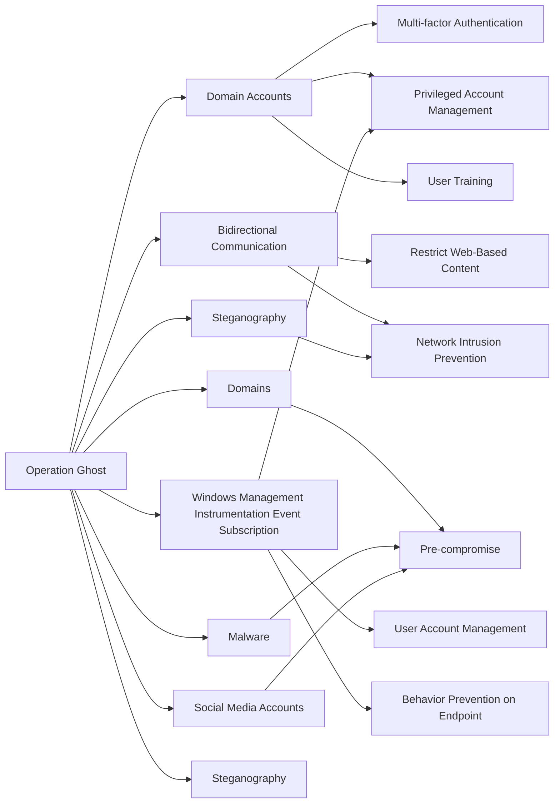

---
tags:
   - campaigns
---
# Operation Ghost
## ID:C0023
[Operation Ghost](campaigns/C0023) was an [APT29](groups/G0016) campaign starting in 2013 that included operations against ministries of foreign affairs in Europe and the Washington, D.C. embassy of a European Union country. During [Operation Ghost](campaigns/C0023), [APT29](groups/G0016) used new families of malware and leveraged web services, steganography, and unique C2 infrastructure for each victim.(Citation: ESET Dukes October 2019)

## Techniques Used By Campaign
* [Domain Accounts](techniques/T1078/002)
* [Bidirectional Communication](techniques/T1102/002)
* [Steganography](techniques/T1001/002)
* [Domains](techniques/T1583/001)
* [Malware](techniques/T1587/001)
* [Windows Management Instrumentation Event Subscription](techniques/T1546/003)
* [Social Media Accounts](techniques/T1585/001)
* [Steganography](techniques/T1027/003)

# Summary of Techniques and Mitigations
