---
tags:
   - campaigns
---
# SolarWinds Compromise
## ID:C0024
The [SolarWinds Compromise](/mitre/campaigns/C0024) was a sophisticated supply chain cyber operation conducted by [APT29](/mitre/groups/G0016) that was discovered in mid-December 2020. [APT29](/mitre/groups/G0016) used customized malware to inject malicious code into the SolarWinds Orion software build process that was later distributed through a normal software update; they also used password spraying, token theft, API abuse, spear phishing, and other supply chain attacks to compromise user accounts and leverage their associated access. Victims of this campaign included government, consulting, technology, telecom, and other organizations in North America, Europe, Asia, and the Middle East. Industry reporting initially referred to the actors involved in this campaign as UNC2452, NOBELIUM, StellarParticle, Dark Halo, and SolarStorm.(Citation: SolarWinds Advisory Dec 2020)(Citation: SolarWinds Sunburst Sunspot Update January 2021)(Citation: FireEye SUNBURST Backdoor December 2020)(Citation: Volexity SolarWinds)(Citation: CrowdStrike StellarParticle January 2022)(Citation: Unit 42 SolarStorm December 2020)(Citation: Microsoft Analyzing Solorigate Dec 2020)(Citation: Microsoft Internal Solorigate Investigation Blog) 

In April 2021, the US and UK governments attributed the [SolarWinds Compromise](/mitre/campaigns/C0024) to Russia's Foreign Intelligence Service (SVR); public statements included citations to [APT29](/mitre/groups/G0016), Cozy Bear, and The Dukes.(Citation: NSA Joint Advisory SVR SolarWinds April 2021)(Citation: UK NSCS Russia SolarWinds April 2021)(Citation: Mandiant UNC2452 APT29 April 2022) The US government assessed that of the approximately 18,000 affected public and private sector customers of Solar Winds’ Orion product, a much smaller number were compromised by follow-on [APT29](/mitre/groups/G0016) activity on their systems.(Citation: USG Joint Statement SolarWinds January 2021) 
## Techniques Used By Campaign
* [SAML Tokens](/mitre/techniques/T1606/002)
* [Cloud Accounts](/mitre/techniques/T1078/004)
* [Scheduled Task](/mitre/techniques/T1053/005)
* [Domain Account](/mitre/techniques/T1087/002)
* [Internal Proxy](/mitre/techniques/T1090/001)
* [Remote Email Collection](/mitre/techniques/T1114/002)
* [Domain Groups](/mitre/techniques/T1069/002)
* [Process Discovery](/mitre/techniques/T1057)
* [Domains](/mitre/techniques/T1584/001)
* [Internet Connection Discovery](/mitre/techniques/T1016/001)
* [Use Alternate Authentication Material](/mitre/techniques/T1550)
* [Credentials from Web Browsers](/mitre/techniques/T1555/003)
* [Domain Accounts](/mitre/techniques/T1078/002)
* [Match Legitimate Name or Location](/mitre/techniques/T1036/005)
* [Hide Infrastructure](/mitre/techniques/T1665)
* [Additional Email Delegate Permissions](/mitre/techniques/T1098/002)
* [Remote Desktop Protocol](/mitre/techniques/T1021/001)
* [Disable or Modify Tools](/mitre/techniques/T1562/001)
* [Data from Information Repositories](/mitre/techniques/T1213)
* [SMB/Windows Admin Shares](/mitre/techniques/T1021/002)
* [Visual Basic](/mitre/techniques/T1059/005)
* [Dynamic Resolution](/mitre/techniques/T1568)
* [Credentials](/mitre/techniques/T1589/001)
* [Private Keys](/mitre/techniques/T1552/004)
* [Malware](/mitre/techniques/T1587/001)
* [Deobfuscate/Decode Files or Information](/mitre/techniques/T1140)
* [Data from Local System](/mitre/techniques/T1005)
* [File and Directory Discovery](/mitre/techniques/T1083)
* [Permission Groups Discovery](/mitre/techniques/T1069)
* [Remote System Discovery](/mitre/techniques/T1018)
* [Windows Remote Management](/mitre/techniques/T1021/006)
* [Application Access Token](/mitre/techniques/T1550/001)
* [Additional Cloud Roles](/mitre/techniques/T1098/003)
* [Code Signing](/mitre/techniques/T1553/002)
* [Rundll32](/mitre/techniques/T1218/011)
* [Windows Management Instrumentation Event Subscription](/mitre/techniques/T1546/003)
* [Exploit Public-Facing Application](/mitre/techniques/T1190)
* [Code Repositories](/mitre/techniques/T1213/003)
* [PowerShell](/mitre/techniques/T1059/001)
* [File Deletion](/mitre/techniques/T1070/004)
* [Steal Web Session Cookie](/mitre/techniques/T1539)
* [Web Cookies](/mitre/techniques/T1606/001)
* [Web Session Cookie](/mitre/techniques/T1550/004)
* [Remote Data Staging](/mitre/techniques/T1074/002)
* [Device Registration](/mitre/techniques/T1098/005)
* [External Remote Services](/mitre/techniques/T1133)
* [Trusted Relationship](/mitre/techniques/T1199)
* [Windows Command Shell](/mitre/techniques/T1059/003)
* [Timestomp](/mitre/techniques/T1070/006)
* [Kerberoasting](/mitre/techniques/T1558/003)
* [System Information Discovery](/mitre/techniques/T1082)
* [Ingress Tool Transfer](/mitre/techniques/T1105)
* [Local Accounts](/mitre/techniques/T1078/003)
* [Indicator Removal](/mitre/techniques/T1070)
* [DCSync](/mitre/techniques/T1003/006)
* [Disable Windows Event Logging](/mitre/techniques/T1562/002)
* [Masquerade Task or Service](/mitre/techniques/T1036/004)
* [Additional Cloud Credentials](/mitre/techniques/T1098/001)
* [Domain Trust Discovery](/mitre/techniques/T1482)
* [Credentials from Password Stores](/mitre/techniques/T1555)
* [Windows Management Instrumentation](/mitre/techniques/T1047)
* [Compromise Software Supply Chain](/mitre/techniques/T1195/002)
* [Clear Mailbox Data](/mitre/techniques/T1070/008)
* [Trust Modification](/mitre/techniques/T1484/002)
* [Domains](/mitre/techniques/T1583/001)
* [Account Discovery](/mitre/techniques/T1087)
* [Valid Accounts](/mitre/techniques/T1078)
* [Archive via Utility](/mitre/techniques/T1560/001)
* [Disable or Modify System Firewall](/mitre/techniques/T1562/004)
* [Exfiltration Over Asymmetric Encrypted Non-C2 Protocol](/mitre/techniques/T1048/002)
* [Web Protocols](/mitre/techniques/T1071/001)

# Summary of Techniques and Mitigations

```mermaid
flowchart LR
group[SolarWinds Compromise] --> T1606.002[SAML Tokens]
T1606.002[SAML Tokens] --> M1015[Active Directory Configuration]
T1606.002[SAML Tokens] --> M1047[Audit]
T1606.002[SAML Tokens] --> M1018[User Account Management]
T1606.002[SAML Tokens] --> M1026[Privileged Account Management]
group[SolarWinds Compromise] --> T1078.004[Cloud Accounts]
T1078.004[Cloud Accounts] --> M1027[Password Policies]
T1078.004[Cloud Accounts] --> M1015[Active Directory Configuration]
T1078.004[Cloud Accounts] --> M1026[Privileged Account Management]
T1078.004[Cloud Accounts] --> M1032[Multi-factor Authentication]
T1078.004[Cloud Accounts] --> M1036[Account Use Policies]
T1078.004[Cloud Accounts] --> M1017[User Training]
T1078.004[Cloud Accounts] --> M1018[User Account Management]
group[SolarWinds Compromise] --> T1053.005[Scheduled Task]
T1053.005[Scheduled Task] --> M1026[Privileged Account Management]
T1053.005[Scheduled Task] --> M1018[User Account Management]
T1053.005[Scheduled Task] --> M1047[Audit]
T1053.005[Scheduled Task] --> M1028[Operating System Configuration]
group[SolarWinds Compromise] --> T1087.002[Domain Account]
T1087.002[Domain Account] --> M1028[Operating System Configuration]
group[SolarWinds Compromise] --> T1090.001[Internal Proxy]
T1090.001[Internal Proxy] --> M1031[Network Intrusion Prevention]
group[SolarWinds Compromise] --> T1114.002[Remote Email Collection]
T1114.002[Remote Email Collection] --> M1041[Encrypt Sensitive Information]
T1114.002[Remote Email Collection] --> M1032[Multi-factor Authentication]
group[SolarWinds Compromise] --> T1069.002[Domain Groups]
group[SolarWinds Compromise] --> T1057[Process Discovery]
group[SolarWinds Compromise] --> T1584.001[Domains]
T1584.001[Domains] --> M1056[Pre-compromise]
group[SolarWinds Compromise] --> T1016.001[Internet Connection Discovery]
group[SolarWinds Compromise] --> T1550[Use Alternate Authentication Material]
T1550[Use Alternate Authentication Material] --> M1047[Audit]
T1550[Use Alternate Authentication Material] --> M1027[Password Policies]
T1550[Use Alternate Authentication Material] --> M1026[Privileged Account Management]
T1550[Use Alternate Authentication Material] --> M1015[Active Directory Configuration]
T1550[Use Alternate Authentication Material] --> M1013[Application Developer Guidance]
T1550[Use Alternate Authentication Material] --> M1018[User Account Management]
group[SolarWinds Compromise] --> T1555.003[Credentials from Web Browsers]
T1555.003[Credentials from Web Browsers] --> M1027[Password Policies]
group[SolarWinds Compromise] --> T1078.002[Domain Accounts]
T1078.002[Domain Accounts] --> M1032[Multi-factor Authentication]
T1078.002[Domain Accounts] --> M1026[Privileged Account Management]
T1078.002[Domain Accounts] --> M1017[User Training]
group[SolarWinds Compromise] --> T1036.005[Match Legitimate Name or Location]
T1036.005[Match Legitimate Name or Location] --> M1022[Restrict File and Directory Permissions]
T1036.005[Match Legitimate Name or Location] --> M1038[Execution Prevention]
T1036.005[Match Legitimate Name or Location] --> M1045[Code Signing]
group[SolarWinds Compromise] --> T1665[Hide Infrastructure]
group[SolarWinds Compromise] --> T1098.002[Additional Email Delegate Permissions]
T1098.002[Additional Email Delegate Permissions] --> M1026[Privileged Account Management]
T1098.002[Additional Email Delegate Permissions] --> M1032[Multi-factor Authentication]
T1098.002[Additional Email Delegate Permissions] --> M1042[Disable or Remove Feature or Program]
group[SolarWinds Compromise] --> T1021.001[Remote Desktop Protocol]
T1021.001[Remote Desktop Protocol] --> M1047[Audit]
T1021.001[Remote Desktop Protocol] --> M1035[Limit Access to Resource Over Network]
T1021.001[Remote Desktop Protocol] --> M1030[Network Segmentation]
T1021.001[Remote Desktop Protocol] --> M1028[Operating System Configuration]
T1021.001[Remote Desktop Protocol] --> M1042[Disable or Remove Feature or Program]
T1021.001[Remote Desktop Protocol] --> M1018[User Account Management]
T1021.001[Remote Desktop Protocol] --> M1032[Multi-factor Authentication]
T1021.001[Remote Desktop Protocol] --> M1026[Privileged Account Management]
group[SolarWinds Compromise] --> T1562.001[Disable or Modify Tools]
T1562.001[Disable or Modify Tools] --> M1038[Execution Prevention]
T1562.001[Disable or Modify Tools] --> M1024[Restrict Registry Permissions]
T1562.001[Disable or Modify Tools] --> M1018[User Account Management]
T1562.001[Disable or Modify Tools] --> M1022[Restrict File and Directory Permissions]
group[SolarWinds Compromise] --> T1213[Data from Information Repositories]
T1213[Data from Information Repositories] --> M1032[Multi-factor Authentication]
T1213[Data from Information Repositories] --> M1017[User Training]
T1213[Data from Information Repositories] --> M1018[User Account Management]
T1213[Data from Information Repositories] --> M1047[Audit]
group[SolarWinds Compromise] --> T1021.002[SMB/Windows Admin Shares]
T1021.002[SMB/Windows Admin Shares] --> M1026[Privileged Account Management]
T1021.002[SMB/Windows Admin Shares] --> M1035[Limit Access to Resource Over Network]
T1021.002[SMB/Windows Admin Shares] --> M1037[Filter Network Traffic]
T1021.002[SMB/Windows Admin Shares] --> M1027[Password Policies]
group[SolarWinds Compromise] --> T1059.005[Visual Basic]
T1059.005[Visual Basic] --> M1042[Disable or Remove Feature or Program]
T1059.005[Visual Basic] --> M1049[Antivirus/Antimalware]
T1059.005[Visual Basic] --> M1038[Execution Prevention]
T1059.005[Visual Basic] --> M1040[Behavior Prevention on Endpoint]
T1059.005[Visual Basic] --> M1021[Restrict Web-Based Content]
group[SolarWinds Compromise] --> T1568[Dynamic Resolution]
T1568[Dynamic Resolution] --> M1031[Network Intrusion Prevention]
T1568[Dynamic Resolution] --> M1021[Restrict Web-Based Content]
group[SolarWinds Compromise] --> T1589.001[Credentials]
T1589.001[Credentials] --> M1056[Pre-compromise]
group[SolarWinds Compromise] --> T1552.004[Private Keys]
T1552.004[Private Keys] --> M1027[Password Policies]
T1552.004[Private Keys] --> M1022[Restrict File and Directory Permissions]
T1552.004[Private Keys] --> M1047[Audit]
T1552.004[Private Keys] --> M1041[Encrypt Sensitive Information]
group[SolarWinds Compromise] --> T1587.001[Malware]
T1587.001[Malware] --> M1056[Pre-compromise]
group[SolarWinds Compromise] --> T1140[Deobfuscate/Decode Files or Information]
group[SolarWinds Compromise] --> T1005[Data from Local System]
T1005[Data from Local System] --> M1057[Data Loss Prevention]
group[SolarWinds Compromise] --> T1083[File and Directory Discovery]
group[SolarWinds Compromise] --> T1069[Permission Groups Discovery]
group[SolarWinds Compromise] --> T1018[Remote System Discovery]
group[SolarWinds Compromise] --> T1021.006[Windows Remote Management]
T1021.006[Windows Remote Management] --> M1042[Disable or Remove Feature or Program]
T1021.006[Windows Remote Management] --> M1026[Privileged Account Management]
T1021.006[Windows Remote Management] --> M1030[Network Segmentation]
group[SolarWinds Compromise] --> T1550.001[Application Access Token]
T1550.001[Application Access Token] --> M1047[Audit]
T1550.001[Application Access Token] --> M1021[Restrict Web-Based Content]
T1550.001[Application Access Token] --> M1013[Application Developer Guidance]
T1550.001[Application Access Token] --> M1041[Encrypt Sensitive Information]
group[SolarWinds Compromise] --> T1098.003[Additional Cloud Roles]
T1098.003[Additional Cloud Roles] --> M1026[Privileged Account Management]
T1098.003[Additional Cloud Roles] --> M1032[Multi-factor Authentication]
T1098.003[Additional Cloud Roles] --> M1018[User Account Management]
group[SolarWinds Compromise] --> T1553.002[Code Signing]
group[SolarWinds Compromise] --> T1218.011[Rundll32]
T1218.011[Rundll32] --> M1050[Exploit Protection]
group[SolarWinds Compromise] --> T1546.003[Windows Management Instrumentation Event Subscription]
T1546.003[Windows Management Instrumentation Event Subscription] --> M1018[User Account Management]
T1546.003[Windows Management Instrumentation Event Subscription] --> M1026[Privileged Account Management]
T1546.003[Windows Management Instrumentation Event Subscription] --> M1040[Behavior Prevention on Endpoint]
group[SolarWinds Compromise] --> T1190[Exploit Public-Facing Application]
T1190[Exploit Public-Facing Application] --> M1048[Application Isolation and Sandboxing]
T1190[Exploit Public-Facing Application] --> M1030[Network Segmentation]
T1190[Exploit Public-Facing Application] --> M1016[Vulnerability Scanning]
T1190[Exploit Public-Facing Application] --> M1026[Privileged Account Management]
T1190[Exploit Public-Facing Application] --> M1050[Exploit Protection]
T1190[Exploit Public-Facing Application] --> M1051[Update Software]
group[SolarWinds Compromise] --> T1213.003[Code Repositories]
T1213.003[Code Repositories] --> M1017[User Training]
T1213.003[Code Repositories] --> M1047[Audit]
T1213.003[Code Repositories] --> M1018[User Account Management]
T1213.003[Code Repositories] --> M1032[Multi-factor Authentication]
group[SolarWinds Compromise] --> T1059.001[PowerShell]
T1059.001[PowerShell] --> M1042[Disable or Remove Feature or Program]
T1059.001[PowerShell] --> M1049[Antivirus/Antimalware]
T1059.001[PowerShell] --> M1045[Code Signing]
T1059.001[PowerShell] --> M1026[Privileged Account Management]
T1059.001[PowerShell] --> M1038[Execution Prevention]
group[SolarWinds Compromise] --> T1070.004[File Deletion]
group[SolarWinds Compromise] --> T1539[Steal Web Session Cookie]
T1539[Steal Web Session Cookie] --> M1054[Software Configuration]
T1539[Steal Web Session Cookie] --> M1032[Multi-factor Authentication]
T1539[Steal Web Session Cookie] --> M1017[User Training]
group[SolarWinds Compromise] --> T1606.001[Web Cookies]
T1606.001[Web Cookies] --> M1047[Audit]
T1606.001[Web Cookies] --> M1054[Software Configuration]
group[SolarWinds Compromise] --> T1550.004[Web Session Cookie]
T1550.004[Web Session Cookie] --> M1054[Software Configuration]
group[SolarWinds Compromise] --> T1074.002[Remote Data Staging]
group[SolarWinds Compromise] --> T1098.005[Device Registration]
T1098.005[Device Registration] --> M1032[Multi-factor Authentication]
group[SolarWinds Compromise] --> T1133[External Remote Services]
T1133[External Remote Services] --> M1030[Network Segmentation]
T1133[External Remote Services] --> M1042[Disable or Remove Feature or Program]
T1133[External Remote Services] --> M1035[Limit Access to Resource Over Network]
T1133[External Remote Services] --> M1032[Multi-factor Authentication]
group[SolarWinds Compromise] --> T1199[Trusted Relationship]
T1199[Trusted Relationship] --> M1032[Multi-factor Authentication]
T1199[Trusted Relationship] --> M1018[User Account Management]
T1199[Trusted Relationship] --> M1030[Network Segmentation]
group[SolarWinds Compromise] --> T1059.003[Windows Command Shell]
T1059.003[Windows Command Shell] --> M1038[Execution Prevention]
group[SolarWinds Compromise] --> T1070.006[Timestomp]
group[SolarWinds Compromise] --> T1558.003[Kerberoasting]
T1558.003[Kerberoasting] --> M1027[Password Policies]
T1558.003[Kerberoasting] --> M1041[Encrypt Sensitive Information]
T1558.003[Kerberoasting] --> M1026[Privileged Account Management]
group[SolarWinds Compromise] --> T1082[System Information Discovery]
group[SolarWinds Compromise] --> T1105[Ingress Tool Transfer]
T1105[Ingress Tool Transfer] --> M1031[Network Intrusion Prevention]
group[SolarWinds Compromise] --> T1078.003[Local Accounts]
T1078.003[Local Accounts] --> M1026[Privileged Account Management]
T1078.003[Local Accounts] --> M1027[Password Policies]
group[SolarWinds Compromise] --> T1070[Indicator Removal]
T1070[Indicator Removal] --> M1041[Encrypt Sensitive Information]
T1070[Indicator Removal] --> M1029[Remote Data Storage]
T1070[Indicator Removal] --> M1022[Restrict File and Directory Permissions]
group[SolarWinds Compromise] --> T1003.006[DCSync]
T1003.006[DCSync] --> M1027[Password Policies]
T1003.006[DCSync] --> M1015[Active Directory Configuration]
T1003.006[DCSync] --> M1026[Privileged Account Management]
group[SolarWinds Compromise] --> T1562.002[Disable Windows Event Logging]
T1562.002[Disable Windows Event Logging] --> M1022[Restrict File and Directory Permissions]
T1562.002[Disable Windows Event Logging] --> M1024[Restrict Registry Permissions]
T1562.002[Disable Windows Event Logging] --> M1047[Audit]
T1562.002[Disable Windows Event Logging] --> M1018[User Account Management]
group[SolarWinds Compromise] --> T1036.004[Masquerade Task or Service]
group[SolarWinds Compromise] --> T1098.001[Additional Cloud Credentials]
T1098.001[Additional Cloud Credentials] --> M1032[Multi-factor Authentication]
T1098.001[Additional Cloud Credentials] --> M1018[User Account Management]
T1098.001[Additional Cloud Credentials] --> M1030[Network Segmentation]
T1098.001[Additional Cloud Credentials] --> M1026[Privileged Account Management]
group[SolarWinds Compromise] --> T1482[Domain Trust Discovery]
T1482[Domain Trust Discovery] --> M1047[Audit]
T1482[Domain Trust Discovery] --> M1030[Network Segmentation]
group[SolarWinds Compromise] --> T1555[Credentials from Password Stores]
T1555[Credentials from Password Stores] --> M1026[Privileged Account Management]
T1555[Credentials from Password Stores] --> M1051[Update Software]
T1555[Credentials from Password Stores] --> M1027[Password Policies]
group[SolarWinds Compromise] --> T1047[Windows Management Instrumentation]
T1047[Windows Management Instrumentation] --> M1026[Privileged Account Management]
T1047[Windows Management Instrumentation] --> M1040[Behavior Prevention on Endpoint]
T1047[Windows Management Instrumentation] --> M1018[User Account Management]
T1047[Windows Management Instrumentation] --> M1038[Execution Prevention]
group[SolarWinds Compromise] --> T1195.002[Compromise Software Supply Chain]
T1195.002[Compromise Software Supply Chain] --> M1051[Update Software]
T1195.002[Compromise Software Supply Chain] --> M1016[Vulnerability Scanning]
group[SolarWinds Compromise] --> T1070.008[Clear Mailbox Data]
T1070.008[Clear Mailbox Data] --> M1022[Restrict File and Directory Permissions]
T1070.008[Clear Mailbox Data] --> M1047[Audit]
T1070.008[Clear Mailbox Data] --> M1029[Remote Data Storage]
group[SolarWinds Compromise] --> T1484.002[Trust Modification]
T1484.002[Trust Modification] --> M1026[Privileged Account Management]
group[SolarWinds Compromise] --> T1583.001[Domains]
T1583.001[Domains] --> M1056[Pre-compromise]
group[SolarWinds Compromise] --> T1087[Account Discovery]
T1087[Account Discovery] --> M1028[Operating System Configuration]
T1087[Account Discovery] --> M1018[User Account Management]
group[SolarWinds Compromise] --> T1078[Valid Accounts]
T1078[Valid Accounts] --> M1027[Password Policies]
T1078[Valid Accounts] --> M1018[User Account Management]
T1078[Valid Accounts] --> M1026[Privileged Account Management]
T1078[Valid Accounts] --> M1013[Application Developer Guidance]
T1078[Valid Accounts] --> M1017[User Training]
T1078[Valid Accounts] --> M1015[Active Directory Configuration]
T1078[Valid Accounts] --> M1036[Account Use Policies]
group[SolarWinds Compromise] --> T1560.001[Archive via Utility]
T1560.001[Archive via Utility] --> M1047[Audit]
group[SolarWinds Compromise] --> T1562.004[Disable or Modify System Firewall]
T1562.004[Disable or Modify System Firewall] --> M1047[Audit]
T1562.004[Disable or Modify System Firewall] --> M1018[User Account Management]
T1562.004[Disable or Modify System Firewall] --> M1024[Restrict Registry Permissions]
T1562.004[Disable or Modify System Firewall] --> M1022[Restrict File and Directory Permissions]
group[SolarWinds Compromise] --> T1048.002[Exfiltration Over Asymmetric Encrypted Non-C2 Protocol]
T1048.002[Exfiltration Over Asymmetric Encrypted Non-C2 Protocol] --> M1031[Network Intrusion Prevention]
T1048.002[Exfiltration Over Asymmetric Encrypted Non-C2 Protocol] --> M1030[Network Segmentation]
T1048.002[Exfiltration Over Asymmetric Encrypted Non-C2 Protocol] --> M1037[Filter Network Traffic]
T1048.002[Exfiltration Over Asymmetric Encrypted Non-C2 Protocol] --> M1057[Data Loss Prevention]
group[SolarWinds Compromise] --> T1071.001[Web Protocols]
T1071.001[Web Protocols] --> M1031[Network Intrusion Prevention]
```
