---
tags:
   - campaigns
---
# 2016 Ukraine Electric Power Attack
## ID:C0025
[2016 Ukraine Electric Power Attack](campaigns/C0025) was a [Sandworm Team](groups/G0034) campaign during which they used [Industroyer](software/S0604) malware to target and disrupt distribution substations within the Ukrainian power grid. This campaign was the second major public attack conducted against Ukraine by [Sandworm Team](groups/G0034).(Citation: ESET Industroyer)(Citation: Dragos Crashoverride 2018)
## Techniques Used By Campaign
* [Visual Basic](techniques/T1059/005)
* [Masquerade File Type](techniques/T1036/008)
* [PowerShell](techniques/T1059/001)
* [Match Legitimate Name or Location](techniques/T1036/005)
* [SQL Stored Procedures](techniques/T1505/001)
* [Create Account](techniques/T1136)
* [Lateral Tool Transfer](techniques/T1570)
* [Windows Command Shell](techniques/T1059/003)
* [Obfuscated Files or Information](techniques/T1027)
* [Windows Service](techniques/T1543/003)
* [Software Packing](techniques/T1027/002)
* [LSASS Memory](techniques/T1003/001)
* [Windows Management Instrumentation](techniques/T1047)
* [Account Manipulation](techniques/T1098)
* [Brute Force](techniques/T1110)
* [Domain Account](techniques/T1136/002)
* [Remote System Discovery](techniques/T1018)
* [Compromise Host Software Binary](techniques/T1554)
* [Disable Windows Event Logging](techniques/T1562/002)
* [SMB/Windows Admin Shares](techniques/T1021/002)

# Summary of Techniques and Mitigations

```mermaid
flowchart LR
group[2016 Ukraine Electric Power Attack] --> T1059.005[Visual Basic]
T1059.005[Visual Basic] --> M1042[Disable or Remove Feature or Program]
T1059.005[Visual Basic] --> M1049[Antivirus/Antimalware]
T1059.005[Visual Basic] --> M1038[Execution Prevention]
T1059.005[Visual Basic] --> M1040[Behavior Prevention on Endpoint]
T1059.005[Visual Basic] --> M1021[Restrict Web-Based Content]
group[2016 Ukraine Electric Power Attack] --> T1036.008[Masquerade File Type]
T1036.008[Masquerade File Type] --> M1040[Behavior Prevention on Endpoint]
T1036.008[Masquerade File Type] --> M1049[Antivirus/Antimalware]
T1036.008[Masquerade File Type] --> M1038[Execution Prevention]
group[2016 Ukraine Electric Power Attack] --> T1059.001[PowerShell]
T1059.001[PowerShell] --> M1042[Disable or Remove Feature or Program]
T1059.001[PowerShell] --> M1049[Antivirus/Antimalware]
T1059.001[PowerShell] --> M1045[Code Signing]
T1059.001[PowerShell] --> M1026[Privileged Account Management]
T1059.001[PowerShell] --> M1038[Execution Prevention]
group[2016 Ukraine Electric Power Attack] --> T1036.005[Match Legitimate Name or Location]
T1036.005[Match Legitimate Name or Location] --> M1022[Restrict File and Directory Permissions]
T1036.005[Match Legitimate Name or Location] --> M1038[Execution Prevention]
T1036.005[Match Legitimate Name or Location] --> M1045[Code Signing]
group[2016 Ukraine Electric Power Attack] --> T1505.001[SQL Stored Procedures]
T1505.001[SQL Stored Procedures] --> M1047[Audit]
T1505.001[SQL Stored Procedures] --> M1045[Code Signing]
T1505.001[SQL Stored Procedures] --> M1026[Privileged Account Management]
group[2016 Ukraine Electric Power Attack] --> T1136[Create Account]
T1136[Create Account] --> M1030[Network Segmentation]
T1136[Create Account] --> M1028[Operating System Configuration]
T1136[Create Account] --> M1032[Multi-factor Authentication]
T1136[Create Account] --> M1026[Privileged Account Management]
group[2016 Ukraine Electric Power Attack] --> T1570[Lateral Tool Transfer]
T1570[Lateral Tool Transfer] --> M1037[Filter Network Traffic]
T1570[Lateral Tool Transfer] --> M1031[Network Intrusion Prevention]
group[2016 Ukraine Electric Power Attack] --> T1059.003[Windows Command Shell]
T1059.003[Windows Command Shell] --> M1038[Execution Prevention]
group[2016 Ukraine Electric Power Attack] --> T1027[Obfuscated Files or Information]
T1027[Obfuscated Files or Information] --> M1047[Audit]
T1027[Obfuscated Files or Information] --> M1040[Behavior Prevention on Endpoint]
T1027[Obfuscated Files or Information] --> M1017[User Training]
T1027[Obfuscated Files or Information] --> M1049[Antivirus/Antimalware]
group[2016 Ukraine Electric Power Attack] --> T1543.003[Windows Service]
T1543.003[Windows Service] --> M1040[Behavior Prevention on Endpoint]
T1543.003[Windows Service] --> M1028[Operating System Configuration]
T1543.003[Windows Service] --> M1047[Audit]
T1543.003[Windows Service] --> M1045[Code Signing]
T1543.003[Windows Service] --> M1018[User Account Management]
group[2016 Ukraine Electric Power Attack] --> T1027.002[Software Packing]
T1027.002[Software Packing] --> M1049[Antivirus/Antimalware]
group[2016 Ukraine Electric Power Attack] --> T1003.001[LSASS Memory]
T1003.001[LSASS Memory] --> M1028[Operating System Configuration]
T1003.001[LSASS Memory] --> M1043[Credential Access Protection]
T1003.001[LSASS Memory] --> M1025[Privileged Process Integrity]
T1003.001[LSASS Memory] --> M1026[Privileged Account Management]
T1003.001[LSASS Memory] --> M1017[User Training]
T1003.001[LSASS Memory] --> M1040[Behavior Prevention on Endpoint]
T1003.001[LSASS Memory] --> M1027[Password Policies]
group[2016 Ukraine Electric Power Attack] --> T1047[Windows Management Instrumentation]
T1047[Windows Management Instrumentation] --> M1026[Privileged Account Management]
T1047[Windows Management Instrumentation] --> M1040[Behavior Prevention on Endpoint]
T1047[Windows Management Instrumentation] --> M1018[User Account Management]
T1047[Windows Management Instrumentation] --> M1038[Execution Prevention]
group[2016 Ukraine Electric Power Attack] --> T1098[Account Manipulation]
T1098[Account Manipulation] --> M1030[Network Segmentation]
T1098[Account Manipulation] --> M1018[User Account Management]
T1098[Account Manipulation] --> M1032[Multi-factor Authentication]
T1098[Account Manipulation] --> M1026[Privileged Account Management]
T1098[Account Manipulation] --> M1028[Operating System Configuration]
group[2016 Ukraine Electric Power Attack] --> T1110[Brute Force]
T1110[Brute Force] --> M1018[User Account Management]
T1110[Brute Force] --> M1036[Account Use Policies]
T1110[Brute Force] --> M1032[Multi-factor Authentication]
T1110[Brute Force] --> M1027[Password Policies]
group[2016 Ukraine Electric Power Attack] --> T1136.002[Domain Account]
T1136.002[Domain Account] --> M1032[Multi-factor Authentication]
T1136.002[Domain Account] --> M1028[Operating System Configuration]
T1136.002[Domain Account] --> M1030[Network Segmentation]
T1136.002[Domain Account] --> M1026[Privileged Account Management]
group[2016 Ukraine Electric Power Attack] --> T1018[Remote System Discovery]
group[2016 Ukraine Electric Power Attack] --> T1554[Compromise Host Software Binary]
T1554[Compromise Host Software Binary] --> M1045[Code Signing]
group[2016 Ukraine Electric Power Attack] --> T1562.002[Disable Windows Event Logging]
T1562.002[Disable Windows Event Logging] --> M1022[Restrict File and Directory Permissions]
T1562.002[Disable Windows Event Logging] --> M1024[Restrict Registry Permissions]
T1562.002[Disable Windows Event Logging] --> M1047[Audit]
T1562.002[Disable Windows Event Logging] --> M1018[User Account Management]
group[2016 Ukraine Electric Power Attack] --> T1021.002[SMB/Windows Admin Shares]
T1021.002[SMB/Windows Admin Shares] --> M1026[Privileged Account Management]
T1021.002[SMB/Windows Admin Shares] --> M1035[Limit Access to Resource Over Network]
T1021.002[SMB/Windows Admin Shares] --> M1037[Filter Network Traffic]
T1021.002[SMB/Windows Admin Shares] --> M1027[Password Policies]
```
