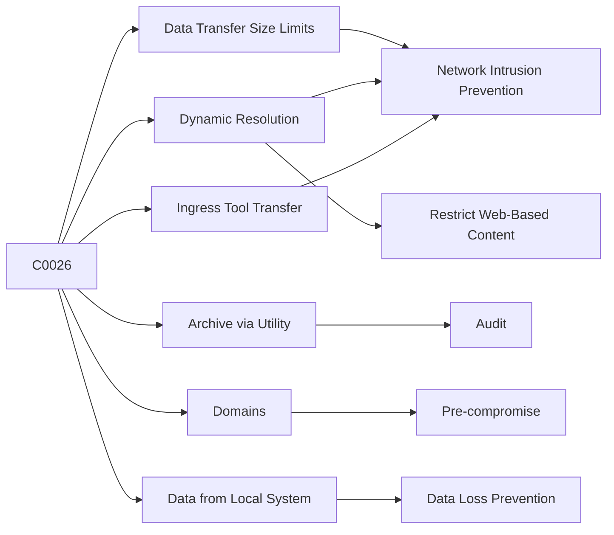

---
tags:
   - campaigns
---
# C0026
## ID:C0026
[C0026](/mitre/campaigns/C0026) was a campaign identified in September 2022 that included the selective distribution of [KOPILUWAK](/mitre/software/S1075) and [QUIETCANARY](/mitre/software/S1076) malware to previous [ANDROMEDA](/mitre/software/S1074) malware victims in Ukraine through re-registered [ANDROMEDA](/mitre/software/S1074) C2 domains. Several tools and tactics used during [C0026](/mitre/campaigns/C0026) were consistent with historic [Turla](/mitre/groups/G0010) operations.(Citation: Mandiant Suspected Turla Campaign February 2023)
## Techniques Used By Campaign
* [Data Transfer Size Limits](/mitre/techniques/T1030)
* [Dynamic Resolution](/mitre/techniques/T1568)
* [Archive via Utility](/mitre/techniques/T1560/001)
* [Domains](/mitre/techniques/T1583/001)
* [Ingress Tool Transfer](/mitre/techniques/T1105)
* [Data from Local System](/mitre/techniques/T1005)

# Summary of Techniques and Mitigations
