---
tags:
   - campaigns
---
# C0027
## ID:C0027
[C0027](campaigns/C0027) was a financially-motivated campaign linked to [Scattered Spider](groups/G1015) that targeted telecommunications and business process outsourcing (BPO) companies from at least June through December of 2022. During [C0027](campaigns/C0027) [Scattered Spider](groups/G1015) used various forms of social engineering, performed SIM swapping, and attempted to leverage access from victim environments to mobile carrier networks.(Citation: Crowdstrike TELCO BPO Campaign December 2022)

## Techniques Used By Campaign
* [Protocol Tunneling](techniques/T1572)
* [Exploit Public-Facing Application](techniques/T1190)
* [Cloud Account](techniques/T1087/004)
* [Web Service](techniques/T1102)
* [Cloud Groups](techniques/T1069/003)
* [Spearphishing Voice](techniques/T1598/004)
* [DCSync](techniques/T1003/006)
* [Ingress Tool Transfer](techniques/T1105)
* [Additional Cloud Roles](techniques/T1098/003)
* [Create Cloud Instance](techniques/T1578/002)
* [Network Service Discovery](techniques/T1046)
* [Cloud Services](techniques/T1021/007)
* [Sharepoint](techniques/T1213/002)
* [Cloud Accounts](techniques/T1078/004)
* [Email Account](techniques/T1087/003)
* [Spearphishing Service](techniques/T1598/001)
* [Multi-Factor Authentication Request Generation](techniques/T1621)
* [Device Registration](techniques/T1098/005)
* [Remote Access Software](techniques/T1219)
* [Windows Management Instrumentation](techniques/T1047)
* [Impersonation](techniques/T1656)
* [Additional Cloud Credentials](techniques/T1098/001)
* [External Remote Services](techniques/T1133)
* [Data from Cloud Storage](techniques/T1530)
* [Tool](techniques/T1588/002)
* [Credentials](techniques/T1589/001)
* [Proxy](techniques/T1090)
* [Spearphishing Voice](techniques/T1566/004)

# Summary of Techniques and Mitigations

```mermaid
flowchart LR
group[C0027] --> T1572[Protocol Tunneling]
T1572[Protocol Tunneling] --> M1037[Filter Network Traffic]
T1572[Protocol Tunneling] --> M1031[Network Intrusion Prevention]
group[C0027] --> T1190[Exploit Public-Facing Application]
T1190[Exploit Public-Facing Application] --> M1048[Application Isolation and Sandboxing]
T1190[Exploit Public-Facing Application] --> M1030[Network Segmentation]
T1190[Exploit Public-Facing Application] --> M1016[Vulnerability Scanning]
T1190[Exploit Public-Facing Application] --> M1026[Privileged Account Management]
T1190[Exploit Public-Facing Application] --> M1050[Exploit Protection]
T1190[Exploit Public-Facing Application] --> M1051[Update Software]
group[C0027] --> T1087.004[Cloud Account]
T1087.004[Cloud Account] --> M1047[Audit]
T1087.004[Cloud Account] --> M1018[User Account Management]
group[C0027] --> T1102[Web Service]
T1102[Web Service] --> M1031[Network Intrusion Prevention]
T1102[Web Service] --> M1021[Restrict Web-Based Content]
group[C0027] --> T1069.003[Cloud Groups]
group[C0027] --> T1598.004[Spearphishing Voice]
T1598.004[Spearphishing Voice] --> M1017[User Training]
group[C0027] --> T1003.006[DCSync]
T1003.006[DCSync] --> M1027[Password Policies]
T1003.006[DCSync] --> M1015[Active Directory Configuration]
T1003.006[DCSync] --> M1026[Privileged Account Management]
group[C0027] --> T1105[Ingress Tool Transfer]
T1105[Ingress Tool Transfer] --> M1031[Network Intrusion Prevention]
group[C0027] --> T1098.003[Additional Cloud Roles]
T1098.003[Additional Cloud Roles] --> M1026[Privileged Account Management]
T1098.003[Additional Cloud Roles] --> M1032[Multi-factor Authentication]
T1098.003[Additional Cloud Roles] --> M1018[User Account Management]
group[C0027] --> T1578.002[Create Cloud Instance]
T1578.002[Create Cloud Instance] --> M1047[Audit]
T1578.002[Create Cloud Instance] --> M1018[User Account Management]
group[C0027] --> T1046[Network Service Discovery]
T1046[Network Service Discovery] --> M1042[Disable or Remove Feature or Program]
T1046[Network Service Discovery] --> M1031[Network Intrusion Prevention]
T1046[Network Service Discovery] --> M1030[Network Segmentation]
group[C0027] --> T1021.007[Cloud Services]
T1021.007[Cloud Services] --> M1032[Multi-factor Authentication]
T1021.007[Cloud Services] --> M1026[Privileged Account Management]
group[C0027] --> T1213.002[Sharepoint]
T1213.002[Sharepoint] --> M1047[Audit]
T1213.002[Sharepoint] --> M1018[User Account Management]
T1213.002[Sharepoint] --> M1017[User Training]
group[C0027] --> T1078.004[Cloud Accounts]
T1078.004[Cloud Accounts] --> M1027[Password Policies]
T1078.004[Cloud Accounts] --> M1015[Active Directory Configuration]
T1078.004[Cloud Accounts] --> M1026[Privileged Account Management]
T1078.004[Cloud Accounts] --> M1032[Multi-factor Authentication]
T1078.004[Cloud Accounts] --> M1036[Account Use Policies]
T1078.004[Cloud Accounts] --> M1017[User Training]
T1078.004[Cloud Accounts] --> M1018[User Account Management]
group[C0027] --> T1087.003[Email Account]
group[C0027] --> T1598.001[Spearphishing Service]
T1598.001[Spearphishing Service] --> M1017[User Training]
group[C0027] --> T1621[Multi-Factor Authentication Request Generation]
T1621[Multi-Factor Authentication Request Generation] --> M1032[Multi-factor Authentication]
T1621[Multi-Factor Authentication Request Generation] --> M1036[Account Use Policies]
T1621[Multi-Factor Authentication Request Generation] --> M1017[User Training]
group[C0027] --> T1098.005[Device Registration]
T1098.005[Device Registration] --> M1032[Multi-factor Authentication]
group[C0027] --> T1219[Remote Access Software]
T1219[Remote Access Software] --> M1038[Execution Prevention]
T1219[Remote Access Software] --> M1037[Filter Network Traffic]
T1219[Remote Access Software] --> M1031[Network Intrusion Prevention]
T1219[Remote Access Software] --> M1042[Disable or Remove Feature or Program]
group[C0027] --> T1047[Windows Management Instrumentation]
T1047[Windows Management Instrumentation] --> M1026[Privileged Account Management]
T1047[Windows Management Instrumentation] --> M1040[Behavior Prevention on Endpoint]
T1047[Windows Management Instrumentation] --> M1018[User Account Management]
T1047[Windows Management Instrumentation] --> M1038[Execution Prevention]
group[C0027] --> T1656[Impersonation]
T1656[Impersonation] --> M1017[User Training]
T1656[Impersonation] --> M1019[Threat Intelligence Program]
group[C0027] --> T1098.001[Additional Cloud Credentials]
T1098.001[Additional Cloud Credentials] --> M1032[Multi-factor Authentication]
T1098.001[Additional Cloud Credentials] --> M1018[User Account Management]
T1098.001[Additional Cloud Credentials] --> M1030[Network Segmentation]
T1098.001[Additional Cloud Credentials] --> M1026[Privileged Account Management]
group[C0027] --> T1133[External Remote Services]
T1133[External Remote Services] --> M1030[Network Segmentation]
T1133[External Remote Services] --> M1042[Disable or Remove Feature or Program]
T1133[External Remote Services] --> M1035[Limit Access to Resource Over Network]
T1133[External Remote Services] --> M1032[Multi-factor Authentication]
group[C0027] --> T1530[Data from Cloud Storage]
T1530[Data from Cloud Storage] --> M1018[User Account Management]
T1530[Data from Cloud Storage] --> M1041[Encrypt Sensitive Information]
T1530[Data from Cloud Storage] --> M1022[Restrict File and Directory Permissions]
T1530[Data from Cloud Storage] --> M1037[Filter Network Traffic]
T1530[Data from Cloud Storage] --> M1047[Audit]
T1530[Data from Cloud Storage] --> M1032[Multi-factor Authentication]
group[C0027] --> T1588.002[Tool]
T1588.002[Tool] --> M1056[Pre-compromise]
group[C0027] --> T1589.001[Credentials]
T1589.001[Credentials] --> M1056[Pre-compromise]
group[C0027] --> T1090[Proxy]
T1090[Proxy] --> M1037[Filter Network Traffic]
T1090[Proxy] --> M1031[Network Intrusion Prevention]
T1090[Proxy] --> M1020[SSL/TLS Inspection]
group[C0027] --> T1566.004[Spearphishing Voice]
T1566.004[Spearphishing Voice] --> M1017[User Training]
```
