---
tags:
   - campaigns
---
# 2015 Ukraine Electric Power Attack
## ID:C0028
[2015 Ukraine Electric Power Attack](/mitre/campaigns/C0028) was a [Sandworm Team](/mitre/groups/G0034) campaign during which they used [BlackEnergy](/mitre/software/S0089) (specifically BlackEnergy3) and [KillDisk](/mitre/software/S0607) to target and disrupt transmission and distribution substations within the Ukrainian power grid. This campaign was the first major public attack conducted against the Ukrainian power grid by Sandworm Team.
## Techniques Used By Campaign
* [Spearphishing Attachment](/mitre/techniques/T1566/001)
* [Modify Registry](/mitre/techniques/T1112)
* [File Deletion](/mitre/techniques/T1070/004)
* [Remote System Discovery](/mitre/techniques/T1018)
* [External Remote Services](/mitre/techniques/T1133)
* [Ingress Tool Transfer](/mitre/techniques/T1105)
* [Malicious File](/mitre/techniques/T1204/002)
* [Valid Accounts](/mitre/techniques/T1078)
* [Network Sniffing](/mitre/techniques/T1040)
* [Domain Account](/mitre/techniques/T1136/002)
* [Rundll32](/mitre/techniques/T1218/011)
* [Visual Basic](/mitre/techniques/T1059/005)
* [Web Protocols](/mitre/techniques/T1071/001)
* [Lateral Tool Transfer](/mitre/techniques/T1570)
* [Keylogging](/mitre/techniques/T1056/001)
* [Process Injection](/mitre/techniques/T1055)
* [Disable or Modify Tools](/mitre/techniques/T1562/001)

# Summary of Techniques and Mitigations

```mermaid
flowchart LR
group[2015 Ukraine Electric Power Attack] --> T1566.001[Spearphishing Attachment]
T1566.001[Spearphishing Attachment] --> M1049[Antivirus/Antimalware]
T1566.001[Spearphishing Attachment] --> M1031[Network Intrusion Prevention]
T1566.001[Spearphishing Attachment] --> M1054[Software Configuration]
T1566.001[Spearphishing Attachment] --> M1017[User Training]
T1566.001[Spearphishing Attachment] --> M1021[Restrict Web-Based Content]
group[2015 Ukraine Electric Power Attack] --> T1112[Modify Registry]
T1112[Modify Registry] --> M1024[Restrict Registry Permissions]
group[2015 Ukraine Electric Power Attack] --> T1070.004[File Deletion]
group[2015 Ukraine Electric Power Attack] --> T1018[Remote System Discovery]
group[2015 Ukraine Electric Power Attack] --> T1133[External Remote Services]
T1133[External Remote Services] --> M1030[Network Segmentation]
T1133[External Remote Services] --> M1042[Disable or Remove Feature or Program]
T1133[External Remote Services] --> M1035[Limit Access to Resource Over Network]
T1133[External Remote Services] --> M1032[Multi-factor Authentication]
group[2015 Ukraine Electric Power Attack] --> T1105[Ingress Tool Transfer]
T1105[Ingress Tool Transfer] --> M1031[Network Intrusion Prevention]
group[2015 Ukraine Electric Power Attack] --> T1204.002[Malicious File]
T1204.002[Malicious File] --> M1038[Execution Prevention]
T1204.002[Malicious File] --> M1040[Behavior Prevention on Endpoint]
T1204.002[Malicious File] --> M1017[User Training]
group[2015 Ukraine Electric Power Attack] --> T1078[Valid Accounts]
T1078[Valid Accounts] --> M1027[Password Policies]
T1078[Valid Accounts] --> M1018[User Account Management]
T1078[Valid Accounts] --> M1026[Privileged Account Management]
T1078[Valid Accounts] --> M1013[Application Developer Guidance]
T1078[Valid Accounts] --> M1017[User Training]
T1078[Valid Accounts] --> M1015[Active Directory Configuration]
T1078[Valid Accounts] --> M1036[Account Use Policies]
group[2015 Ukraine Electric Power Attack] --> T1040[Network Sniffing]
T1040[Network Sniffing] --> M1018[User Account Management]
T1040[Network Sniffing] --> M1032[Multi-factor Authentication]
T1040[Network Sniffing] --> M1041[Encrypt Sensitive Information]
T1040[Network Sniffing] --> M1030[Network Segmentation]
group[2015 Ukraine Electric Power Attack] --> T1136.002[Domain Account]
T1136.002[Domain Account] --> M1032[Multi-factor Authentication]
T1136.002[Domain Account] --> M1028[Operating System Configuration]
T1136.002[Domain Account] --> M1030[Network Segmentation]
T1136.002[Domain Account] --> M1026[Privileged Account Management]
group[2015 Ukraine Electric Power Attack] --> T1218.011[Rundll32]
T1218.011[Rundll32] --> M1050[Exploit Protection]
group[2015 Ukraine Electric Power Attack] --> T1059.005[Visual Basic]
T1059.005[Visual Basic] --> M1042[Disable or Remove Feature or Program]
T1059.005[Visual Basic] --> M1049[Antivirus/Antimalware]
T1059.005[Visual Basic] --> M1038[Execution Prevention]
T1059.005[Visual Basic] --> M1040[Behavior Prevention on Endpoint]
T1059.005[Visual Basic] --> M1021[Restrict Web-Based Content]
group[2015 Ukraine Electric Power Attack] --> T1071.001[Web Protocols]
T1071.001[Web Protocols] --> M1031[Network Intrusion Prevention]
group[2015 Ukraine Electric Power Attack] --> T1570[Lateral Tool Transfer]
T1570[Lateral Tool Transfer] --> M1037[Filter Network Traffic]
T1570[Lateral Tool Transfer] --> M1031[Network Intrusion Prevention]
group[2015 Ukraine Electric Power Attack] --> T1056.001[Keylogging]
group[2015 Ukraine Electric Power Attack] --> T1055[Process Injection]
T1055[Process Injection] --> M1026[Privileged Account Management]
T1055[Process Injection] --> M1040[Behavior Prevention on Endpoint]
group[2015 Ukraine Electric Power Attack] --> T1562.001[Disable or Modify Tools]
T1562.001[Disable or Modify Tools] --> M1038[Execution Prevention]
T1562.001[Disable or Modify Tools] --> M1024[Restrict Registry Permissions]
T1562.001[Disable or Modify Tools] --> M1018[User Account Management]
T1562.001[Disable or Modify Tools] --> M1022[Restrict File and Directory Permissions]
```
