---
tags:
   - campaigns
---
# Cutting Edge
## ID:C0029
[Cutting Edge](/mitre/campaigns/C0029) was a campaign conducted by suspected China-nexus espionage actors, variously identified as UNC5221/UTA0178 and UNC5325, that began as early as December 2023 with the exploitation of zero-day vulnerabilities in Ivanti Connect Secure (previously Pulse Secure) VPN appliances. [Cutting Edge](/mitre/campaigns/C0029) targeted the U.S. defense industrial base and multiple sectors globally including  telecommunications, financial, aerospace, and technology. [Cutting Edge](/mitre/campaigns/C0029) featured the use of defense evasion and living-off-the-land (LoTL) techniques along with the deployment of web shells and other custom malware.(Citation: Mandiant Cutting Edge January 2024)(Citation: Volexity Ivanti Zero-Day Exploitation January 2024)(Citation: Volexity Ivanti Global Exploitation January 2024)(Citation: Mandiant Cutting Edge Part 2 January 2024)(Citation: Mandiant Cutting Edge Part 3 February 2024)
## Techniques Used By Campaign
* [Vulnerability Scanning](/mitre/techniques/T1595/002)
* [Traffic Signaling](/mitre/techniques/T1205)
* [Indicator Removal](/mitre/techniques/T1070)
* [LSASS Memory](/mitre/techniques/T1003/001)
* [Process Injection](/mitre/techniques/T1055)
* [SSH](/mitre/techniques/T1021/004)
* [File Deletion](/mitre/techniques/T1070/004)
* [Command and Scripting Interpreter](/mitre/techniques/T1059)
* [Timestomp](/mitre/techniques/T1070/006)
* [DNS](/mitre/techniques/T1071/004)
* [Compromise Host Software Binary](/mitre/techniques/T1554)
* [Remote Desktop Protocol](/mitre/techniques/T1021/001)
* [Non-Application Layer Protocol](/mitre/techniques/T1095)
* [Search Victim-Owned Websites](/mitre/techniques/T1594)
* [Web Shell](/mitre/techniques/T1505/003)
* [Ingress Tool Transfer](/mitre/techniques/T1105)
* [NTDS](/mitre/techniques/T1003/003)
* [Protocol Tunneling](/mitre/techniques/T1572)
* [Exploit Public-Facing Application](/mitre/techniques/T1190)
* [Archive via Utility](/mitre/techniques/T1560/001)
* [Python](/mitre/techniques/T1059/006)
* [Network Devices](/mitre/techniques/T1584/008)
* [Data from Local System](/mitre/techniques/T1005)
* [SMB/Windows Admin Shares](/mitre/techniques/T1021/002)
* [System Information Discovery](/mitre/techniques/T1082)
* [Web Portal Capture](/mitre/techniques/T1056/003)
* [Domain Accounts](/mitre/techniques/T1078/002)
* [Keylogging](/mitre/techniques/T1056/001)
* [Encrypted/Encoded File](/mitre/techniques/T1027/013)
* [Disable or Modify Tools](/mitre/techniques/T1562/001)
* [Tool](/mitre/techniques/T1588/002)

# Summary of Techniques and Mitigations

```mermaid
flowchart LR
group[Cutting Edge] --> T1595.002[Vulnerability Scanning]
T1595.002[Vulnerability Scanning] --> M1056[Pre-compromise]
group[Cutting Edge] --> T1205[Traffic Signaling]
T1205[Traffic Signaling] --> M1037[Filter Network Traffic]
T1205[Traffic Signaling] --> M1042[Disable or Remove Feature or Program]
group[Cutting Edge] --> T1070[Indicator Removal]
T1070[Indicator Removal] --> M1041[Encrypt Sensitive Information]
T1070[Indicator Removal] --> M1029[Remote Data Storage]
T1070[Indicator Removal] --> M1022[Restrict File and Directory Permissions]
group[Cutting Edge] --> T1003.001[LSASS Memory]
T1003.001[LSASS Memory] --> M1028[Operating System Configuration]
T1003.001[LSASS Memory] --> M1043[Credential Access Protection]
T1003.001[LSASS Memory] --> M1025[Privileged Process Integrity]
T1003.001[LSASS Memory] --> M1026[Privileged Account Management]
T1003.001[LSASS Memory] --> M1017[User Training]
T1003.001[LSASS Memory] --> M1040[Behavior Prevention on Endpoint]
T1003.001[LSASS Memory] --> M1027[Password Policies]
group[Cutting Edge] --> T1055[Process Injection]
T1055[Process Injection] --> M1026[Privileged Account Management]
T1055[Process Injection] --> M1040[Behavior Prevention on Endpoint]
group[Cutting Edge] --> T1021.004[SSH]
T1021.004[SSH] --> M1042[Disable or Remove Feature or Program]
T1021.004[SSH] --> M1032[Multi-factor Authentication]
T1021.004[SSH] --> M1018[User Account Management]
group[Cutting Edge] --> T1070.004[File Deletion]
group[Cutting Edge] --> T1059[Command and Scripting Interpreter]
T1059[Command and Scripting Interpreter] --> M1045[Code Signing]
T1059[Command and Scripting Interpreter] --> M1042[Disable or Remove Feature or Program]
T1059[Command and Scripting Interpreter] --> M1038[Execution Prevention]
T1059[Command and Scripting Interpreter] --> M1049[Antivirus/Antimalware]
T1059[Command and Scripting Interpreter] --> M1026[Privileged Account Management]
T1059[Command and Scripting Interpreter] --> M1021[Restrict Web-Based Content]
T1059[Command and Scripting Interpreter] --> M1040[Behavior Prevention on Endpoint]
group[Cutting Edge] --> T1070.006[Timestomp]
group[Cutting Edge] --> T1071.004[DNS]
T1071.004[DNS] --> M1037[Filter Network Traffic]
T1071.004[DNS] --> M1031[Network Intrusion Prevention]
group[Cutting Edge] --> T1554[Compromise Host Software Binary]
T1554[Compromise Host Software Binary] --> M1045[Code Signing]
group[Cutting Edge] --> T1021.001[Remote Desktop Protocol]
T1021.001[Remote Desktop Protocol] --> M1047[Audit]
T1021.001[Remote Desktop Protocol] --> M1035[Limit Access to Resource Over Network]
T1021.001[Remote Desktop Protocol] --> M1030[Network Segmentation]
T1021.001[Remote Desktop Protocol] --> M1028[Operating System Configuration]
T1021.001[Remote Desktop Protocol] --> M1042[Disable or Remove Feature or Program]
T1021.001[Remote Desktop Protocol] --> M1018[User Account Management]
T1021.001[Remote Desktop Protocol] --> M1032[Multi-factor Authentication]
T1021.001[Remote Desktop Protocol] --> M1026[Privileged Account Management]
group[Cutting Edge] --> T1095[Non-Application Layer Protocol]
T1095[Non-Application Layer Protocol] --> M1031[Network Intrusion Prevention]
T1095[Non-Application Layer Protocol] --> M1037[Filter Network Traffic]
T1095[Non-Application Layer Protocol] --> M1030[Network Segmentation]
group[Cutting Edge] --> T1594[Search Victim-Owned Websites]
T1594[Search Victim-Owned Websites] --> M1056[Pre-compromise]
group[Cutting Edge] --> T1505.003[Web Shell]
T1505.003[Web Shell] --> M1042[Disable or Remove Feature or Program]
T1505.003[Web Shell] --> M1018[User Account Management]
group[Cutting Edge] --> T1105[Ingress Tool Transfer]
T1105[Ingress Tool Transfer] --> M1031[Network Intrusion Prevention]
group[Cutting Edge] --> T1003.003[NTDS]
T1003.003[NTDS] --> M1027[Password Policies]
T1003.003[NTDS] --> M1026[Privileged Account Management]
T1003.003[NTDS] --> M1017[User Training]
T1003.003[NTDS] --> M1041[Encrypt Sensitive Information]
group[Cutting Edge] --> T1572[Protocol Tunneling]
T1572[Protocol Tunneling] --> M1037[Filter Network Traffic]
T1572[Protocol Tunneling] --> M1031[Network Intrusion Prevention]
group[Cutting Edge] --> T1190[Exploit Public-Facing Application]
T1190[Exploit Public-Facing Application] --> M1048[Application Isolation and Sandboxing]
T1190[Exploit Public-Facing Application] --> M1030[Network Segmentation]
T1190[Exploit Public-Facing Application] --> M1016[Vulnerability Scanning]
T1190[Exploit Public-Facing Application] --> M1026[Privileged Account Management]
T1190[Exploit Public-Facing Application] --> M1050[Exploit Protection]
T1190[Exploit Public-Facing Application] --> M1051[Update Software]
group[Cutting Edge] --> T1560.001[Archive via Utility]
T1560.001[Archive via Utility] --> M1047[Audit]
group[Cutting Edge] --> T1059.006[Python]
T1059.006[Python] --> M1047[Audit]
T1059.006[Python] --> M1049[Antivirus/Antimalware]
T1059.006[Python] --> M1033[Limit Software Installation]
T1059.006[Python] --> M1038[Execution Prevention]
group[Cutting Edge] --> T1584.008[Network Devices]
T1584.008[Network Devices] --> M1056[Pre-compromise]
group[Cutting Edge] --> T1005[Data from Local System]
T1005[Data from Local System] --> M1057[Data Loss Prevention]
group[Cutting Edge] --> T1021.002[SMB/Windows Admin Shares]
T1021.002[SMB/Windows Admin Shares] --> M1026[Privileged Account Management]
T1021.002[SMB/Windows Admin Shares] --> M1035[Limit Access to Resource Over Network]
T1021.002[SMB/Windows Admin Shares] --> M1037[Filter Network Traffic]
T1021.002[SMB/Windows Admin Shares] --> M1027[Password Policies]
group[Cutting Edge] --> T1082[System Information Discovery]
group[Cutting Edge] --> T1056.003[Web Portal Capture]
T1056.003[Web Portal Capture] --> M1026[Privileged Account Management]
group[Cutting Edge] --> T1078.002[Domain Accounts]
T1078.002[Domain Accounts] --> M1032[Multi-factor Authentication]
T1078.002[Domain Accounts] --> M1026[Privileged Account Management]
T1078.002[Domain Accounts] --> M1017[User Training]
group[Cutting Edge] --> T1056.001[Keylogging]
group[Cutting Edge] --> T1027.013[Encrypted/Encoded File]
T1027.013[Encrypted/Encoded File] --> M1049[Antivirus/Antimalware]
T1027.013[Encrypted/Encoded File] --> M1040[Behavior Prevention on Endpoint]
group[Cutting Edge] --> T1562.001[Disable or Modify Tools]
T1562.001[Disable or Modify Tools] --> M1038[Execution Prevention]
T1562.001[Disable or Modify Tools] --> M1024[Restrict Registry Permissions]
T1562.001[Disable or Modify Tools] --> M1018[User Account Management]
T1562.001[Disable or Modify Tools] --> M1022[Restrict File and Directory Permissions]
group[Cutting Edge] --> T1588.002[Tool]
T1588.002[Tool] --> M1056[Pre-compromise]
```
