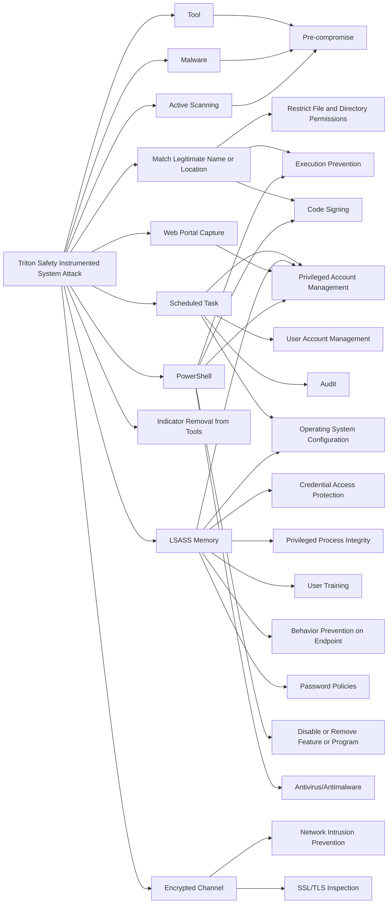

---
tags:
   - campaigns
---
# Triton Safety Instrumented System Attack
## ID:C0030
[Triton Safety Instrumented System Attack](campaigns/C0030) was a campaign employed by [TEMP.Veles](groups/G0088) which leveraged the [Triton](software/S1009) malware framework against a petrochemical organization.(Citation: Triton-EENews-2017) The malware and techniques used within this campaign targeted specific Triconex [Safety Controller](assets/A0010)s within the environment.(Citation: FireEye TRITON 2018) The incident was eventually discovered due to a safety trip that occurred as a result of an issue in the malware.(Citation: FireEye TRITON 2017)

## Techniques Used By Campaign
* [Tool](techniques/T1588/002)
* [Match Legitimate Name or Location](techniques/T1036/005)
* [Scheduled Task](techniques/T1053/005)
* [LSASS Memory](techniques/T1003/001)
* [Malware](techniques/T1587/001)
* [Web Portal Capture](techniques/T1056/003)
* [PowerShell](techniques/T1059/001)
* [Indicator Removal from Tools](techniques/T1027/005)
* [Encrypted Channel](techniques/T1573)
* [Active Scanning](techniques/T1595)

# Summary of Techniques and Mitigations
