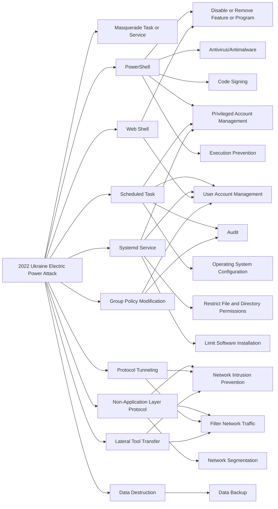

---
tags:
   - campaigns
---
# 2022 Ukraine Electric Power Attack
## ID:C0034
The [2022 Ukraine Electric Power Attack](/mitre/campaigns/C0034) was a [Sandworm Team](/mitre/groups/G0034) campaign that used a combination of GOGETTER, Neo-REGEORG, [CaddyWiper](/mitre/software/S0693), and living of the land (LotL) techniques to gain access to a Ukrainian electric utility to send unauthorized commands from their SCADA system.(Citation: Mandiant-Sandworm-Ukraine-2022)(Citation: Dragos-Sandworm-Ukraine-2022) 
## Techniques Used By Campaign
* [Masquerade Task or Service](techniques/T1036/004)
* [PowerShell](techniques/T1059/001)
* [Scheduled Task](techniques/T1053/005)
* [Systemd Service](techniques/T1543/002)
* [Web Shell](techniques/T1505/003)
* [Non-Application Layer Protocol](techniques/T1095)
* [Protocol Tunneling](techniques/T1572)
* [Data Destruction](techniques/T1485)
* [Lateral Tool Transfer](techniques/T1570)
* [Group Policy Modification](techniques/T1484/001)

# Summary of Techniques and Mitigations
