---
tags:
   - groups
---
# Axiom
## ID:G0001
[Axiom](/mitre/groups/G0001) is a suspected Chinese cyber espionage group that has targeted the aerospace, defense, government, manufacturing, and media sectors since at least 2008. Some reporting suggests a degree of overlap between [Axiom](/mitre/groups/G0001) and [Winnti Group](/mitre/groups/G0044) but the two groups appear to be distinct based on differences in reporting on TTPs and targeting.(Citation: Kaspersky Winnti April 2013)(Citation: Kaspersky Winnti June 2015)(Citation: Novetta Winnti April 2015)
## Techniques Used By Group
* [Steganography](techniques/T1001/002)
* [Data from Local System](techniques/T1005)
* [Archive Collected Data](techniques/T1560)
* [Botnet](techniques/T1584/005)
* [Drive-by Compromise](techniques/T1189)
* [Subvert Trust Controls](techniques/T1553)
* [Remote Desktop Protocol](techniques/T1021/001)
* [DNS Server](techniques/T1583/002)
* [Exploitation for Client Execution](techniques/T1203)
* [Valid Accounts](techniques/T1078)
* [Virtual Private Server](techniques/T1583/003)
* [RDP Hijacking](techniques/T1563/002)
* [Accessibility Features](techniques/T1546/008)
* [Phishing](techniques/T1566)
* [Exploit Public-Facing Application](techniques/T1190)
* [OS Credential Dumping](techniques/T1003)

# Summary of Techniques and Mitigations

```mermaid
flowchart LR
group[Axiom] --> T1001.002[Steganography]
group[Axiom] --> T1005[Data from Local System]
group[Axiom] --> T1560[Archive Collected Data]
group[Axiom] --> T1584.005[Botnet]
group[Axiom] --> T1189[Drive-by Compromise]
group[Axiom] --> T1553[Subvert Trust Controls]
group[Axiom] --> T1021.001[Remote Desktop Protocol]
group[Axiom] --> T1583.002[DNS Server]
group[Axiom] --> T1203[Exploitation for Client Execution]
group[Axiom] --> T1078[Valid Accounts]
group[Axiom] --> T1583.003[Virtual Private Server]
group[Axiom] --> T1563.002[RDP Hijacking]
group[Axiom] --> T1546.008[Accessibility Features]
group[Axiom] --> T1566[Phishing]
group[Axiom] --> T1190[Exploit Public-Facing Application]
group[Axiom] --> T1003[OS Credential Dumping]
T1001.002[Steganography] --> M1031[Network Intrusion Prevention]
T1005[Data from Local System] --> M1057[Data Loss Prevention]
T1560[Archive Collected Data] --> M1047[Audit]
T1584.005[Botnet] --> M1056[Pre-compromise]
T1189[Drive-by Compromise] --> M1050[Exploit Protection]
T1189[Drive-by Compromise] --> M1051[Update Software]
T1189[Drive-by Compromise] --> M1048[Application Isolation and Sandboxing]
T1189[Drive-by Compromise] --> M1021[Restrict Web-Based Content]
T1553[Subvert Trust Controls] --> M1038[Execution Prevention]
T1553[Subvert Trust Controls] --> M1028[Operating System Configuration]
T1553[Subvert Trust Controls] --> M1026[Privileged Account Management]
T1553[Subvert Trust Controls] --> M1024[Restrict Registry Permissions]
T1553[Subvert Trust Controls] --> M1054[Software Configuration]
T1021.001[Remote Desktop Protocol] --> M1047[Audit]
T1021.001[Remote Desktop Protocol] --> M1035[Limit Access to Resource Over Network]
T1021.001[Remote Desktop Protocol] --> M1030[Network Segmentation]
T1021.001[Remote Desktop Protocol] --> M1028[Operating System Configuration]
T1021.001[Remote Desktop Protocol] --> M1042[Disable or Remove Feature or Program]
T1021.001[Remote Desktop Protocol] --> M1018[User Account Management]
T1021.001[Remote Desktop Protocol] --> M1032[Multi-factor Authentication]
T1021.001[Remote Desktop Protocol] --> M1026[Privileged Account Management]
T1583.002[DNS Server] --> M1056[Pre-compromise]
T1203[Exploitation for Client Execution] --> M1050[Exploit Protection]
T1203[Exploitation for Client Execution] --> M1048[Application Isolation and Sandboxing]
T1078[Valid Accounts] --> M1027[Password Policies]
T1078[Valid Accounts] --> M1018[User Account Management]
T1078[Valid Accounts] --> M1026[Privileged Account Management]
T1078[Valid Accounts] --> M1013[Application Developer Guidance]
T1078[Valid Accounts] --> M1017[User Training]
T1078[Valid Accounts] --> M1015[Active Directory Configuration]
T1078[Valid Accounts] --> M1036[Account Use Policies]
T1583.003[Virtual Private Server] --> M1056[Pre-compromise]
T1563.002[RDP Hijacking] --> M1035[Limit Access to Resource Over Network]
T1563.002[RDP Hijacking] --> M1030[Network Segmentation]
T1563.002[RDP Hijacking] --> M1028[Operating System Configuration]
T1563.002[RDP Hijacking] --> M1018[User Account Management]
T1563.002[RDP Hijacking] --> M1047[Audit]
T1563.002[RDP Hijacking] --> M1042[Disable or Remove Feature or Program]
T1563.002[RDP Hijacking] --> M1026[Privileged Account Management]
T1546.008[Accessibility Features] --> M1035[Limit Access to Resource Over Network]
T1546.008[Accessibility Features] --> M1028[Operating System Configuration]
T1546.008[Accessibility Features] --> M1038[Execution Prevention]
T1566[Phishing] --> M1047[Audit]
T1566[Phishing] --> M1031[Network Intrusion Prevention]
T1566[Phishing] --> M1054[Software Configuration]
T1566[Phishing] --> M1021[Restrict Web-Based Content]
T1566[Phishing] --> M1049[Antivirus/Antimalware]
T1566[Phishing] --> M1017[User Training]
T1190[Exploit Public-Facing Application] --> M1048[Application Isolation and Sandboxing]
T1190[Exploit Public-Facing Application] --> M1030[Network Segmentation]
T1190[Exploit Public-Facing Application] --> M1016[Vulnerability Scanning]
T1190[Exploit Public-Facing Application] --> M1026[Privileged Account Management]
T1190[Exploit Public-Facing Application] --> M1050[Exploit Protection]
T1190[Exploit Public-Facing Application] --> M1051[Update Software]
T1003[OS Credential Dumping] --> M1041[Encrypt Sensitive Information]
T1003[OS Credential Dumping] --> M1040[Behavior Prevention on Endpoint]
T1003[OS Credential Dumping] --> M1027[Password Policies]
T1003[OS Credential Dumping] --> M1017[User Training]
T1003[OS Credential Dumping] --> M1026[Privileged Account Management]
T1003[OS Credential Dumping] --> M1025[Privileged Process Integrity]
T1003[OS Credential Dumping] --> M1043[Credential Access Protection]
T1003[OS Credential Dumping] --> M1015[Active Directory Configuration]
T1003[OS Credential Dumping] --> M1028[Operating System Configuration]
```
