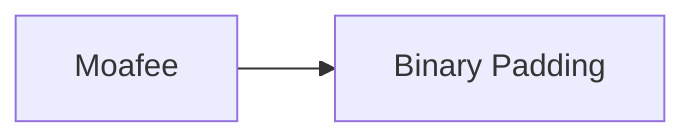

---
tags:
   - groups
---
# Moafee
## ID:G0002
[Moafee](/mitre/groups/G0002) is a threat group that appears to operate from the Guandong Province of China. Due to overlapping TTPs, including similar custom tools, Moafee is thought to have a direct or indirect relationship with the threat group [DragonOK](/mitre/groups/G0017). (Citation: Haq 2014)
## Techniques Used By Group
* [Binary Padding](/mitre/techniques/T1027/001)

# Summary of Techniques and Mitigations
