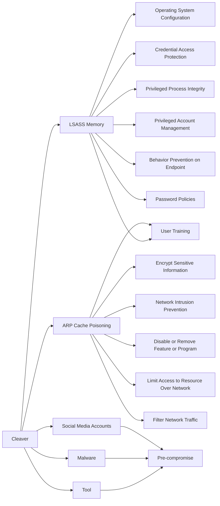

---
tags:
   - groups
---
# Cleaver
## ID:G0003
[Cleaver](/mitre/groups/G0003) is a threat group that has been attributed to Iranian actors and is responsible for activity tracked as Operation Cleaver. (Citation: Cylance Cleaver) Strong circumstantial evidence suggests Cleaver is linked to Threat Group 2889 (TG-2889). (Citation: Dell Threat Group 2889)
## Techniques Used By Group
* [LSASS Memory](/mitre/techniques/T1003/001)
* [ARP Cache Poisoning](/mitre/techniques/T1557/002)
* [Tool](/mitre/techniques/T1588/002)
* [Malware](/mitre/techniques/T1587/001)
* [Social Media Accounts](/mitre/techniques/T1585/001)

# Summary of Techniques and Mitigations
