---
tags:
   - groups
---
# Ke3chang
## ID:G0004
[Ke3chang](/mitre/groups/G0004) is a threat group attributed to actors operating out of China. [Ke3chang](/mitre/groups/G0004) has targeted oil, government, diplomatic, military, and NGOs in Central and South America, the Caribbean, Europe, and North America since at least 2010.(Citation: Mandiant Operation Ke3chang November 2014)(Citation: NCC Group APT15 Alive and Strong)(Citation: APT15 Intezer June 2018)(Citation: Microsoft NICKEL December 2021)
## Techniques Used By Group
* [Remote Email Collection](techniques/T1114/002)
* [Ingress Tool Transfer](techniques/T1105)
* [Local Account](techniques/T1087/001)
* [System Owner/User Discovery](techniques/T1033)
* [System Language Discovery](techniques/T1614/001)
* [Domain Account](techniques/T1087/002)
* [Deobfuscate/Decode Files or Information](techniques/T1140)
* [Golden Ticket](techniques/T1558/001)
* [SMB/Windows Admin Shares](techniques/T1021/002)
* [Exfiltration Over C2 Channel](techniques/T1041)
* [Automated Collection](techniques/T1119)
* [File and Directory Discovery](techniques/T1083)
* [External Remote Services](techniques/T1133)
* [Remote System Discovery](techniques/T1018)
* [Security Account Manager](techniques/T1003/002)
* [System Network Configuration Discovery](techniques/T1016)
* [Tool](techniques/T1588/002)
* [Automated Exfiltration](techniques/T1020)
* [System Service Discovery](techniques/T1007)
* [Windows Service](techniques/T1543/003)
* [Exploit Public-Facing Application](techniques/T1190)
* [Match Legitimate Name or Location](techniques/T1036/005)
* [Service Execution](techniques/T1569/002)
* [Data from Local System](techniques/T1005)
* [DNS](techniques/T1071/004)
* [Sharepoint](techniques/T1213/002)
* [Obfuscated Files or Information](techniques/T1027)
* [Command and Scripting Interpreter](techniques/T1059)
* [Right-to-Left Override](techniques/T1036/002)
* [Archive Collected Data](techniques/T1560)
* [Domain Groups](techniques/T1069/002)
* [Archive via Utility](techniques/T1560/001)
* [NTDS](techniques/T1003/003)
* [Process Discovery](techniques/T1057)
* [LSASS Memory](techniques/T1003/001)
* [Malware](techniques/T1587/001)
* [Web Protocols](techniques/T1071/001)
* [Windows Command Shell](techniques/T1059/003)
* [Valid Accounts](techniques/T1078)
* [Registry Run Keys / Startup Folder](techniques/T1547/001)
* [System Network Connections Discovery](techniques/T1049)
* [Keylogging](techniques/T1056/001)
* [LSA Secrets](techniques/T1003/004)
* [Cloud Accounts](techniques/T1078/004)
* [System Information Discovery](techniques/T1082)

# Summary of Techniques and Mitigations

```mermaid
flowchart LR
group[Ke3chang] --> T1114.002[Remote Email Collection]
group[Ke3chang] --> T1105[Ingress Tool Transfer]
group[Ke3chang] --> T1087.001[Local Account]
group[Ke3chang] --> T1033[System Owner/User Discovery]
group[Ke3chang] --> T1614.001[System Language Discovery]
group[Ke3chang] --> T1087.002[Domain Account]
group[Ke3chang] --> T1140[Deobfuscate/Decode Files or Information]
group[Ke3chang] --> T1558.001[Golden Ticket]
group[Ke3chang] --> T1021.002[SMB/Windows Admin Shares]
group[Ke3chang] --> T1041[Exfiltration Over C2 Channel]
group[Ke3chang] --> T1119[Automated Collection]
group[Ke3chang] --> T1083[File and Directory Discovery]
group[Ke3chang] --> T1133[External Remote Services]
group[Ke3chang] --> T1018[Remote System Discovery]
group[Ke3chang] --> T1003.002[Security Account Manager]
group[Ke3chang] --> T1016[System Network Configuration Discovery]
group[Ke3chang] --> T1588.002[Tool]
group[Ke3chang] --> T1020[Automated Exfiltration]
group[Ke3chang] --> T1007[System Service Discovery]
group[Ke3chang] --> T1543.003[Windows Service]
group[Ke3chang] --> T1190[Exploit Public-Facing Application]
group[Ke3chang] --> T1036.005[Match Legitimate Name or Location]
group[Ke3chang] --> T1569.002[Service Execution]
group[Ke3chang] --> T1005[Data from Local System]
group[Ke3chang] --> T1071.004[DNS]
group[Ke3chang] --> T1213.002[Sharepoint]
group[Ke3chang] --> T1027[Obfuscated Files or Information]
group[Ke3chang] --> T1059[Command and Scripting Interpreter]
group[Ke3chang] --> T1036.002[Right-to-Left Override]
group[Ke3chang] --> T1560[Archive Collected Data]
group[Ke3chang] --> T1069.002[Domain Groups]
group[Ke3chang] --> T1560.001[Archive via Utility]
group[Ke3chang] --> T1003.003[NTDS]
group[Ke3chang] --> T1057[Process Discovery]
group[Ke3chang] --> T1003.001[LSASS Memory]
group[Ke3chang] --> T1587.001[Malware]
group[Ke3chang] --> T1071.001[Web Protocols]
group[Ke3chang] --> T1059.003[Windows Command Shell]
group[Ke3chang] --> T1078[Valid Accounts]
group[Ke3chang] --> T1547.001[Registry Run Keys / Startup Folder]
group[Ke3chang] --> T1049[System Network Connections Discovery]
group[Ke3chang] --> T1056.001[Keylogging]
group[Ke3chang] --> T1003.004[LSA Secrets]
group[Ke3chang] --> T1078.004[Cloud Accounts]
group[Ke3chang] --> T1082[System Information Discovery]
T1114.002[Remote Email Collection] --> M1041[Encrypt Sensitive Information]
T1114.002[Remote Email Collection] --> M1032[Multi-factor Authentication]
T1105[Ingress Tool Transfer] --> M1031[Network Intrusion Prevention]
T1087.001[Local Account] --> M1028[Operating System Configuration]
T1087.002[Domain Account] --> M1028[Operating System Configuration]
T1558.001[Golden Ticket] --> M1026[Privileged Account Management]
T1558.001[Golden Ticket] --> M1015[Active Directory Configuration]
T1021.002[SMB/Windows Admin Shares] --> M1026[Privileged Account Management]
T1021.002[SMB/Windows Admin Shares] --> M1035[Limit Access to Resource Over Network]
T1021.002[SMB/Windows Admin Shares] --> M1037[Filter Network Traffic]
T1021.002[SMB/Windows Admin Shares] --> M1027[Password Policies]
T1041[Exfiltration Over C2 Channel] --> M1031[Network Intrusion Prevention]
T1041[Exfiltration Over C2 Channel] --> M1057[Data Loss Prevention]
T1119[Automated Collection] --> M1029[Remote Data Storage]
T1119[Automated Collection] --> M1041[Encrypt Sensitive Information]
T1133[External Remote Services] --> M1030[Network Segmentation]
T1133[External Remote Services] --> M1042[Disable or Remove Feature or Program]
T1133[External Remote Services] --> M1035[Limit Access to Resource Over Network]
T1133[External Remote Services] --> M1032[Multi-factor Authentication]
T1003.002[Security Account Manager] --> M1027[Password Policies]
T1003.002[Security Account Manager] --> M1026[Privileged Account Management]
T1003.002[Security Account Manager] --> M1028[Operating System Configuration]
T1003.002[Security Account Manager] --> M1017[User Training]
T1588.002[Tool] --> M1056[Pre-compromise]
T1543.003[Windows Service] --> M1040[Behavior Prevention on Endpoint]
T1543.003[Windows Service] --> M1028[Operating System Configuration]
T1543.003[Windows Service] --> M1047[Audit]
T1543.003[Windows Service] --> M1045[Code Signing]
T1543.003[Windows Service] --> M1018[User Account Management]
T1190[Exploit Public-Facing Application] --> M1048[Application Isolation and Sandboxing]
T1190[Exploit Public-Facing Application] --> M1030[Network Segmentation]
T1190[Exploit Public-Facing Application] --> M1016[Vulnerability Scanning]
T1190[Exploit Public-Facing Application] --> M1026[Privileged Account Management]
T1190[Exploit Public-Facing Application] --> M1050[Exploit Protection]
T1190[Exploit Public-Facing Application] --> M1051[Update Software]
T1036.005[Match Legitimate Name or Location] --> M1022[Restrict File and Directory Permissions]
T1036.005[Match Legitimate Name or Location] --> M1038[Execution Prevention]
T1036.005[Match Legitimate Name or Location] --> M1045[Code Signing]
T1569.002[Service Execution] --> M1026[Privileged Account Management]
T1569.002[Service Execution] --> M1040[Behavior Prevention on Endpoint]
T1569.002[Service Execution] --> M1022[Restrict File and Directory Permissions]
T1005[Data from Local System] --> M1057[Data Loss Prevention]
T1071.004[DNS] --> M1037[Filter Network Traffic]
T1071.004[DNS] --> M1031[Network Intrusion Prevention]
T1213.002[Sharepoint] --> M1047[Audit]
T1213.002[Sharepoint] --> M1018[User Account Management]
T1213.002[Sharepoint] --> M1017[User Training]
T1027[Obfuscated Files or Information] --> M1047[Audit]
T1027[Obfuscated Files or Information] --> M1040[Behavior Prevention on Endpoint]
T1027[Obfuscated Files or Information] --> M1017[User Training]
T1027[Obfuscated Files or Information] --> M1049[Antivirus/Antimalware]
T1059[Command and Scripting Interpreter] --> M1045[Code Signing]
T1059[Command and Scripting Interpreter] --> M1042[Disable or Remove Feature or Program]
T1059[Command and Scripting Interpreter] --> M1038[Execution Prevention]
T1059[Command and Scripting Interpreter] --> M1049[Antivirus/Antimalware]
T1059[Command and Scripting Interpreter] --> M1026[Privileged Account Management]
T1059[Command and Scripting Interpreter] --> M1021[Restrict Web-Based Content]
T1059[Command and Scripting Interpreter] --> M1040[Behavior Prevention on Endpoint]
T1560[Archive Collected Data] --> M1047[Audit]
T1560.001[Archive via Utility] --> M1047[Audit]
T1003.003[NTDS] --> M1027[Password Policies]
T1003.003[NTDS] --> M1026[Privileged Account Management]
T1003.003[NTDS] --> M1017[User Training]
T1003.003[NTDS] --> M1041[Encrypt Sensitive Information]
T1003.001[LSASS Memory] --> M1028[Operating System Configuration]
T1003.001[LSASS Memory] --> M1043[Credential Access Protection]
T1003.001[LSASS Memory] --> M1025[Privileged Process Integrity]
T1003.001[LSASS Memory] --> M1026[Privileged Account Management]
T1003.001[LSASS Memory] --> M1017[User Training]
T1003.001[LSASS Memory] --> M1040[Behavior Prevention on Endpoint]
T1003.001[LSASS Memory] --> M1027[Password Policies]
T1587.001[Malware] --> M1056[Pre-compromise]
T1071.001[Web Protocols] --> M1031[Network Intrusion Prevention]
T1059.003[Windows Command Shell] --> M1038[Execution Prevention]
T1078[Valid Accounts] --> M1027[Password Policies]
T1078[Valid Accounts] --> M1018[User Account Management]
T1078[Valid Accounts] --> M1026[Privileged Account Management]
T1078[Valid Accounts] --> M1013[Application Developer Guidance]
T1078[Valid Accounts] --> M1017[User Training]
T1078[Valid Accounts] --> M1015[Active Directory Configuration]
T1078[Valid Accounts] --> M1036[Account Use Policies]
T1003.004[LSA Secrets] --> M1027[Password Policies]
T1003.004[LSA Secrets] --> M1026[Privileged Account Management]
T1003.004[LSA Secrets] --> M1017[User Training]
T1078.004[Cloud Accounts] --> M1027[Password Policies]
T1078.004[Cloud Accounts] --> M1015[Active Directory Configuration]
T1078.004[Cloud Accounts] --> M1026[Privileged Account Management]
T1078.004[Cloud Accounts] --> M1032[Multi-factor Authentication]
T1078.004[Cloud Accounts] --> M1036[Account Use Policies]
T1078.004[Cloud Accounts] --> M1017[User Training]
T1078.004[Cloud Accounts] --> M1018[User Account Management]
```
