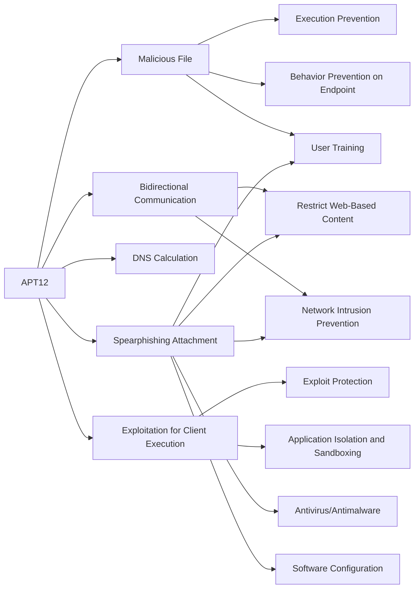

---
tags:
   - groups
---
# APT12
## ID:G0005
[APT12](/mitre/groups/G0005) is a threat group that has been attributed to China. The group has targeted a variety of victims including but not limited to media outlets, high-tech companies, and multiple governments.(Citation: Meyers Numbered Panda)
## Techniques Used By Group
* [Malicious File](/mitre/techniques/T1204/002)
* [Bidirectional Communication](/mitre/techniques/T1102/002)
* [DNS Calculation](/mitre/techniques/T1568/003)
* [Exploitation for Client Execution](/mitre/techniques/T1203)
* [Spearphishing Attachment](/mitre/techniques/T1566/001)

# Summary of Techniques and Mitigations
