---
tags:
   - groups
---
# APT1
## ID:G0006
[APT1](groups/G0006) is a Chinese threat group that has been attributed to the 2nd Bureau of the People’s Liberation Army (PLA) General Staff Department’s (GSD) 3rd Department, commonly known by its Military Unit Cover Designator (MUCD) as Unit 61398. (Citation: Mandiant APT1)
## Techniques Used By Group
* [LSASS Memory](techniques/T1003/001)
* [Process Discovery](techniques/T1057)
* [Data from Local System](techniques/T1005)
* [Pass the Hash](techniques/T1550/002)
* [Domains](techniques/T1583/001)
* [Archive via Utility](techniques/T1560/001)
* [Automated Collection](techniques/T1119)
* [Remote Email Collection](techniques/T1114/002)
* [Spearphishing Link](techniques/T1566/002)
* [System Network Configuration Discovery](techniques/T1016)
* [Local Email Collection](techniques/T1114/001)
* [Malware](techniques/T1588/001)
* [System Network Connections Discovery](techniques/T1049)
* [Email Accounts](techniques/T1585/002)
* [Domains](techniques/T1584/001)
* [Match Legitimate Name or Location](techniques/T1036/005)
* [Local Account](techniques/T1087/001)
* [Spearphishing Attachment](techniques/T1566/001)
* [Network Share Discovery](techniques/T1135)
* [Windows Command Shell](techniques/T1059/003)
* [Tool](techniques/T1588/002)
* [System Service Discovery](techniques/T1007)
* [Remote Desktop Protocol](techniques/T1021/001)

# Summary of Techniques and Mitigations

```mermaid
flowchart LR
group[APT1] --> T1003.001[LSASS Memory]
group[APT1] --> T1057[Process Discovery]
group[APT1] --> T1005[Data from Local System]
group[APT1] --> T1550.002[Pass the Hash]
group[APT1] --> T1583.001[Domains]
group[APT1] --> T1560.001[Archive via Utility]
group[APT1] --> T1119[Automated Collection]
group[APT1] --> T1114.002[Remote Email Collection]
group[APT1] --> T1566.002[Spearphishing Link]
group[APT1] --> T1016[System Network Configuration Discovery]
group[APT1] --> T1114.001[Local Email Collection]
group[APT1] --> T1588.001[Malware]
group[APT1] --> T1049[System Network Connections Discovery]
group[APT1] --> T1585.002[Email Accounts]
group[APT1] --> T1584.001[Domains]
group[APT1] --> T1036.005[Match Legitimate Name or Location]
group[APT1] --> T1087.001[Local Account]
group[APT1] --> T1566.001[Spearphishing Attachment]
group[APT1] --> T1135[Network Share Discovery]
group[APT1] --> T1059.003[Windows Command Shell]
group[APT1] --> T1588.002[Tool]
group[APT1] --> T1007[System Service Discovery]
group[APT1] --> T1021.001[Remote Desktop Protocol]
T1003.001[LSASS Memory] --> M1028[Operating System Configuration]
T1003.001[LSASS Memory] --> M1043[Credential Access Protection]
T1003.001[LSASS Memory] --> M1025[Privileged Process Integrity]
T1003.001[LSASS Memory] --> M1026[Privileged Account Management]
T1003.001[LSASS Memory] --> M1017[User Training]
T1003.001[LSASS Memory] --> M1040[Behavior Prevention on Endpoint]
T1003.001[LSASS Memory] --> M1027[Password Policies]
T1005[Data from Local System] --> M1057[Data Loss Prevention]
T1550.002[Pass the Hash] --> M1051[Update Software]
T1550.002[Pass the Hash] --> M1052[User Account Control]
T1550.002[Pass the Hash] --> M1018[User Account Management]
T1550.002[Pass the Hash] --> M1026[Privileged Account Management]
T1583.001[Domains] --> M1056[Pre-compromise]
T1560.001[Archive via Utility] --> M1047[Audit]
T1119[Automated Collection] --> M1029[Remote Data Storage]
T1119[Automated Collection] --> M1041[Encrypt Sensitive Information]
T1114.002[Remote Email Collection] --> M1041[Encrypt Sensitive Information]
T1114.002[Remote Email Collection] --> M1032[Multi-factor Authentication]
T1566.002[Spearphishing Link] --> M1054[Software Configuration]
T1566.002[Spearphishing Link] --> M1021[Restrict Web-Based Content]
T1566.002[Spearphishing Link] --> M1047[Audit]
T1566.002[Spearphishing Link] --> M1018[User Account Management]
T1566.002[Spearphishing Link] --> M1017[User Training]
T1114.001[Local Email Collection] --> M1041[Encrypt Sensitive Information]
T1588.001[Malware] --> M1056[Pre-compromise]
T1585.002[Email Accounts] --> M1056[Pre-compromise]
T1584.001[Domains] --> M1056[Pre-compromise]
T1036.005[Match Legitimate Name or Location] --> M1022[Restrict File and Directory Permissions]
T1036.005[Match Legitimate Name or Location] --> M1038[Execution Prevention]
T1036.005[Match Legitimate Name or Location] --> M1045[Code Signing]
T1087.001[Local Account] --> M1028[Operating System Configuration]
T1566.001[Spearphishing Attachment] --> M1049[Antivirus/Antimalware]
T1566.001[Spearphishing Attachment] --> M1031[Network Intrusion Prevention]
T1566.001[Spearphishing Attachment] --> M1054[Software Configuration]
T1566.001[Spearphishing Attachment] --> M1017[User Training]
T1566.001[Spearphishing Attachment] --> M1021[Restrict Web-Based Content]
T1135[Network Share Discovery] --> M1028[Operating System Configuration]
T1059.003[Windows Command Shell] --> M1038[Execution Prevention]
T1588.002[Tool] --> M1056[Pre-compromise]
T1021.001[Remote Desktop Protocol] --> M1047[Audit]
T1021.001[Remote Desktop Protocol] --> M1035[Limit Access to Resource Over Network]
T1021.001[Remote Desktop Protocol] --> M1030[Network Segmentation]
T1021.001[Remote Desktop Protocol] --> M1028[Operating System Configuration]
T1021.001[Remote Desktop Protocol] --> M1042[Disable or Remove Feature or Program]
T1021.001[Remote Desktop Protocol] --> M1018[User Account Management]
T1021.001[Remote Desktop Protocol] --> M1032[Multi-factor Authentication]
T1021.001[Remote Desktop Protocol] --> M1026[Privileged Account Management]
```
