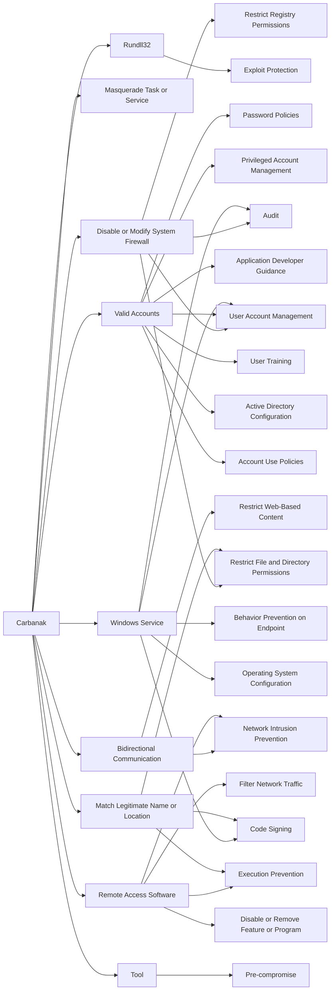

---
tags:
   - groups
---
# Carbanak
## ID:G0008
[Carbanak](groups/G0008) is a cybercriminal group that has used [Carbanak](software/S0030) malware to target financial institutions since at least 2013. [Carbanak](groups/G0008) may be linked to groups tracked separately as [Cobalt Group](groups/G0080) and [FIN7](groups/G0046) that have also used [Carbanak](software/S0030) malware.(Citation: Kaspersky Carbanak)(Citation: FireEye FIN7 April 2017)(Citation: Europol Cobalt Mar 2018)(Citation: Secureworks GOLD NIAGARA Threat Profile)(Citation: Secureworks GOLD KINGSWOOD Threat Profile)
## Techniques Used By Group
* [Disable or Modify System Firewall](techniques/T1562/004)
* [Masquerade Task or Service](techniques/T1036/004)
* [Rundll32](techniques/T1218/011)
* [Valid Accounts](techniques/T1078)
* [Bidirectional Communication](techniques/T1102/002)
* [Windows Service](techniques/T1543/003)
* [Remote Access Software](techniques/T1219)
* [Match Legitimate Name or Location](techniques/T1036/005)
* [Tool](techniques/T1588/002)

# Summary of Techniques and Mitigations
