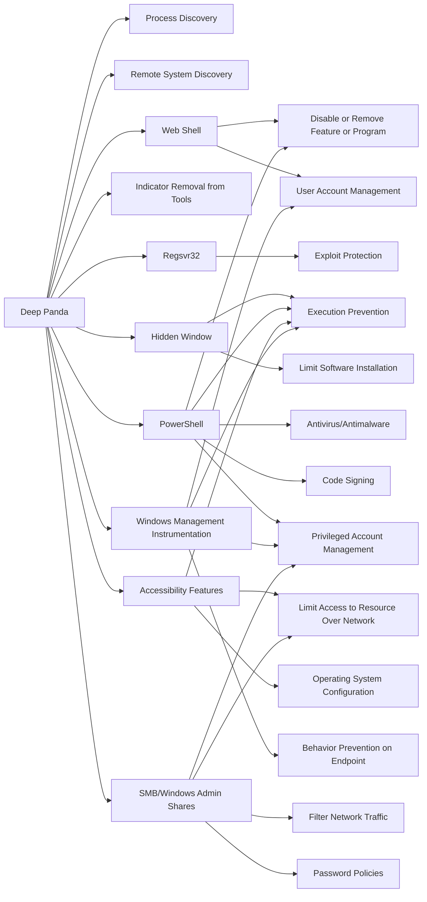

---
tags:
   - groups
---
# Deep Panda
## ID:G0009
[Deep Panda](groups/G0009) is a suspected Chinese threat group known to target many industries, including government, defense, financial, and telecommunications. (Citation: Alperovitch 2014) The intrusion into healthcare company Anthem has been attributed to [Deep Panda](groups/G0009). (Citation: ThreatConnect Anthem) This group is also known as Shell Crew, WebMasters, KungFu Kittens, and PinkPanther. (Citation: RSA Shell Crew) [Deep Panda](groups/G0009) also appears to be known as Black Vine based on the attribution of both group names to the Anthem intrusion. (Citation: Symantec Black Vine) Some analysts track [Deep Panda](groups/G0009) and [APT19](groups/G0073) as the same group, but it is unclear from open source information if the groups are the same. (Citation: ICIT China's Espionage Jul 2016)
## Techniques Used By Group
* [Process Discovery](techniques/T1057)
* [Remote System Discovery](techniques/T1018)
* [Web Shell](techniques/T1505/003)
* [Indicator Removal from Tools](techniques/T1027/005)
* [Regsvr32](techniques/T1218/010)
* [Hidden Window](techniques/T1564/003)
* [PowerShell](techniques/T1059/001)
* [Accessibility Features](techniques/T1546/008)
* [Windows Management Instrumentation](techniques/T1047)
* [SMB/Windows Admin Shares](techniques/T1021/002)

# Summary of Techniques and Mitigations
