---
tags:
   - groups
---
# Turla
## ID:G0010
[Turla](groups/G0010) is a cyber espionage threat group that has been attributed to Russia's Federal Security Service (FSB).  They have compromised victims in over 50 countries since at least 2004, spanning a range of industries including government, embassies, military, education, research and pharmaceutical companies. [Turla](groups/G0010) is known for conducting watering hole and spearphishing campaigns, and leveraging in-house tools and malware, such as [Uroburos](software/S0022).(Citation: Kaspersky Turla)(Citation: ESET Gazer Aug 2017)(Citation: CrowdStrike VENOMOUS BEAR)(Citation: ESET Turla Mosquito Jan 2018)(Citation: Joint Cybersecurity Advisory AA23-129A Snake Malware May 2023)
## Techniques Used By Group
* [Web Services](techniques/T1584/006)
* [Modify Registry](techniques/T1112)
* [Local Groups](techniques/T1069/001)
* [Deobfuscate/Decode Files or Information](techniques/T1140)
* [Tool](techniques/T1588/002)
* [JavaScript](techniques/T1059/007)
* [Create Process with Token](techniques/T1134/002)
* [Disable or Modify Tools](techniques/T1562/001)
* [Visual Basic](techniques/T1059/005)
* [PowerShell Profile](techniques/T1546/013)
* [Web Services](techniques/T1583/006)
* [Dynamic-link Library Injection](techniques/T1055/001)
* [Ingress Tool Transfer](techniques/T1105)
* [Windows Credential Manager](techniques/T1555/004)
* [Proxy](techniques/T1090)
* [Exploitation for Privilege Escalation](techniques/T1068)
* [Group Policy Discovery](techniques/T1615)
* [System Network Connections Discovery](techniques/T1049)
* [Native API](techniques/T1106)
* [Mail Protocols](techniques/T1071/003)
* [SMB/Windows Admin Shares](techniques/T1021/002)
* [Registry Run Keys / Startup Folder](techniques/T1547/001)
* [Data from Local System](techniques/T1005)
* [Query Registry](techniques/T1012)
* [System Service Discovery](techniques/T1007)
* [Brute Force](techniques/T1110)
* [Lateral Tool Transfer](techniques/T1570)
* [Drive-by Compromise](techniques/T1189)
* [Server](techniques/T1584/004)
* [Domain Account](techniques/T1087/002)
* [Peripheral Device Discovery](techniques/T1120)
* [Exfiltration to Cloud Storage](techniques/T1567/002)
* [Bidirectional Communication](techniques/T1102/002)
* [Web Protocols](techniques/T1071/001)
* [System Time Discovery](techniques/T1124)
* [Local Account](techniques/T1087/001)
* [Malicious Link](techniques/T1204/001)
* [Internal Proxy](techniques/T1090/001)
* [Windows Management Instrumentation Event Subscription](techniques/T1546/003)
* [Archive via Utility](techniques/T1560/001)
* [Windows Command Shell](techniques/T1059/003)
* [Process Discovery](techniques/T1057)
* [System Network Configuration Discovery](techniques/T1016)
* [Malware](techniques/T1587/001)
* [Data from Removable Media](techniques/T1025)
* [Security Software Discovery](techniques/T1518/001)
* [PowerShell](techniques/T1059/001)
* [Command Obfuscation](techniques/T1027/010)
* [Python](techniques/T1059/006)
* [Data from Information Repositories](techniques/T1213)
* [Remote System Discovery](techniques/T1018)
* [Malware](techniques/T1588/001)
* [Domain Groups](techniques/T1069/002)
* [Fileless Storage](techniques/T1027/011)
* [Winlogon Helper DLL](techniques/T1547/004)
* [Code Signing Policy Modification](techniques/T1553/006)
* [Spearphishing Link](techniques/T1566/002)
* [Internet Connection Discovery](techniques/T1016/001)
* [Web Service](techniques/T1102)
* [System Information Discovery](techniques/T1082)
* [Virtual Private Server](techniques/T1584/003)
* [Process Injection](techniques/T1055)
* [Local Accounts](techniques/T1078/003)
* [Password Policy Discovery](techniques/T1201)
* [File and Directory Discovery](techniques/T1083)
* [Indicator Removal from Tools](techniques/T1027/005)

# Summary of Techniques and Mitigations

```mermaid
flowchart LR
group[Turla] --> T1584.006[Web Services]
group[Turla] --> T1112[Modify Registry]
group[Turla] --> T1069.001[Local Groups]
group[Turla] --> T1140[Deobfuscate/Decode Files or Information]
group[Turla] --> T1588.002[Tool]
group[Turla] --> T1059.007[JavaScript]
group[Turla] --> T1134.002[Create Process with Token]
group[Turla] --> T1562.001[Disable or Modify Tools]
group[Turla] --> T1059.005[Visual Basic]
group[Turla] --> T1546.013[PowerShell Profile]
group[Turla] --> T1583.006[Web Services]
group[Turla] --> T1055.001[Dynamic-link Library Injection]
group[Turla] --> T1105[Ingress Tool Transfer]
group[Turla] --> T1555.004[Windows Credential Manager]
group[Turla] --> T1090[Proxy]
group[Turla] --> T1068[Exploitation for Privilege Escalation]
group[Turla] --> T1615[Group Policy Discovery]
group[Turla] --> T1049[System Network Connections Discovery]
group[Turla] --> T1106[Native API]
group[Turla] --> T1071.003[Mail Protocols]
group[Turla] --> T1021.002[SMB/Windows Admin Shares]
group[Turla] --> T1547.001[Registry Run Keys / Startup Folder]
group[Turla] --> T1005[Data from Local System]
group[Turla] --> T1012[Query Registry]
group[Turla] --> T1007[System Service Discovery]
group[Turla] --> T1110[Brute Force]
group[Turla] --> T1570[Lateral Tool Transfer]
group[Turla] --> T1189[Drive-by Compromise]
group[Turla] --> T1584.004[Server]
group[Turla] --> T1087.002[Domain Account]
group[Turla] --> T1120[Peripheral Device Discovery]
group[Turla] --> T1567.002[Exfiltration to Cloud Storage]
group[Turla] --> T1102.002[Bidirectional Communication]
group[Turla] --> T1071.001[Web Protocols]
group[Turla] --> T1124[System Time Discovery]
group[Turla] --> T1087.001[Local Account]
group[Turla] --> T1204.001[Malicious Link]
group[Turla] --> T1090.001[Internal Proxy]
group[Turla] --> T1546.003[Windows Management Instrumentation Event Subscription]
group[Turla] --> T1560.001[Archive via Utility]
group[Turla] --> T1059.003[Windows Command Shell]
group[Turla] --> T1057[Process Discovery]
group[Turla] --> T1016[System Network Configuration Discovery]
group[Turla] --> T1587.001[Malware]
group[Turla] --> T1025[Data from Removable Media]
group[Turla] --> T1518.001[Security Software Discovery]
group[Turla] --> T1059.001[PowerShell]
group[Turla] --> T1027.010[Command Obfuscation]
group[Turla] --> T1059.006[Python]
group[Turla] --> T1213[Data from Information Repositories]
group[Turla] --> T1018[Remote System Discovery]
group[Turla] --> T1588.001[Malware]
group[Turla] --> T1069.002[Domain Groups]
group[Turla] --> T1027.011[Fileless Storage]
group[Turla] --> T1547.004[Winlogon Helper DLL]
group[Turla] --> T1553.006[Code Signing Policy Modification]
group[Turla] --> T1566.002[Spearphishing Link]
group[Turla] --> T1016.001[Internet Connection Discovery]
group[Turla] --> T1102[Web Service]
group[Turla] --> T1082[System Information Discovery]
group[Turla] --> T1584.003[Virtual Private Server]
group[Turla] --> T1055[Process Injection]
group[Turla] --> T1078.003[Local Accounts]
group[Turla] --> T1201[Password Policy Discovery]
group[Turla] --> T1083[File and Directory Discovery]
group[Turla] --> T1027.005[Indicator Removal from Tools]
T1584.006[Web Services] --> M1056[Pre-compromise]
T1112[Modify Registry] --> M1024[Restrict Registry Permissions]
T1588.002[Tool] --> M1056[Pre-compromise]
T1059.007[JavaScript] --> M1040[Behavior Prevention on Endpoint]
T1059.007[JavaScript] --> M1038[Execution Prevention]
T1059.007[JavaScript] --> M1042[Disable or Remove Feature or Program]
T1059.007[JavaScript] --> M1021[Restrict Web-Based Content]
T1134.002[Create Process with Token] --> M1026[Privileged Account Management]
T1134.002[Create Process with Token] --> M1018[User Account Management]
T1562.001[Disable or Modify Tools] --> M1038[Execution Prevention]
T1562.001[Disable or Modify Tools] --> M1024[Restrict Registry Permissions]
T1562.001[Disable or Modify Tools] --> M1018[User Account Management]
T1562.001[Disable or Modify Tools] --> M1022[Restrict File and Directory Permissions]
T1059.005[Visual Basic] --> M1042[Disable or Remove Feature or Program]
T1059.005[Visual Basic] --> M1049[Antivirus/Antimalware]
T1059.005[Visual Basic] --> M1038[Execution Prevention]
T1059.005[Visual Basic] --> M1040[Behavior Prevention on Endpoint]
T1059.005[Visual Basic] --> M1021[Restrict Web-Based Content]
T1546.013[PowerShell Profile] --> M1045[Code Signing]
T1546.013[PowerShell Profile] --> M1022[Restrict File and Directory Permissions]
T1546.013[PowerShell Profile] --> M1054[Software Configuration]
T1583.006[Web Services] --> M1056[Pre-compromise]
T1055.001[Dynamic-link Library Injection] --> M1040[Behavior Prevention on Endpoint]
T1105[Ingress Tool Transfer] --> M1031[Network Intrusion Prevention]
T1555.004[Windows Credential Manager] --> M1042[Disable or Remove Feature or Program]
T1090[Proxy] --> M1037[Filter Network Traffic]
T1090[Proxy] --> M1031[Network Intrusion Prevention]
T1090[Proxy] --> M1020[SSL/TLS Inspection]
T1068[Exploitation for Privilege Escalation] --> M1051[Update Software]
T1068[Exploitation for Privilege Escalation] --> M1050[Exploit Protection]
T1068[Exploitation for Privilege Escalation] --> M1048[Application Isolation and Sandboxing]
T1068[Exploitation for Privilege Escalation] --> M1019[Threat Intelligence Program]
T1068[Exploitation for Privilege Escalation] --> M1038[Execution Prevention]
T1106[Native API] --> M1038[Execution Prevention]
T1106[Native API] --> M1040[Behavior Prevention on Endpoint]
T1071.003[Mail Protocols] --> M1031[Network Intrusion Prevention]
T1021.002[SMB/Windows Admin Shares] --> M1026[Privileged Account Management]
T1021.002[SMB/Windows Admin Shares] --> M1035[Limit Access to Resource Over Network]
T1021.002[SMB/Windows Admin Shares] --> M1037[Filter Network Traffic]
T1021.002[SMB/Windows Admin Shares] --> M1027[Password Policies]
T1005[Data from Local System] --> M1057[Data Loss Prevention]
T1110[Brute Force] --> M1018[User Account Management]
T1110[Brute Force] --> M1036[Account Use Policies]
T1110[Brute Force] --> M1032[Multi-factor Authentication]
T1110[Brute Force] --> M1027[Password Policies]
T1570[Lateral Tool Transfer] --> M1037[Filter Network Traffic]
T1570[Lateral Tool Transfer] --> M1031[Network Intrusion Prevention]
T1189[Drive-by Compromise] --> M1050[Exploit Protection]
T1189[Drive-by Compromise] --> M1051[Update Software]
T1189[Drive-by Compromise] --> M1048[Application Isolation and Sandboxing]
T1189[Drive-by Compromise] --> M1021[Restrict Web-Based Content]
T1584.004[Server] --> M1056[Pre-compromise]
T1087.002[Domain Account] --> M1028[Operating System Configuration]
T1567.002[Exfiltration to Cloud Storage] --> M1021[Restrict Web-Based Content]
T1102.002[Bidirectional Communication] --> M1021[Restrict Web-Based Content]
T1102.002[Bidirectional Communication] --> M1031[Network Intrusion Prevention]
T1071.001[Web Protocols] --> M1031[Network Intrusion Prevention]
T1087.001[Local Account] --> M1028[Operating System Configuration]
T1204.001[Malicious Link] --> M1031[Network Intrusion Prevention]
T1204.001[Malicious Link] --> M1017[User Training]
T1204.001[Malicious Link] --> M1021[Restrict Web-Based Content]
T1090.001[Internal Proxy] --> M1031[Network Intrusion Prevention]
T1546.003[Windows Management Instrumentation Event Subscription] --> M1018[User Account Management]
T1546.003[Windows Management Instrumentation Event Subscription] --> M1026[Privileged Account Management]
T1546.003[Windows Management Instrumentation Event Subscription] --> M1040[Behavior Prevention on Endpoint]
T1560.001[Archive via Utility] --> M1047[Audit]
T1059.003[Windows Command Shell] --> M1038[Execution Prevention]
T1587.001[Malware] --> M1056[Pre-compromise]
T1025[Data from Removable Media] --> M1057[Data Loss Prevention]
T1059.001[PowerShell] --> M1042[Disable or Remove Feature or Program]
T1059.001[PowerShell] --> M1049[Antivirus/Antimalware]
T1059.001[PowerShell] --> M1045[Code Signing]
T1059.001[PowerShell] --> M1026[Privileged Account Management]
T1059.001[PowerShell] --> M1038[Execution Prevention]
T1027.010[Command Obfuscation] --> M1040[Behavior Prevention on Endpoint]
T1027.010[Command Obfuscation] --> M1049[Antivirus/Antimalware]
T1059.006[Python] --> M1047[Audit]
T1059.006[Python] --> M1049[Antivirus/Antimalware]
T1059.006[Python] --> M1033[Limit Software Installation]
T1059.006[Python] --> M1038[Execution Prevention]
T1213[Data from Information Repositories] --> M1032[Multi-factor Authentication]
T1213[Data from Information Repositories] --> M1017[User Training]
T1213[Data from Information Repositories] --> M1018[User Account Management]
T1213[Data from Information Repositories] --> M1047[Audit]
T1588.001[Malware] --> M1056[Pre-compromise]
T1027.011[Fileless Storage] --> M1047[Audit]
T1547.004[Winlogon Helper DLL] --> M1038[Execution Prevention]
T1547.004[Winlogon Helper DLL] --> M1018[User Account Management]
T1553.006[Code Signing Policy Modification] --> M1026[Privileged Account Management]
T1553.006[Code Signing Policy Modification] --> M1046[Boot Integrity]
T1553.006[Code Signing Policy Modification] --> M1024[Restrict Registry Permissions]
T1566.002[Spearphishing Link] --> M1054[Software Configuration]
T1566.002[Spearphishing Link] --> M1021[Restrict Web-Based Content]
T1566.002[Spearphishing Link] --> M1047[Audit]
T1566.002[Spearphishing Link] --> M1018[User Account Management]
T1566.002[Spearphishing Link] --> M1017[User Training]
T1102[Web Service] --> M1031[Network Intrusion Prevention]
T1102[Web Service] --> M1021[Restrict Web-Based Content]
T1584.003[Virtual Private Server] --> M1056[Pre-compromise]
T1055[Process Injection] --> M1026[Privileged Account Management]
T1055[Process Injection] --> M1040[Behavior Prevention on Endpoint]
T1078.003[Local Accounts] --> M1026[Privileged Account Management]
T1078.003[Local Accounts] --> M1027[Password Policies]
T1201[Password Policy Discovery] --> M1027[Password Policies]
```
