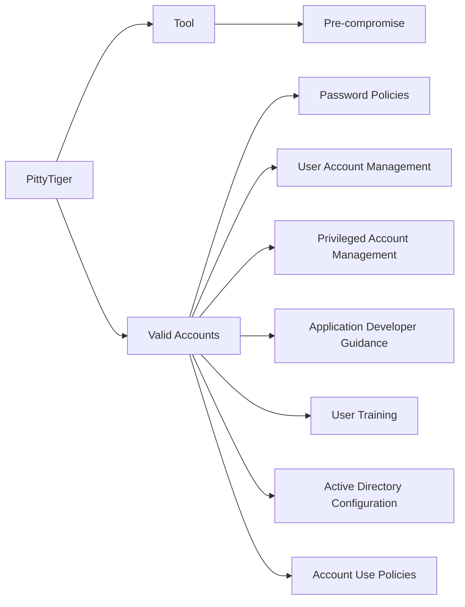

---
tags:
   - groups
---
# PittyTiger
## ID:G0011
[PittyTiger](/mitre/groups/G0011) is a threat group believed to operate out of China that uses multiple different types of malware to maintain command and control.(Citation: Bizeul 2014)(Citation: Villeneuve 2014)
## Techniques Used By Group
* [Tool](/mitre/techniques/T1588/002)
* [Valid Accounts](/mitre/techniques/T1078)

# Summary of Techniques and Mitigations
