---
tags:
   - groups
---
# Darkhotel
## ID:G0012
[Darkhotel](/mitre/groups/G0012) is a suspected South Korean threat group that has targeted victims primarily in East Asia since at least 2004. The group's name is based on cyber espionage operations conducted via hotel Internet networks against traveling executives and other select guests. [Darkhotel](/mitre/groups/G0012) has also conducted spearphishing campaigns and infected victims through peer-to-peer and file sharing networks.(Citation: Kaspersky Darkhotel)(Citation: Securelist Darkhotel Aug 2015)(Citation: Microsoft Digital Defense FY20 Sept 2020)
## Techniques Used By Group
* [Security Software Discovery](techniques/T1518/001)
* [User Activity Based Checks](techniques/T1497/002)
* [Encrypted/Encoded File](techniques/T1027/013)
* [Symmetric Cryptography](techniques/T1573/001)
* [Taint Shared Content](techniques/T1080)
* [System Information Discovery](techniques/T1082)
* [Keylogging](techniques/T1056/001)
* [Spearphishing Attachment](techniques/T1566/001)
* [Process Discovery](techniques/T1057)
* [Deobfuscate/Decode Files or Information](techniques/T1140)
* [Drive-by Compromise](techniques/T1189)
* [Replication Through Removable Media](techniques/T1091)
* [Virtualization/Sandbox Evasion](techniques/T1497)
* [System Checks](techniques/T1497/001)
* [System Time Discovery](techniques/T1124)
* [Code Signing](techniques/T1553/002)
* [System Network Configuration Discovery](techniques/T1016)
* [File and Directory Discovery](techniques/T1083)
* [Windows Command Shell](techniques/T1059/003)
* [Match Legitimate Name or Location](techniques/T1036/005)
* [Ingress Tool Transfer](techniques/T1105)
* [Registry Run Keys / Startup Folder](techniques/T1547/001)
* [Exploitation for Client Execution](techniques/T1203)
* [Malicious File](techniques/T1204/002)

# Summary of Techniques and Mitigations

```mermaid
flowchart LR
group[Darkhotel] --> T1518.001[Security Software Discovery]
group[Darkhotel] --> T1497.002[User Activity Based Checks]
group[Darkhotel] --> T1027.013[Encrypted/Encoded File]
group[Darkhotel] --> T1573.001[Symmetric Cryptography]
group[Darkhotel] --> T1080[Taint Shared Content]
group[Darkhotel] --> T1082[System Information Discovery]
group[Darkhotel] --> T1056.001[Keylogging]
group[Darkhotel] --> T1566.001[Spearphishing Attachment]
group[Darkhotel] --> T1057[Process Discovery]
group[Darkhotel] --> T1140[Deobfuscate/Decode Files or Information]
group[Darkhotel] --> T1189[Drive-by Compromise]
group[Darkhotel] --> T1091[Replication Through Removable Media]
group[Darkhotel] --> T1497[Virtualization/Sandbox Evasion]
group[Darkhotel] --> T1497.001[System Checks]
group[Darkhotel] --> T1124[System Time Discovery]
group[Darkhotel] --> T1553.002[Code Signing]
group[Darkhotel] --> T1016[System Network Configuration Discovery]
group[Darkhotel] --> T1083[File and Directory Discovery]
group[Darkhotel] --> T1059.003[Windows Command Shell]
group[Darkhotel] --> T1036.005[Match Legitimate Name or Location]
group[Darkhotel] --> T1105[Ingress Tool Transfer]
group[Darkhotel] --> T1547.001[Registry Run Keys / Startup Folder]
group[Darkhotel] --> T1203[Exploitation for Client Execution]
group[Darkhotel] --> T1204.002[Malicious File]
T1027.013[Encrypted/Encoded File] --> M1049[Antivirus/Antimalware]
T1027.013[Encrypted/Encoded File] --> M1040[Behavior Prevention on Endpoint]
T1573.001[Symmetric Cryptography] --> M1031[Network Intrusion Prevention]
T1080[Taint Shared Content] --> M1049[Antivirus/Antimalware]
T1080[Taint Shared Content] --> M1038[Execution Prevention]
T1080[Taint Shared Content] --> M1022[Restrict File and Directory Permissions]
T1080[Taint Shared Content] --> M1050[Exploit Protection]
T1566.001[Spearphishing Attachment] --> M1049[Antivirus/Antimalware]
T1566.001[Spearphishing Attachment] --> M1031[Network Intrusion Prevention]
T1566.001[Spearphishing Attachment] --> M1054[Software Configuration]
T1566.001[Spearphishing Attachment] --> M1017[User Training]
T1566.001[Spearphishing Attachment] --> M1021[Restrict Web-Based Content]
T1189[Drive-by Compromise] --> M1050[Exploit Protection]
T1189[Drive-by Compromise] --> M1051[Update Software]
T1189[Drive-by Compromise] --> M1048[Application Isolation and Sandboxing]
T1189[Drive-by Compromise] --> M1021[Restrict Web-Based Content]
T1091[Replication Through Removable Media] --> M1042[Disable or Remove Feature or Program]
T1091[Replication Through Removable Media] --> M1034[Limit Hardware Installation]
T1091[Replication Through Removable Media] --> M1040[Behavior Prevention on Endpoint]
T1059.003[Windows Command Shell] --> M1038[Execution Prevention]
T1036.005[Match Legitimate Name or Location] --> M1022[Restrict File and Directory Permissions]
T1036.005[Match Legitimate Name or Location] --> M1038[Execution Prevention]
T1036.005[Match Legitimate Name or Location] --> M1045[Code Signing]
T1105[Ingress Tool Transfer] --> M1031[Network Intrusion Prevention]
T1203[Exploitation for Client Execution] --> M1050[Exploit Protection]
T1203[Exploitation for Client Execution] --> M1048[Application Isolation and Sandboxing]
T1204.002[Malicious File] --> M1038[Execution Prevention]
T1204.002[Malicious File] --> M1040[Behavior Prevention on Endpoint]
T1204.002[Malicious File] --> M1017[User Training]
```
