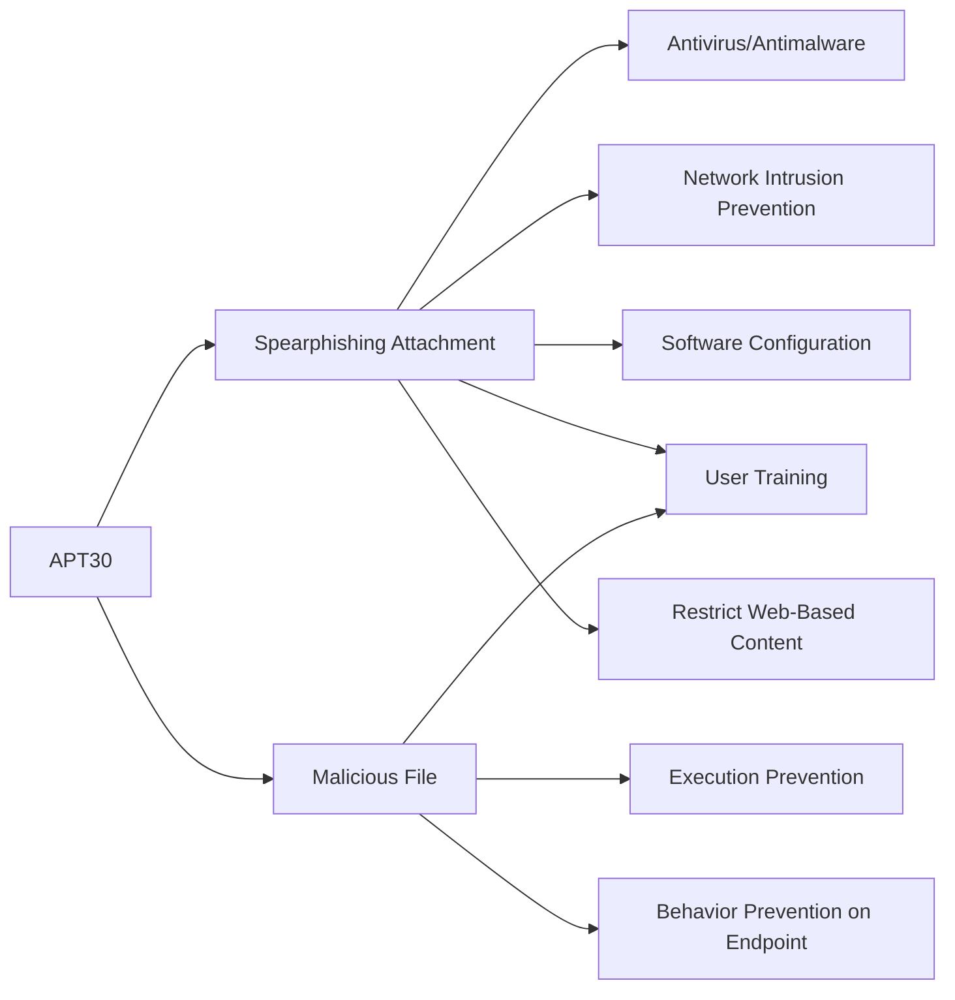

---
tags:
   - groups
---
# APT30
## ID:G0013
[APT30](/mitre/groups/G0013) is a threat group suspected to be associated with the Chinese government. While [Naikon](/mitre/groups/G0019) shares some characteristics with [APT30](/mitre/groups/G0013), the two groups do not appear to be exact matches.(Citation: FireEye APT30)(Citation: Baumgartner Golovkin Naikon 2015)
## Techniques Used By Group
* [Spearphishing Attachment](/mitre/techniques/T1566/001)
* [Malicious File](/mitre/techniques/T1204/002)

# Summary of Techniques and Mitigations
