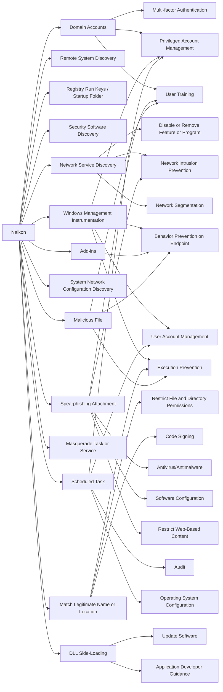

---
tags:
   - groups
---
# Naikon
## ID:G0019
[Naikon](/mitre/groups/G0019) is assessed to be a state-sponsored cyber espionage group attributed to the Chinese People’s Liberation Army’s (PLA) Chengdu Military Region Second Technical Reconnaissance Bureau (Military Unit Cover Designator 78020).(Citation: CameraShy) Active since at least 2010, [Naikon](/mitre/groups/G0019) has primarily conducted operations against government, military, and civil organizations in Southeast Asia, as well as against international bodies such as the United Nations Development Programme (UNDP) and the Association of Southeast Asian Nations (ASEAN).(Citation: CameraShy)(Citation: Baumgartner Naikon 2015) 

While [Naikon](/mitre/groups/G0019) shares some characteristics with [APT30](/mitre/groups/G0013), the two groups do not appear to be exact matches.(Citation: Baumgartner Golovkin Naikon 2015)
## Techniques Used By Group
* [Domain Accounts](/mitre/techniques/T1078/002)
* [Remote System Discovery](/mitre/techniques/T1018)
* [Registry Run Keys / Startup Folder](/mitre/techniques/T1547/001)
* [Security Software Discovery](/mitre/techniques/T1518/001)
* [Network Service Discovery](/mitre/techniques/T1046)
* [Windows Management Instrumentation](/mitre/techniques/T1047)
* [Add-ins](/mitre/techniques/T1137/006)
* [System Network Configuration Discovery](/mitre/techniques/T1016)
* [Match Legitimate Name or Location](/mitre/techniques/T1036/005)
* [Spearphishing Attachment](/mitre/techniques/T1566/001)
* [Masquerade Task or Service](/mitre/techniques/T1036/004)
* [Scheduled Task](/mitre/techniques/T1053/005)
* [Malicious File](/mitre/techniques/T1204/002)
* [DLL Side-Loading](/mitre/techniques/T1574/002)

# Summary of Techniques and Mitigations
