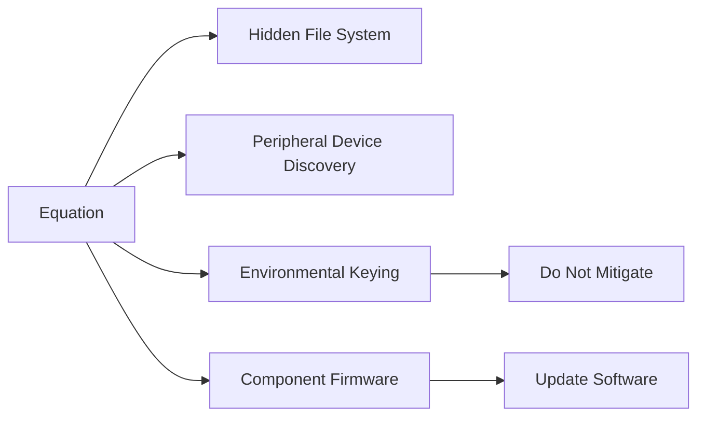

---
tags:
   - groups
---
# Equation
## ID:G0020
[Equation](/mitre/groups/G0020) is a sophisticated threat group that employs multiple remote access tools. The group is known to use zero-day exploits and has developed the capability to overwrite the firmware of hard disk drives. (Citation: Kaspersky Equation QA)
## Techniques Used By Group
* [Hidden File System](/mitre/techniques/T1564/005)
* [Peripheral Device Discovery](/mitre/techniques/T1120)
* [Environmental Keying](/mitre/techniques/T1480/001)
* [Component Firmware](/mitre/techniques/T1542/002)

# Summary of Techniques and Mitigations
