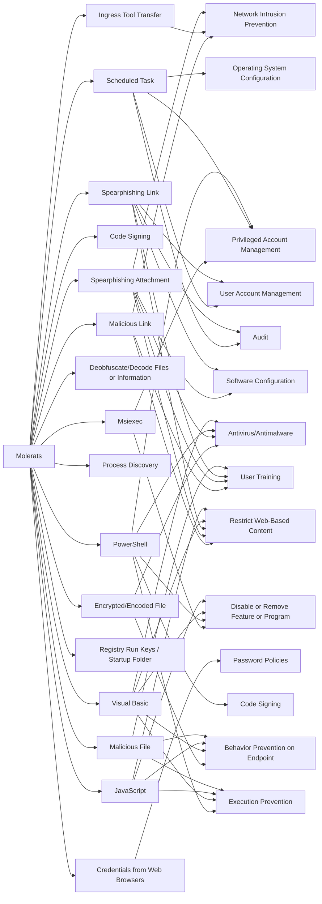

---
tags:
   - groups
---
# Molerats
## ID:G0021
[Molerats](/mitre/groups/G0021) is an Arabic-speaking, politically-motivated threat group that has been operating since 2012. The group's victims have primarily been in the Middle East, Europe, and the United States.(Citation: DustySky)(Citation: DustySky2)(Citation: Kaspersky MoleRATs April 2019)(Citation: Cybereason Molerats Dec 2020)
## Techniques Used By Group
* [Msiexec](/mitre/techniques/T1218/007)
* [Malicious Link](/mitre/techniques/T1204/001)
* [Ingress Tool Transfer](/mitre/techniques/T1105)
* [Code Signing](/mitre/techniques/T1553/002)
* [Encrypted/Encoded File](/mitre/techniques/T1027/013)
* [Scheduled Task](/mitre/techniques/T1053/005)
* [Deobfuscate/Decode Files or Information](/mitre/techniques/T1140)
* [Spearphishing Attachment](/mitre/techniques/T1566/001)
* [Process Discovery](/mitre/techniques/T1057)
* [Spearphishing Link](/mitre/techniques/T1566/002)
* [Credentials from Web Browsers](/mitre/techniques/T1555/003)
* [Registry Run Keys / Startup Folder](/mitre/techniques/T1547/001)
* [PowerShell](/mitre/techniques/T1059/001)
* [Visual Basic](/mitre/techniques/T1059/005)
* [JavaScript](/mitre/techniques/T1059/007)
* [Malicious File](/mitre/techniques/T1204/002)

# Summary of Techniques and Mitigations
