---
tags:
   - groups
---
# APT3
## ID:G0022
[APT3](groups/G0022) is a China-based threat group that researchers have attributed to China's Ministry of State Security.(Citation: FireEye Clandestine Wolf)(Citation: Recorded Future APT3 May 2017) This group is responsible for the campaigns known as Operation Clandestine Fox, Operation Clandestine Wolf, and Operation Double Tap.(Citation: FireEye Clandestine Wolf)(Citation: FireEye Operation Double Tap) As of June 2015, the group appears to have shifted from targeting primarily US victims to primarily political organizations in Hong Kong.(Citation: Symantec Buckeye)
## Techniques Used By Group
* [Scheduled Task](techniques/T1053/005)
* [Multi-Stage Channels](techniques/T1104)
* [Password Cracking](techniques/T1110/002)
* [Hidden Window](techniques/T1564/003)
* [Credentials from Web Browsers](techniques/T1555/003)
* [Windows Command Shell](techniques/T1059/003)
* [System Network Configuration Discovery](techniques/T1016)
* [System Network Connections Discovery](techniques/T1049)
* [External Proxy](techniques/T1090/002)
* [Rundll32](techniques/T1218/011)
* [Obfuscated Files or Information](techniques/T1027)
* [Spearphishing Link](techniques/T1566/002)
* [Account Manipulation](techniques/T1098)
* [Malicious Link](techniques/T1204/001)
* [Exfiltration Over C2 Channel](techniques/T1041)
* [Credentials In Files](techniques/T1552/001)
* [Local Data Staging](techniques/T1074/001)
* [Domain Accounts](techniques/T1078/002)
* [Data from Local System](techniques/T1005)
* [Exploitation for Client Execution](techniques/T1203)
* [SMB/Windows Admin Shares](techniques/T1021/002)
* [DLL Side-Loading](techniques/T1574/002)
* [Local Account](techniques/T1087/001)
* [File Deletion](techniques/T1070/004)
* [File and Directory Discovery](techniques/T1083)
* [Accessibility Features](techniques/T1546/008)
* [Archive via Utility](techniques/T1560/001)
* [System Information Discovery](techniques/T1082)
* [PowerShell](techniques/T1059/001)
* [Windows Service](techniques/T1543/003)
* [LSASS Memory](techniques/T1003/001)
* [Registry Run Keys / Startup Folder](techniques/T1547/001)
* [Remote Desktop Protocol](techniques/T1021/001)
* [Process Discovery](techniques/T1057)
* [Non-Application Layer Protocol](techniques/T1095)
* [Permission Groups Discovery](techniques/T1069)
* [Remote System Discovery](techniques/T1018)
* [Keylogging](techniques/T1056/001)
* [Software Packing](techniques/T1027/002)
* [Local Account](techniques/T1136/001)
* [Ingress Tool Transfer](techniques/T1105)
* [System Owner/User Discovery](techniques/T1033)
* [Indicator Removal from Tools](techniques/T1027/005)

# Summary of Techniques and Mitigations

```mermaid
flowchart LR
group[APT3] --> T1053.005[Scheduled Task]
group[APT3] --> T1104[Multi-Stage Channels]
group[APT3] --> T1110.002[Password Cracking]
group[APT3] --> T1564.003[Hidden Window]
group[APT3] --> T1555.003[Credentials from Web Browsers]
group[APT3] --> T1059.003[Windows Command Shell]
group[APT3] --> T1016[System Network Configuration Discovery]
group[APT3] --> T1049[System Network Connections Discovery]
group[APT3] --> T1090.002[External Proxy]
group[APT3] --> T1218.011[Rundll32]
group[APT3] --> T1027[Obfuscated Files or Information]
group[APT3] --> T1566.002[Spearphishing Link]
group[APT3] --> T1098[Account Manipulation]
group[APT3] --> T1204.001[Malicious Link]
group[APT3] --> T1041[Exfiltration Over C2 Channel]
group[APT3] --> T1552.001[Credentials In Files]
group[APT3] --> T1074.001[Local Data Staging]
group[APT3] --> T1078.002[Domain Accounts]
group[APT3] --> T1005[Data from Local System]
group[APT3] --> T1203[Exploitation for Client Execution]
group[APT3] --> T1021.002[SMB/Windows Admin Shares]
group[APT3] --> T1574.002[DLL Side-Loading]
group[APT3] --> T1087.001[Local Account]
group[APT3] --> T1070.004[File Deletion]
group[APT3] --> T1083[File and Directory Discovery]
group[APT3] --> T1546.008[Accessibility Features]
group[APT3] --> T1560.001[Archive via Utility]
group[APT3] --> T1082[System Information Discovery]
group[APT3] --> T1059.001[PowerShell]
group[APT3] --> T1543.003[Windows Service]
group[APT3] --> T1003.001[LSASS Memory]
group[APT3] --> T1547.001[Registry Run Keys / Startup Folder]
group[APT3] --> T1021.001[Remote Desktop Protocol]
group[APT3] --> T1057[Process Discovery]
group[APT3] --> T1095[Non-Application Layer Protocol]
group[APT3] --> T1069[Permission Groups Discovery]
group[APT3] --> T1018[Remote System Discovery]
group[APT3] --> T1056.001[Keylogging]
group[APT3] --> T1027.002[Software Packing]
group[APT3] --> T1136.001[Local Account]
group[APT3] --> T1105[Ingress Tool Transfer]
group[APT3] --> T1033[System Owner/User Discovery]
group[APT3] --> T1027.005[Indicator Removal from Tools]
T1053.005[Scheduled Task] --> M1026[Privileged Account Management]
T1053.005[Scheduled Task] --> M1018[User Account Management]
T1053.005[Scheduled Task] --> M1047[Audit]
T1053.005[Scheduled Task] --> M1028[Operating System Configuration]
T1104[Multi-Stage Channels] --> M1031[Network Intrusion Prevention]
T1110.002[Password Cracking] --> M1027[Password Policies]
T1110.002[Password Cracking] --> M1032[Multi-factor Authentication]
T1564.003[Hidden Window] --> M1038[Execution Prevention]
T1564.003[Hidden Window] --> M1033[Limit Software Installation]
T1555.003[Credentials from Web Browsers] --> M1027[Password Policies]
T1059.003[Windows Command Shell] --> M1038[Execution Prevention]
T1090.002[External Proxy] --> M1031[Network Intrusion Prevention]
T1218.011[Rundll32] --> M1050[Exploit Protection]
T1027[Obfuscated Files or Information] --> M1047[Audit]
T1027[Obfuscated Files or Information] --> M1040[Behavior Prevention on Endpoint]
T1027[Obfuscated Files or Information] --> M1017[User Training]
T1027[Obfuscated Files or Information] --> M1049[Antivirus/Antimalware]
T1566.002[Spearphishing Link] --> M1054[Software Configuration]
T1566.002[Spearphishing Link] --> M1021[Restrict Web-Based Content]
T1566.002[Spearphishing Link] --> M1047[Audit]
T1566.002[Spearphishing Link] --> M1018[User Account Management]
T1566.002[Spearphishing Link] --> M1017[User Training]
T1098[Account Manipulation] --> M1030[Network Segmentation]
T1098[Account Manipulation] --> M1018[User Account Management]
T1098[Account Manipulation] --> M1032[Multi-factor Authentication]
T1098[Account Manipulation] --> M1026[Privileged Account Management]
T1098[Account Manipulation] --> M1028[Operating System Configuration]
T1204.001[Malicious Link] --> M1031[Network Intrusion Prevention]
T1204.001[Malicious Link] --> M1017[User Training]
T1204.001[Malicious Link] --> M1021[Restrict Web-Based Content]
T1041[Exfiltration Over C2 Channel] --> M1031[Network Intrusion Prevention]
T1041[Exfiltration Over C2 Channel] --> M1057[Data Loss Prevention]
T1552.001[Credentials In Files] --> M1017[User Training]
T1552.001[Credentials In Files] --> M1047[Audit]
T1552.001[Credentials In Files] --> M1022[Restrict File and Directory Permissions]
T1552.001[Credentials In Files] --> M1027[Password Policies]
T1078.002[Domain Accounts] --> M1032[Multi-factor Authentication]
T1078.002[Domain Accounts] --> M1026[Privileged Account Management]
T1078.002[Domain Accounts] --> M1017[User Training]
T1005[Data from Local System] --> M1057[Data Loss Prevention]
T1203[Exploitation for Client Execution] --> M1050[Exploit Protection]
T1203[Exploitation for Client Execution] --> M1048[Application Isolation and Sandboxing]
T1021.002[SMB/Windows Admin Shares] --> M1026[Privileged Account Management]
T1021.002[SMB/Windows Admin Shares] --> M1035[Limit Access to Resource Over Network]
T1021.002[SMB/Windows Admin Shares] --> M1037[Filter Network Traffic]
T1021.002[SMB/Windows Admin Shares] --> M1027[Password Policies]
T1574.002[DLL Side-Loading] --> M1051[Update Software]
T1574.002[DLL Side-Loading] --> M1013[Application Developer Guidance]
T1087.001[Local Account] --> M1028[Operating System Configuration]
T1546.008[Accessibility Features] --> M1035[Limit Access to Resource Over Network]
T1546.008[Accessibility Features] --> M1028[Operating System Configuration]
T1546.008[Accessibility Features] --> M1038[Execution Prevention]
T1560.001[Archive via Utility] --> M1047[Audit]
T1059.001[PowerShell] --> M1042[Disable or Remove Feature or Program]
T1059.001[PowerShell] --> M1049[Antivirus/Antimalware]
T1059.001[PowerShell] --> M1045[Code Signing]
T1059.001[PowerShell] --> M1026[Privileged Account Management]
T1059.001[PowerShell] --> M1038[Execution Prevention]
T1543.003[Windows Service] --> M1040[Behavior Prevention on Endpoint]
T1543.003[Windows Service] --> M1028[Operating System Configuration]
T1543.003[Windows Service] --> M1047[Audit]
T1543.003[Windows Service] --> M1045[Code Signing]
T1543.003[Windows Service] --> M1018[User Account Management]
T1003.001[LSASS Memory] --> M1028[Operating System Configuration]
T1003.001[LSASS Memory] --> M1043[Credential Access Protection]
T1003.001[LSASS Memory] --> M1025[Privileged Process Integrity]
T1003.001[LSASS Memory] --> M1026[Privileged Account Management]
T1003.001[LSASS Memory] --> M1017[User Training]
T1003.001[LSASS Memory] --> M1040[Behavior Prevention on Endpoint]
T1003.001[LSASS Memory] --> M1027[Password Policies]
T1021.001[Remote Desktop Protocol] --> M1047[Audit]
T1021.001[Remote Desktop Protocol] --> M1035[Limit Access to Resource Over Network]
T1021.001[Remote Desktop Protocol] --> M1030[Network Segmentation]
T1021.001[Remote Desktop Protocol] --> M1028[Operating System Configuration]
T1021.001[Remote Desktop Protocol] --> M1042[Disable or Remove Feature or Program]
T1021.001[Remote Desktop Protocol] --> M1018[User Account Management]
T1021.001[Remote Desktop Protocol] --> M1032[Multi-factor Authentication]
T1021.001[Remote Desktop Protocol] --> M1026[Privileged Account Management]
T1095[Non-Application Layer Protocol] --> M1031[Network Intrusion Prevention]
T1095[Non-Application Layer Protocol] --> M1037[Filter Network Traffic]
T1095[Non-Application Layer Protocol] --> M1030[Network Segmentation]
T1027.002[Software Packing] --> M1049[Antivirus/Antimalware]
T1136.001[Local Account] --> M1032[Multi-factor Authentication]
T1136.001[Local Account] --> M1026[Privileged Account Management]
T1105[Ingress Tool Transfer] --> M1031[Network Intrusion Prevention]
```
