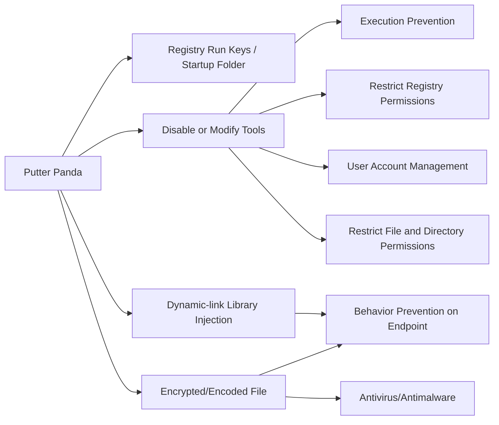

---
tags:
   - groups
---
# Putter Panda
## ID:G0024
[Putter Panda](/mitre/groups/G0024) is a Chinese threat group that has been attributed to Unit 61486 of the 12th Bureau of the PLA’s 3rd General Staff Department (GSD). (Citation: CrowdStrike Putter Panda)
## Techniques Used By Group
* [Registry Run Keys / Startup Folder](techniques/T1547/001)
* [Disable or Modify Tools](techniques/T1562/001)
* [Dynamic-link Library Injection](techniques/T1055/001)
* [Encrypted/Encoded File](techniques/T1027/013)

# Summary of Techniques and Mitigations
