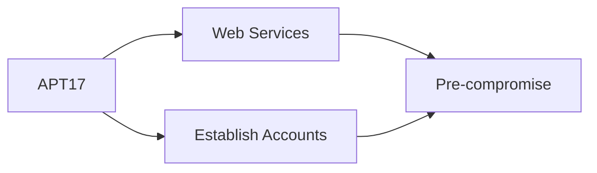

---
tags:
   - groups
---
# APT17
## ID:G0025
[APT17](/mitre/groups/G0025) is a China-based threat group that has conducted network intrusions against U.S. government entities, the defense industry, law firms, information technology companies, mining companies, and non-government organizations. (Citation: FireEye APT17)
## Techniques Used By Group
* [Web Services](techniques/T1583/006)
* [Establish Accounts](techniques/T1585)

# Summary of Techniques and Mitigations
