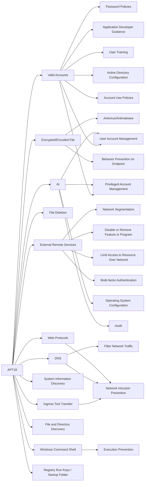

---
tags:
   - groups
---
# APT18
## ID:G0026
[APT18](groups/G0026) is a threat group that has operated since at least 2009 and has targeted a range of industries, including technology, manufacturing, human rights groups, government, and medical. (Citation: Dell Lateral Movement)
## Techniques Used By Group
* [Valid Accounts](techniques/T1078)
* [Encrypted/Encoded File](techniques/T1027/013)
* [External Remote Services](techniques/T1133)
* [File Deletion](techniques/T1070/004)
* [At](techniques/T1053/002)
* [Ingress Tool Transfer](techniques/T1105)
* [DNS](techniques/T1071/004)
* [System Information Discovery](techniques/T1082)
* [Web Protocols](techniques/T1071/001)
* [File and Directory Discovery](techniques/T1083)
* [Windows Command Shell](techniques/T1059/003)
* [Registry Run Keys / Startup Folder](techniques/T1547/001)

# Summary of Techniques and Mitigations
