---
tags:
   - groups
---
# Threat Group-3390
## ID:G0027
[Threat Group-3390](/mitre/groups/G0027) is a Chinese threat group that has extensively used strategic Web compromises to target victims.(Citation: Dell TG-3390) The group has been active since at least 2010 and has targeted organizations in the aerospace, government, defense, technology, energy, manufacturing and gambling/betting sectors.(Citation: SecureWorks BRONZE UNION June 2017)(Citation: Securelist LuckyMouse June 2018)(Citation: Trend Micro DRBControl February 2020)
## Techniques Used By Group
* [Exploitation for Privilege Escalation](techniques/T1068)
* [Data Transfer Size Limits](techniques/T1030)
* [Exploit Public-Facing Application](techniques/T1190)
* [Network Service Discovery](techniques/T1046)
* [At](techniques/T1053/002)
* [Process Hollowing](techniques/T1055/012)
* [Local Data Staging](techniques/T1074/001)
* [Exploitation for Client Execution](techniques/T1203)
* [Exfiltration to Cloud Storage](techniques/T1567/002)
* [LSASS Memory](techniques/T1003/001)
* [Windows Command Shell](techniques/T1059/003)
* [DLL Side-Loading](techniques/T1574/002)
* [Password Managers](techniques/T1555/005)
* [Spearphishing Attachment](techniques/T1566/001)
* [Query Registry](techniques/T1012)
* [LSA Secrets](techniques/T1003/004)
* [Malicious File](techniques/T1204/002)
* [System Owner/User Discovery](techniques/T1033)
* [Upload Malware](techniques/T1608/001)
* [Web Shell](techniques/T1505/003)
* [Registry Run Keys / Startup Folder](techniques/T1547/001)
* [Encrypted/Encoded File](techniques/T1027/013)
* [Windows Service](techniques/T1543/003)
* [Trusted Relationship](techniques/T1199)
* [System Network Configuration Discovery](techniques/T1016)
* [Ingress Tool Transfer](techniques/T1105)
* [Keylogging](techniques/T1056/001)
* [PowerShell](techniques/T1059/001)
* [Disable Windows Event Logging](techniques/T1562/002)
* [Valid Accounts](techniques/T1078)
* [Drive-by Target](techniques/T1608/004)
* [Tool](techniques/T1588/002)
* [Remote System Discovery](techniques/T1018)
* [Domains](techniques/T1583/001)
* [Drive-by Compromise](techniques/T1189)
* [Deobfuscate/Decode Files or Information](techniques/T1140)
* [Security Account Manager](techniques/T1003/002)
* [External Remote Services](techniques/T1133)
* [Data from Local System](techniques/T1005)
* [Local Account](techniques/T1087/001)
* [Compromise Software Supply Chain](techniques/T1195/002)
* [Bypass User Account Control](techniques/T1548/002)
* [Automated Collection](techniques/T1119)
* [Archive via Library](techniques/T1560/002)
* [Software Packing](techniques/T1027/002)
* [Code Signing Certificates](techniques/T1588/003)
* [Windows Management Instrumentation](techniques/T1047)
* [Web Protocols](techniques/T1071/001)
* [Network Share Connection Removal](techniques/T1070/005)
* [Windows Remote Management](techniques/T1021/006)
* [DLL Search Order Hijacking](techniques/T1574/001)
* [File Deletion](techniques/T1070/004)
* [Upload Tool](techniques/T1608/002)
* [Modify Registry](techniques/T1112)
* [Exploitation of Remote Services](techniques/T1210)
* [Remote Data Staging](techniques/T1074/002)
* [System Network Connections Discovery](techniques/T1049)

# Summary of Techniques and Mitigations

```mermaid
flowchart LR
group[Threat Group-3390] --> T1068[Exploitation for Privilege Escalation]
group[Threat Group-3390] --> T1030[Data Transfer Size Limits]
group[Threat Group-3390] --> T1190[Exploit Public-Facing Application]
group[Threat Group-3390] --> T1046[Network Service Discovery]
group[Threat Group-3390] --> T1053.002[At]
group[Threat Group-3390] --> T1055.012[Process Hollowing]
group[Threat Group-3390] --> T1074.001[Local Data Staging]
group[Threat Group-3390] --> T1203[Exploitation for Client Execution]
group[Threat Group-3390] --> T1567.002[Exfiltration to Cloud Storage]
group[Threat Group-3390] --> T1003.001[LSASS Memory]
group[Threat Group-3390] --> T1059.003[Windows Command Shell]
group[Threat Group-3390] --> T1574.002[DLL Side-Loading]
group[Threat Group-3390] --> T1555.005[Password Managers]
group[Threat Group-3390] --> T1566.001[Spearphishing Attachment]
group[Threat Group-3390] --> T1012[Query Registry]
group[Threat Group-3390] --> T1003.004[LSA Secrets]
group[Threat Group-3390] --> T1204.002[Malicious File]
group[Threat Group-3390] --> T1033[System Owner/User Discovery]
group[Threat Group-3390] --> T1608.001[Upload Malware]
group[Threat Group-3390] --> T1505.003[Web Shell]
group[Threat Group-3390] --> T1547.001[Registry Run Keys / Startup Folder]
group[Threat Group-3390] --> T1027.013[Encrypted/Encoded File]
group[Threat Group-3390] --> T1543.003[Windows Service]
group[Threat Group-3390] --> T1199[Trusted Relationship]
group[Threat Group-3390] --> T1016[System Network Configuration Discovery]
group[Threat Group-3390] --> T1105[Ingress Tool Transfer]
group[Threat Group-3390] --> T1056.001[Keylogging]
group[Threat Group-3390] --> T1059.001[PowerShell]
group[Threat Group-3390] --> T1562.002[Disable Windows Event Logging]
group[Threat Group-3390] --> T1078[Valid Accounts]
group[Threat Group-3390] --> T1608.004[Drive-by Target]
group[Threat Group-3390] --> T1588.002[Tool]
group[Threat Group-3390] --> T1018[Remote System Discovery]
group[Threat Group-3390] --> T1583.001[Domains]
group[Threat Group-3390] --> T1189[Drive-by Compromise]
group[Threat Group-3390] --> T1140[Deobfuscate/Decode Files or Information]
group[Threat Group-3390] --> T1003.002[Security Account Manager]
group[Threat Group-3390] --> T1133[External Remote Services]
group[Threat Group-3390] --> T1005[Data from Local System]
group[Threat Group-3390] --> T1087.001[Local Account]
group[Threat Group-3390] --> T1195.002[Compromise Software Supply Chain]
group[Threat Group-3390] --> T1548.002[Bypass User Account Control]
group[Threat Group-3390] --> T1119[Automated Collection]
group[Threat Group-3390] --> T1560.002[Archive via Library]
group[Threat Group-3390] --> T1027.002[Software Packing]
group[Threat Group-3390] --> T1588.003[Code Signing Certificates]
group[Threat Group-3390] --> T1047[Windows Management Instrumentation]
group[Threat Group-3390] --> T1071.001[Web Protocols]
group[Threat Group-3390] --> T1070.005[Network Share Connection Removal]
group[Threat Group-3390] --> T1021.006[Windows Remote Management]
group[Threat Group-3390] --> T1574.001[DLL Search Order Hijacking]
group[Threat Group-3390] --> T1070.004[File Deletion]
group[Threat Group-3390] --> T1608.002[Upload Tool]
group[Threat Group-3390] --> T1112[Modify Registry]
group[Threat Group-3390] --> T1210[Exploitation of Remote Services]
group[Threat Group-3390] --> T1074.002[Remote Data Staging]
group[Threat Group-3390] --> T1049[System Network Connections Discovery]
T1068[Exploitation for Privilege Escalation] --> M1051[Update Software]
T1068[Exploitation for Privilege Escalation] --> M1050[Exploit Protection]
T1068[Exploitation for Privilege Escalation] --> M1048[Application Isolation and Sandboxing]
T1068[Exploitation for Privilege Escalation] --> M1019[Threat Intelligence Program]
T1068[Exploitation for Privilege Escalation] --> M1038[Execution Prevention]
T1030[Data Transfer Size Limits] --> M1031[Network Intrusion Prevention]
T1190[Exploit Public-Facing Application] --> M1048[Application Isolation and Sandboxing]
T1190[Exploit Public-Facing Application] --> M1030[Network Segmentation]
T1190[Exploit Public-Facing Application] --> M1016[Vulnerability Scanning]
T1190[Exploit Public-Facing Application] --> M1026[Privileged Account Management]
T1190[Exploit Public-Facing Application] --> M1050[Exploit Protection]
T1190[Exploit Public-Facing Application] --> M1051[Update Software]
T1046[Network Service Discovery] --> M1042[Disable or Remove Feature or Program]
T1046[Network Service Discovery] --> M1031[Network Intrusion Prevention]
T1046[Network Service Discovery] --> M1030[Network Segmentation]
T1053.002[At] --> M1028[Operating System Configuration]
T1053.002[At] --> M1047[Audit]
T1053.002[At] --> M1018[User Account Management]
T1053.002[At] --> M1026[Privileged Account Management]
T1055.012[Process Hollowing] --> M1040[Behavior Prevention on Endpoint]
T1203[Exploitation for Client Execution] --> M1050[Exploit Protection]
T1203[Exploitation for Client Execution] --> M1048[Application Isolation and Sandboxing]
T1567.002[Exfiltration to Cloud Storage] --> M1021[Restrict Web-Based Content]
T1003.001[LSASS Memory] --> M1028[Operating System Configuration]
T1003.001[LSASS Memory] --> M1043[Credential Access Protection]
T1003.001[LSASS Memory] --> M1025[Privileged Process Integrity]
T1003.001[LSASS Memory] --> M1026[Privileged Account Management]
T1003.001[LSASS Memory] --> M1017[User Training]
T1003.001[LSASS Memory] --> M1040[Behavior Prevention on Endpoint]
T1003.001[LSASS Memory] --> M1027[Password Policies]
T1059.003[Windows Command Shell] --> M1038[Execution Prevention]
T1574.002[DLL Side-Loading] --> M1051[Update Software]
T1574.002[DLL Side-Loading] --> M1013[Application Developer Guidance]
T1555.005[Password Managers] --> M1051[Update Software]
T1555.005[Password Managers] --> M1054[Software Configuration]
T1555.005[Password Managers] --> M1027[Password Policies]
T1566.001[Spearphishing Attachment] --> M1049[Antivirus/Antimalware]
T1566.001[Spearphishing Attachment] --> M1031[Network Intrusion Prevention]
T1566.001[Spearphishing Attachment] --> M1054[Software Configuration]
T1566.001[Spearphishing Attachment] --> M1017[User Training]
T1566.001[Spearphishing Attachment] --> M1021[Restrict Web-Based Content]
T1003.004[LSA Secrets] --> M1027[Password Policies]
T1003.004[LSA Secrets] --> M1026[Privileged Account Management]
T1003.004[LSA Secrets] --> M1017[User Training]
T1204.002[Malicious File] --> M1038[Execution Prevention]
T1204.002[Malicious File] --> M1040[Behavior Prevention on Endpoint]
T1204.002[Malicious File] --> M1017[User Training]
T1608.001[Upload Malware] --> M1056[Pre-compromise]
T1505.003[Web Shell] --> M1042[Disable or Remove Feature or Program]
T1505.003[Web Shell] --> M1018[User Account Management]
T1027.013[Encrypted/Encoded File] --> M1049[Antivirus/Antimalware]
T1027.013[Encrypted/Encoded File] --> M1040[Behavior Prevention on Endpoint]
T1543.003[Windows Service] --> M1040[Behavior Prevention on Endpoint]
T1543.003[Windows Service] --> M1028[Operating System Configuration]
T1543.003[Windows Service] --> M1047[Audit]
T1543.003[Windows Service] --> M1045[Code Signing]
T1543.003[Windows Service] --> M1018[User Account Management]
T1199[Trusted Relationship] --> M1032[Multi-factor Authentication]
T1199[Trusted Relationship] --> M1018[User Account Management]
T1199[Trusted Relationship] --> M1030[Network Segmentation]
T1105[Ingress Tool Transfer] --> M1031[Network Intrusion Prevention]
T1059.001[PowerShell] --> M1042[Disable or Remove Feature or Program]
T1059.001[PowerShell] --> M1049[Antivirus/Antimalware]
T1059.001[PowerShell] --> M1045[Code Signing]
T1059.001[PowerShell] --> M1026[Privileged Account Management]
T1059.001[PowerShell] --> M1038[Execution Prevention]
T1562.002[Disable Windows Event Logging] --> M1022[Restrict File and Directory Permissions]
T1562.002[Disable Windows Event Logging] --> M1024[Restrict Registry Permissions]
T1562.002[Disable Windows Event Logging] --> M1047[Audit]
T1562.002[Disable Windows Event Logging] --> M1018[User Account Management]
T1078[Valid Accounts] --> M1027[Password Policies]
T1078[Valid Accounts] --> M1018[User Account Management]
T1078[Valid Accounts] --> M1026[Privileged Account Management]
T1078[Valid Accounts] --> M1013[Application Developer Guidance]
T1078[Valid Accounts] --> M1017[User Training]
T1078[Valid Accounts] --> M1015[Active Directory Configuration]
T1078[Valid Accounts] --> M1036[Account Use Policies]
T1608.004[Drive-by Target] --> M1056[Pre-compromise]
T1588.002[Tool] --> M1056[Pre-compromise]
T1583.001[Domains] --> M1056[Pre-compromise]
T1189[Drive-by Compromise] --> M1050[Exploit Protection]
T1189[Drive-by Compromise] --> M1051[Update Software]
T1189[Drive-by Compromise] --> M1048[Application Isolation and Sandboxing]
T1189[Drive-by Compromise] --> M1021[Restrict Web-Based Content]
T1003.002[Security Account Manager] --> M1027[Password Policies]
T1003.002[Security Account Manager] --> M1026[Privileged Account Management]
T1003.002[Security Account Manager] --> M1028[Operating System Configuration]
T1003.002[Security Account Manager] --> M1017[User Training]
T1133[External Remote Services] --> M1030[Network Segmentation]
T1133[External Remote Services] --> M1042[Disable or Remove Feature or Program]
T1133[External Remote Services] --> M1035[Limit Access to Resource Over Network]
T1133[External Remote Services] --> M1032[Multi-factor Authentication]
T1005[Data from Local System] --> M1057[Data Loss Prevention]
T1087.001[Local Account] --> M1028[Operating System Configuration]
T1195.002[Compromise Software Supply Chain] --> M1051[Update Software]
T1195.002[Compromise Software Supply Chain] --> M1016[Vulnerability Scanning]
T1548.002[Bypass User Account Control] --> M1051[Update Software]
T1548.002[Bypass User Account Control] --> M1047[Audit]
T1548.002[Bypass User Account Control] --> M1052[User Account Control]
T1548.002[Bypass User Account Control] --> M1026[Privileged Account Management]
T1119[Automated Collection] --> M1029[Remote Data Storage]
T1119[Automated Collection] --> M1041[Encrypt Sensitive Information]
T1027.002[Software Packing] --> M1049[Antivirus/Antimalware]
T1588.003[Code Signing Certificates] --> M1056[Pre-compromise]
T1047[Windows Management Instrumentation] --> M1026[Privileged Account Management]
T1047[Windows Management Instrumentation] --> M1040[Behavior Prevention on Endpoint]
T1047[Windows Management Instrumentation] --> M1018[User Account Management]
T1047[Windows Management Instrumentation] --> M1038[Execution Prevention]
T1071.001[Web Protocols] --> M1031[Network Intrusion Prevention]
T1021.006[Windows Remote Management] --> M1042[Disable or Remove Feature or Program]
T1021.006[Windows Remote Management] --> M1026[Privileged Account Management]
T1021.006[Windows Remote Management] --> M1030[Network Segmentation]
T1574.001[DLL Search Order Hijacking] --> M1038[Execution Prevention]
T1574.001[DLL Search Order Hijacking] --> M1044[Restrict Library Loading]
T1574.001[DLL Search Order Hijacking] --> M1047[Audit]
T1608.002[Upload Tool] --> M1056[Pre-compromise]
T1112[Modify Registry] --> M1024[Restrict Registry Permissions]
T1210[Exploitation of Remote Services] --> M1042[Disable or Remove Feature or Program]
T1210[Exploitation of Remote Services] --> M1016[Vulnerability Scanning]
T1210[Exploitation of Remote Services] --> M1050[Exploit Protection]
T1210[Exploitation of Remote Services] --> M1030[Network Segmentation]
T1210[Exploitation of Remote Services] --> M1019[Threat Intelligence Program]
T1210[Exploitation of Remote Services] --> M1048[Application Isolation and Sandboxing]
T1210[Exploitation of Remote Services] --> M1026[Privileged Account Management]
T1210[Exploitation of Remote Services] --> M1051[Update Software]
```
