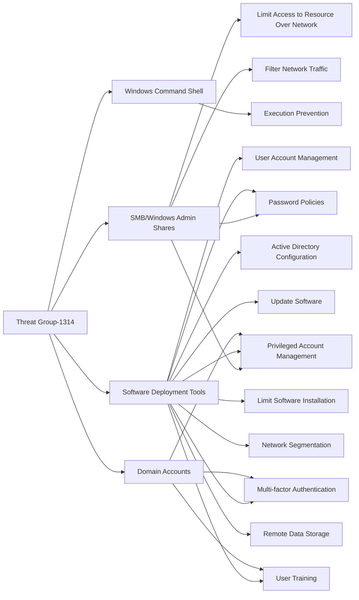

---
tags:
   - groups
---
# Threat Group-1314
## ID:G0028
[Threat Group-1314](/mitre/groups/G0028) is an unattributed threat group that has used compromised credentials to log into a victim's remote access infrastructure. (Citation: Dell TG-1314)
## Techniques Used By Group
* [SMB/Windows Admin Shares](techniques/T1021/002)
* [Windows Command Shell](techniques/T1059/003)
* [Software Deployment Tools](techniques/T1072)
* [Domain Accounts](techniques/T1078/002)

# Summary of Techniques and Mitigations
