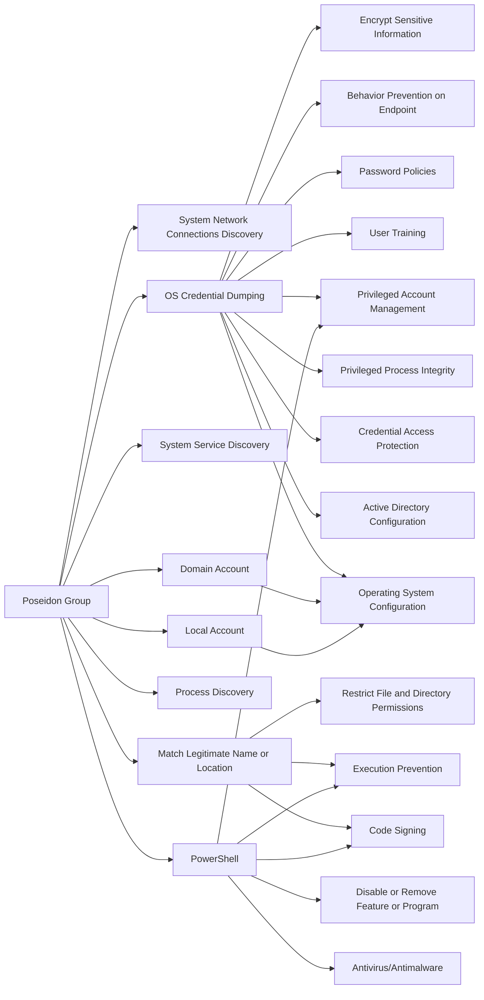

---
tags:
   - groups
---
# Poseidon Group
## ID:G0033
[Poseidon Group](groups/G0033) is a Portuguese-speaking threat group that has been active since at least 2005. The group has a history of using information exfiltrated from victims to blackmail victim companies into contracting the [Poseidon Group](groups/G0033) as a security firm. (Citation: Kaspersky Poseidon Group)
## Techniques Used By Group
* [System Network Connections Discovery](techniques/T1049)
* [OS Credential Dumping](techniques/T1003)
* [System Service Discovery](techniques/T1007)
* [Domain Account](techniques/T1087/002)
* [Local Account](techniques/T1087/001)
* [Process Discovery](techniques/T1057)
* [Match Legitimate Name or Location](techniques/T1036/005)
* [PowerShell](techniques/T1059/001)

# Summary of Techniques and Mitigations
