---
tags:
   - groups
---
# Dragonfly
## ID:G0035
[Dragonfly](groups/G0035) is a cyber espionage group that has been attributed to Russia's Federal Security Service (FSB) Center 16.(Citation: DOJ Russia Targeting Critical Infrastructure March 2022)(Citation: UK GOV FSB Factsheet April 2022) Active since at least 2010, [Dragonfly](groups/G0035) has targeted defense and aviation companies, government entities, companies related to industrial control systems, and critical infrastructure sectors worldwide through supply chain, spearphishing, and drive-by compromise attacks.(Citation: Symantec Dragonfly)(Citation: Secureworks IRON LIBERTY July 2019)(Citation: Symantec Dragonfly Sept 2017)(Citation: Fortune Dragonfly 2.0 Sept 2017)(Citation: Gigamon Berserk Bear October 2021)(Citation: CISA AA20-296A Berserk Bear December 2020)(Citation: Symantec Dragonfly 2.0 October 2017)
## Techniques Used By Group
* [Archive Collected Data](techniques/T1560)
* [Screen Capture](techniques/T1113)
* [Hidden Users](techniques/T1564/002)
* [Web Shell](techniques/T1505/003)
* [Malicious File](techniques/T1204/002)
* [Business Relationships](techniques/T1591/002)
* [Valid Accounts](techniques/T1078)
* [System Network Configuration Discovery](techniques/T1016)
* [Server](techniques/T1584/004)
* [File and Directory Discovery](techniques/T1083)
* [Local Account](techniques/T1136/001)
* [Template Injection](techniques/T1221)
* [Exploitation for Client Execution](techniques/T1203)
* [Password Cracking](techniques/T1110/002)
* [Drive-by Target](techniques/T1608/004)
* [Disable or Modify System Firewall](techniques/T1562/004)
* [Query Registry](techniques/T1012)
* [Spearphishing Attachment](techniques/T1566/001)
* [Drive-by Compromise](techniques/T1189)
* [Domains](techniques/T1583/001)
* [Security Account Manager](techniques/T1003/002)
* [Spearphishing Attachment](techniques/T1598/002)
* [Clear Windows Event Logs](techniques/T1070/001)
* [Data from Local System](techniques/T1005)
* [File Deletion](techniques/T1070/004)
* [Command and Scripting Interpreter](techniques/T1059)
* [Modify Registry](techniques/T1112)
* [Tool](techniques/T1588/002)
* [Compromise Software Supply Chain](techniques/T1195/002)
* [Masquerading](techniques/T1036)
* [NTDS](techniques/T1003/003)
* [Account Manipulation](techniques/T1098)
* [Virtual Private Server](techniques/T1583/003)
* [Windows Command Shell](techniques/T1059/003)
* [File Transfer Protocols](techniques/T1071/002)
* [Spearphishing Link](techniques/T1598/003)
* [Scheduled Task](techniques/T1053/005)
* [Domain Groups](techniques/T1069/002)
* [Remote Email Collection](techniques/T1114/002)
* [Vulnerability Scanning](techniques/T1595/002)
* [Registry Run Keys / Startup Folder](techniques/T1547/001)
* [Ingress Tool Transfer](techniques/T1105)
* [External Remote Services](techniques/T1133)
* [LSA Secrets](techniques/T1003/004)
* [Exploit Public-Facing Application](techniques/T1190)
* [Network Share Discovery](techniques/T1135)
* [Brute Force](techniques/T1110)
* [Remote Desktop Protocol](techniques/T1021/001)
* [Forced Authentication](techniques/T1187)
* [System Owner/User Discovery](techniques/T1033)
* [Local Data Staging](techniques/T1074/001)
* [PowerShell](techniques/T1059/001)
* [Exploitation of Remote Services](techniques/T1210)
* [Python](techniques/T1059/006)
* [Remote System Discovery](techniques/T1018)
* [Domain Account](techniques/T1087/002)

# Summary of Techniques and Mitigations

```mermaid
flowchart LR
group[Dragonfly] --> T1560[Archive Collected Data]
group[Dragonfly] --> T1113[Screen Capture]
group[Dragonfly] --> T1564.002[Hidden Users]
group[Dragonfly] --> T1505.003[Web Shell]
group[Dragonfly] --> T1204.002[Malicious File]
group[Dragonfly] --> T1591.002[Business Relationships]
group[Dragonfly] --> T1078[Valid Accounts]
group[Dragonfly] --> T1016[System Network Configuration Discovery]
group[Dragonfly] --> T1584.004[Server]
group[Dragonfly] --> T1083[File and Directory Discovery]
group[Dragonfly] --> T1136.001[Local Account]
group[Dragonfly] --> T1221[Template Injection]
group[Dragonfly] --> T1203[Exploitation for Client Execution]
group[Dragonfly] --> T1110.002[Password Cracking]
group[Dragonfly] --> T1608.004[Drive-by Target]
group[Dragonfly] --> T1562.004[Disable or Modify System Firewall]
group[Dragonfly] --> T1012[Query Registry]
group[Dragonfly] --> T1566.001[Spearphishing Attachment]
group[Dragonfly] --> T1189[Drive-by Compromise]
group[Dragonfly] --> T1583.001[Domains]
group[Dragonfly] --> T1003.002[Security Account Manager]
group[Dragonfly] --> T1598.002[Spearphishing Attachment]
group[Dragonfly] --> T1070.001[Clear Windows Event Logs]
group[Dragonfly] --> T1005[Data from Local System]
group[Dragonfly] --> T1070.004[File Deletion]
group[Dragonfly] --> T1059[Command and Scripting Interpreter]
group[Dragonfly] --> T1112[Modify Registry]
group[Dragonfly] --> T1588.002[Tool]
group[Dragonfly] --> T1195.002[Compromise Software Supply Chain]
group[Dragonfly] --> T1036[Masquerading]
group[Dragonfly] --> T1003.003[NTDS]
group[Dragonfly] --> T1098[Account Manipulation]
group[Dragonfly] --> T1583.003[Virtual Private Server]
group[Dragonfly] --> T1059.003[Windows Command Shell]
group[Dragonfly] --> T1071.002[File Transfer Protocols]
group[Dragonfly] --> T1598.003[Spearphishing Link]
group[Dragonfly] --> T1053.005[Scheduled Task]
group[Dragonfly] --> T1069.002[Domain Groups]
group[Dragonfly] --> T1114.002[Remote Email Collection]
group[Dragonfly] --> T1595.002[Vulnerability Scanning]
group[Dragonfly] --> T1547.001[Registry Run Keys / Startup Folder]
group[Dragonfly] --> T1105[Ingress Tool Transfer]
group[Dragonfly] --> T1133[External Remote Services]
group[Dragonfly] --> T1003.004[LSA Secrets]
group[Dragonfly] --> T1190[Exploit Public-Facing Application]
group[Dragonfly] --> T1135[Network Share Discovery]
group[Dragonfly] --> T1110[Brute Force]
group[Dragonfly] --> T1021.001[Remote Desktop Protocol]
group[Dragonfly] --> T1187[Forced Authentication]
group[Dragonfly] --> T1033[System Owner/User Discovery]
group[Dragonfly] --> T1074.001[Local Data Staging]
group[Dragonfly] --> T1059.001[PowerShell]
group[Dragonfly] --> T1210[Exploitation of Remote Services]
group[Dragonfly] --> T1059.006[Python]
group[Dragonfly] --> T1018[Remote System Discovery]
group[Dragonfly] --> T1087.002[Domain Account]
T1560[Archive Collected Data] --> M1047[Audit]
T1564.002[Hidden Users] --> M1028[Operating System Configuration]
T1505.003[Web Shell] --> M1042[Disable or Remove Feature or Program]
T1505.003[Web Shell] --> M1018[User Account Management]
T1204.002[Malicious File] --> M1038[Execution Prevention]
T1204.002[Malicious File] --> M1040[Behavior Prevention on Endpoint]
T1204.002[Malicious File] --> M1017[User Training]
T1591.002[Business Relationships] --> M1056[Pre-compromise]
T1078[Valid Accounts] --> M1027[Password Policies]
T1078[Valid Accounts] --> M1018[User Account Management]
T1078[Valid Accounts] --> M1026[Privileged Account Management]
T1078[Valid Accounts] --> M1013[Application Developer Guidance]
T1078[Valid Accounts] --> M1017[User Training]
T1078[Valid Accounts] --> M1015[Active Directory Configuration]
T1078[Valid Accounts] --> M1036[Account Use Policies]
T1584.004[Server] --> M1056[Pre-compromise]
T1136.001[Local Account] --> M1032[Multi-factor Authentication]
T1136.001[Local Account] --> M1026[Privileged Account Management]
T1221[Template Injection] --> M1049[Antivirus/Antimalware]
T1221[Template Injection] --> M1031[Network Intrusion Prevention]
T1221[Template Injection] --> M1017[User Training]
T1221[Template Injection] --> M1042[Disable or Remove Feature or Program]
T1203[Exploitation for Client Execution] --> M1050[Exploit Protection]
T1203[Exploitation for Client Execution] --> M1048[Application Isolation and Sandboxing]
T1110.002[Password Cracking] --> M1027[Password Policies]
T1110.002[Password Cracking] --> M1032[Multi-factor Authentication]
T1608.004[Drive-by Target] --> M1056[Pre-compromise]
T1562.004[Disable or Modify System Firewall] --> M1047[Audit]
T1562.004[Disable or Modify System Firewall] --> M1018[User Account Management]
T1562.004[Disable or Modify System Firewall] --> M1024[Restrict Registry Permissions]
T1562.004[Disable or Modify System Firewall] --> M1022[Restrict File and Directory Permissions]
T1566.001[Spearphishing Attachment] --> M1049[Antivirus/Antimalware]
T1566.001[Spearphishing Attachment] --> M1031[Network Intrusion Prevention]
T1566.001[Spearphishing Attachment] --> M1054[Software Configuration]
T1566.001[Spearphishing Attachment] --> M1017[User Training]
T1566.001[Spearphishing Attachment] --> M1021[Restrict Web-Based Content]
T1189[Drive-by Compromise] --> M1050[Exploit Protection]
T1189[Drive-by Compromise] --> M1051[Update Software]
T1189[Drive-by Compromise] --> M1048[Application Isolation and Sandboxing]
T1189[Drive-by Compromise] --> M1021[Restrict Web-Based Content]
T1583.001[Domains] --> M1056[Pre-compromise]
T1003.002[Security Account Manager] --> M1027[Password Policies]
T1003.002[Security Account Manager] --> M1026[Privileged Account Management]
T1003.002[Security Account Manager] --> M1028[Operating System Configuration]
T1003.002[Security Account Manager] --> M1017[User Training]
T1598.002[Spearphishing Attachment] --> M1017[User Training]
T1598.002[Spearphishing Attachment] --> M1054[Software Configuration]
T1070.001[Clear Windows Event Logs] --> M1022[Restrict File and Directory Permissions]
T1070.001[Clear Windows Event Logs] --> M1029[Remote Data Storage]
T1070.001[Clear Windows Event Logs] --> M1041[Encrypt Sensitive Information]
T1005[Data from Local System] --> M1057[Data Loss Prevention]
T1059[Command and Scripting Interpreter] --> M1045[Code Signing]
T1059[Command and Scripting Interpreter] --> M1042[Disable or Remove Feature or Program]
T1059[Command and Scripting Interpreter] --> M1038[Execution Prevention]
T1059[Command and Scripting Interpreter] --> M1049[Antivirus/Antimalware]
T1059[Command and Scripting Interpreter] --> M1026[Privileged Account Management]
T1059[Command and Scripting Interpreter] --> M1021[Restrict Web-Based Content]
T1059[Command and Scripting Interpreter] --> M1040[Behavior Prevention on Endpoint]
T1112[Modify Registry] --> M1024[Restrict Registry Permissions]
T1588.002[Tool] --> M1056[Pre-compromise]
T1195.002[Compromise Software Supply Chain] --> M1051[Update Software]
T1195.002[Compromise Software Supply Chain] --> M1016[Vulnerability Scanning]
T1036[Masquerading] --> M1017[User Training]
T1036[Masquerading] --> M1045[Code Signing]
T1036[Masquerading] --> M1040[Behavior Prevention on Endpoint]
T1036[Masquerading] --> M1022[Restrict File and Directory Permissions]
T1036[Masquerading] --> M1049[Antivirus/Antimalware]
T1036[Masquerading] --> M1038[Execution Prevention]
T1003.003[NTDS] --> M1027[Password Policies]
T1003.003[NTDS] --> M1026[Privileged Account Management]
T1003.003[NTDS] --> M1017[User Training]
T1003.003[NTDS] --> M1041[Encrypt Sensitive Information]
T1098[Account Manipulation] --> M1030[Network Segmentation]
T1098[Account Manipulation] --> M1018[User Account Management]
T1098[Account Manipulation] --> M1032[Multi-factor Authentication]
T1098[Account Manipulation] --> M1026[Privileged Account Management]
T1098[Account Manipulation] --> M1028[Operating System Configuration]
T1583.003[Virtual Private Server] --> M1056[Pre-compromise]
T1059.003[Windows Command Shell] --> M1038[Execution Prevention]
T1071.002[File Transfer Protocols] --> M1031[Network Intrusion Prevention]
T1598.003[Spearphishing Link] --> M1017[User Training]
T1598.003[Spearphishing Link] --> M1054[Software Configuration]
T1053.005[Scheduled Task] --> M1026[Privileged Account Management]
T1053.005[Scheduled Task] --> M1018[User Account Management]
T1053.005[Scheduled Task] --> M1047[Audit]
T1053.005[Scheduled Task] --> M1028[Operating System Configuration]
T1114.002[Remote Email Collection] --> M1041[Encrypt Sensitive Information]
T1114.002[Remote Email Collection] --> M1032[Multi-factor Authentication]
T1595.002[Vulnerability Scanning] --> M1056[Pre-compromise]
T1105[Ingress Tool Transfer] --> M1031[Network Intrusion Prevention]
T1133[External Remote Services] --> M1030[Network Segmentation]
T1133[External Remote Services] --> M1042[Disable or Remove Feature or Program]
T1133[External Remote Services] --> M1035[Limit Access to Resource Over Network]
T1133[External Remote Services] --> M1032[Multi-factor Authentication]
T1003.004[LSA Secrets] --> M1027[Password Policies]
T1003.004[LSA Secrets] --> M1026[Privileged Account Management]
T1003.004[LSA Secrets] --> M1017[User Training]
T1190[Exploit Public-Facing Application] --> M1048[Application Isolation and Sandboxing]
T1190[Exploit Public-Facing Application] --> M1030[Network Segmentation]
T1190[Exploit Public-Facing Application] --> M1016[Vulnerability Scanning]
T1190[Exploit Public-Facing Application] --> M1026[Privileged Account Management]
T1190[Exploit Public-Facing Application] --> M1050[Exploit Protection]
T1190[Exploit Public-Facing Application] --> M1051[Update Software]
T1135[Network Share Discovery] --> M1028[Operating System Configuration]
T1110[Brute Force] --> M1018[User Account Management]
T1110[Brute Force] --> M1036[Account Use Policies]
T1110[Brute Force] --> M1032[Multi-factor Authentication]
T1110[Brute Force] --> M1027[Password Policies]
T1021.001[Remote Desktop Protocol] --> M1047[Audit]
T1021.001[Remote Desktop Protocol] --> M1035[Limit Access to Resource Over Network]
T1021.001[Remote Desktop Protocol] --> M1030[Network Segmentation]
T1021.001[Remote Desktop Protocol] --> M1028[Operating System Configuration]
T1021.001[Remote Desktop Protocol] --> M1042[Disable or Remove Feature or Program]
T1021.001[Remote Desktop Protocol] --> M1018[User Account Management]
T1021.001[Remote Desktop Protocol] --> M1032[Multi-factor Authentication]
T1021.001[Remote Desktop Protocol] --> M1026[Privileged Account Management]
T1187[Forced Authentication] --> M1027[Password Policies]
T1187[Forced Authentication] --> M1037[Filter Network Traffic]
T1059.001[PowerShell] --> M1042[Disable or Remove Feature or Program]
T1059.001[PowerShell] --> M1049[Antivirus/Antimalware]
T1059.001[PowerShell] --> M1045[Code Signing]
T1059.001[PowerShell] --> M1026[Privileged Account Management]
T1059.001[PowerShell] --> M1038[Execution Prevention]
T1210[Exploitation of Remote Services] --> M1042[Disable or Remove Feature or Program]
T1210[Exploitation of Remote Services] --> M1016[Vulnerability Scanning]
T1210[Exploitation of Remote Services] --> M1050[Exploit Protection]
T1210[Exploitation of Remote Services] --> M1030[Network Segmentation]
T1210[Exploitation of Remote Services] --> M1019[Threat Intelligence Program]
T1210[Exploitation of Remote Services] --> M1048[Application Isolation and Sandboxing]
T1210[Exploitation of Remote Services] --> M1026[Privileged Account Management]
T1210[Exploitation of Remote Services] --> M1051[Update Software]
T1059.006[Python] --> M1047[Audit]
T1059.006[Python] --> M1049[Antivirus/Antimalware]
T1059.006[Python] --> M1033[Limit Software Installation]
T1059.006[Python] --> M1038[Execution Prevention]
T1087.002[Domain Account] --> M1028[Operating System Configuration]
```
