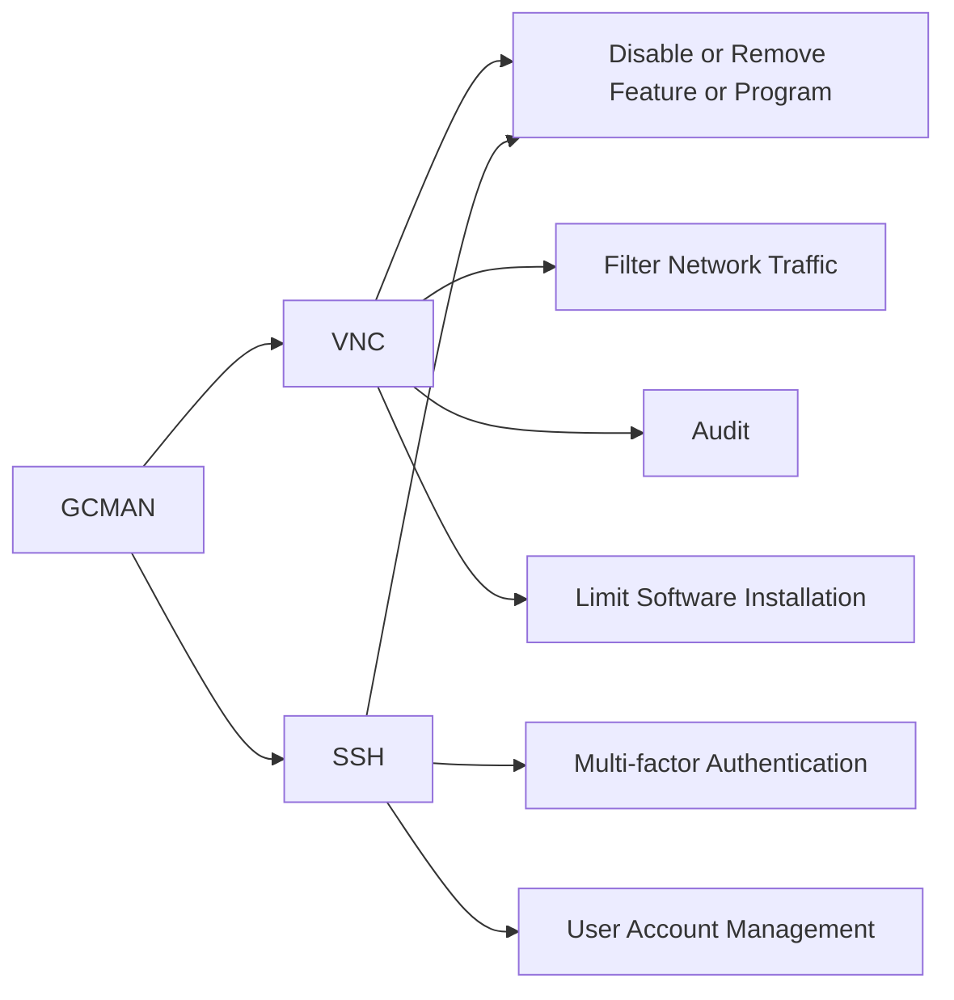

---
tags:
   - groups
---
# GCMAN
## ID:G0036
[GCMAN](groups/G0036) is a threat group that focuses on targeting banks for the purpose of transferring money to e-currency services. (Citation: Securelist GCMAN)
## Techniques Used By Group
* [VNC](techniques/T1021/005)
* [SSH](techniques/T1021/004)

# Summary of Techniques and Mitigations
